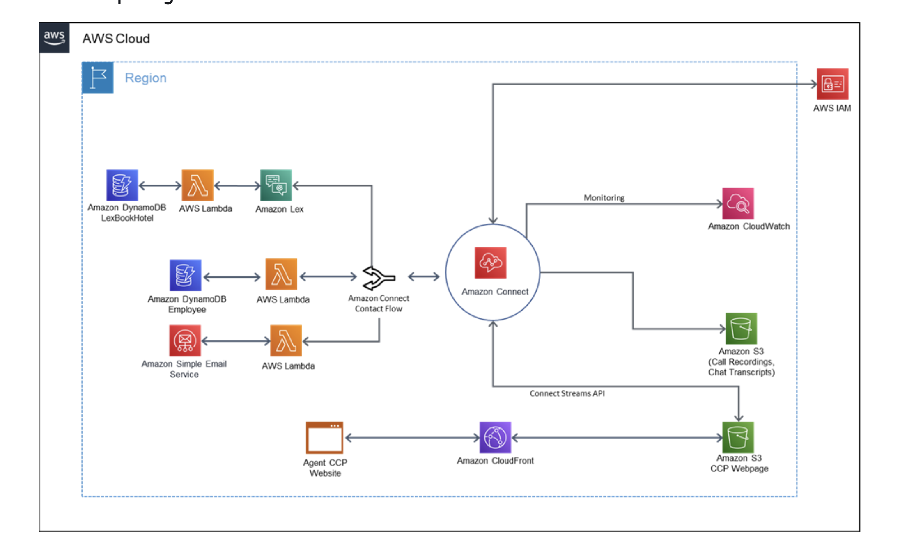

AWS Connect is a cloud-based contact center service provided by Amazon Web Services. It allows businesses to have a fully operational contact center that can be accessed from anywhere in the world without the need for physical infrastructure. AWS Connect offers features such as 

- Intelligent Routing
- Real-time Analytics  
- Integrations with popular CRM systems
- Ominichannel

These features make it a comprehensive solution for customer service needs.

In this article we will talk about steps for setting up AWS Connect for Call Center Operation.

- Amazon Connect Basic Setup
- Amazon Connect and Amazon Lex
- Amazon Connect Dynamic Contact Flow
- Amazon Lex Enhanced
- Send Email Notification
- Integrate CCP into customer web page

Pricing  - Voice

There are three separate charges apply for voice usage.

- Amazon Connect usage charges based in end customer call duration.
- Daily charge for DID.
- Inbound Call Per Minute charge based on Telephony DID.

Case Study

Sample case study will focus on Travel Company facilitating & supporting corporate events, conferences and internal meetings with in US.

Services included - Hotel Accommodation and car rental.

Travel company need to launch new contact center which allows the employees to book their travel accommodations.

Requirements:

- The self-service application should be able to recognize the employee's phone number and authenticate them using a previously provided PIN. If the phone number is not recognized, the system should prompt the user to enter their phone number.

- The application must have separate queues for authenticated and unauthenticated employees, with priority given to authenticated employees.

- Authenticated employees will be greeted by their name.

- Employees will then be able to book a hotel for accommodation using Natural Language Understanding (NLU) chat-bot.

- The employee will then be required to provide the location, check-in date, and the number of nights for the stay. This booking information must then be stored in a database.

- Upon successful booking, employees will have the option to receive an email confirmation of the reservation, including the total booking amount.

- If the employees ask to speak to an agent, then the agent will have to greet the employee by their name.

Module 1

- Create AWS Connect instance and claim a phone number with basic contact flow setup and basic queue setup, call recording.

Data storage 

Call recordings, scheduled reports, and chat transcripts are stored in a S3 bucket that is created for you when you create an Amazon Connect instance. The stored data is encrypted by the AWS Key Management Service using a key specific to your Amazon Connect instance. Flow logs are stored in Amazon CloudWatch Logs in a log group created for you.

Took less than 5 min to create Connect instance.

There is a soft-limit of five numbers per contact center. (As per documentation.)

Log in to AWS Connect instance created using Admin User Id and Password.

Claim a phone number in order to receive and make calls.

QQ - Why am I having only limited choices for Claiming Phone number ?

Phone Number claimed.
+1 206-569-6360 

Queue Setup and routing

Queue Can be set up in two ways.

- Standards Queue 
* This is the queue where contacts are held before they are routed to available agents. 

- Agent Queues
* These queues are automatically created when an agent is added to the contact center.

 

Contacts waiting in agent queues are higher priority than contacts waiting in standard queues. Contacts in agent queues have the highest priority and zero delay:

Highest priority: If there's another contact in the basic queue, Amazon Connect chooses to give the agent the contact from the agent queue first.
Zero delay: If the agent is available, the contact immediately gets routed to them.

 

Routing Profiles

A routing profile determines what types of contacts an agent can receive and their routing priority.

- Each agent is assigned a routing profile.
- A routing profile can have multiple agents assigned to it.

An agent can only be assigned a single routing profile at a time, however, they can serve multiple queues based on the rules defined in the routing profile.

Routing Profile can be created using Terraform;
[Link to Terraform](https://registry.terraform.io/providers/hashicorp/aws/latest/docs/resources/connect_routing_profile)

Amazon Connect uses routing profiles to manage your contact center at scale. To quickly change the responsibilities of a group of agents, you only need to make an update in one place: the routing profile.

Routing Profiles links Queues and Agents:

A Routing profile requires below.

- Channel Agent will support.
- Queues of Customer that the agent will handle. 
- Priority and Delay of the Queue.

Let's create two queues and one routing profile:

- A queue for authenticated customers.
- A queue for unauthenticated customers.
- A routing profile to define how agents will receive contacts from these queues.

Both queues will have the same hours of operations: Monday 8 - 7.

Create Hours Of Operation via Console. Support for automation via Terraform.

https://registry.terraform.io/providers/hashicorp/aws/latest/docs/resources/connect_hours_of_operation

Then add a Queue.

Create Routing Profile to attach Queues.

User Creation:

Permission; Create Permission

- 

Contact Flows

A Contact Flow defines how a customer experience your contact center from start to finish. 

Amazon Lex Bot for creating Voice based NLU to capture customer Intent and execute respective flow.

Amazon Lex Bot integration to Contact Flow.

Build a Dynamic Contact Flow

Create AWS Lambda Role and Policy for DynamoDB Access.

Create DynamoDB Table

Create and Test AWS Lambda Function

## Cost Structure

This section of the page is intended for totla cost of ownership AWS Connect. Type of Cost considered in this section includes..

- Infra Structure
  * Any Fixed Cost Associated with provisioned resources.
- Pay Per Use Cost
  * Define Pay Per Use Cost.
  * Per Call Telephony Cost, Serverless Cost..etc
- Cost of Maintenance 
  * Cost of Managing Platform, if any.
- Cost of Application Development
  * Cost of Application Team deploying using AWS Connect. 
  * Will touch on different types of work needed from App Dev from enterprise standpoint.

### Types Of Cost Associate with AWS Connect

- Telephony Cost

## AWS Connect Features

- **AWS LEX** NLP
- **AWS Polly** TTS
- **AWS Connect Task** route work to the right agents
- **AWS WFM** forecasting, capacity planning, and scheduling
- **AWS Connect Analytics** Analytics, insights, and optimization
- **Amazon Connect Contact Lens** Amazon Connect Contact Lens provides contact center analytics and quality management 