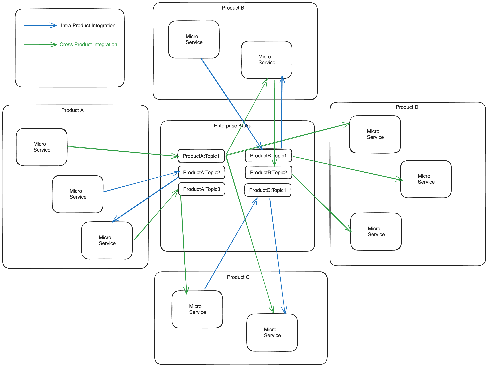

### Kafka in Enterprise Environments: Shared vs. Dedicated Infrastructure Models ( WIP )

## Introduction
This document aims to provide a comprehensive comparison for using Apache Kafka in a shared infrastructure model versus dedicated infrastructure model for various teams within an enterprise.

This document strictly limited to Kafka Tenancy Model, comparing between Multi Tenancy and Dedicated Tenancy model from infra, security and various different aspect of maintainng as a infrastructure product. This is also aimed at brining in different personas ( app engineering, products, sre and infr engineer) and how this deployment model differs for each persona.

## Terminology

- **product** ] A `product` is a capability and responsibilie for providing certain functionality with in an enterprise. An example would be, Payment Product with in an eCommerce Company. Payment Product would represent processing all of payment related functionality for selling consumer goods via eCommerce.

- **Multitenancy** ] It represents using shared infra strcuture model for running workloads belonging to various different teams.

## Out of Scope

- Does not cover details around Kafka usecases, usage or deployment architecture.

### Kafka Dedicated and Multitenancy
Apache Kafka, while not inherently designed for multitenancy, it does have features that make it suitable for such a setup within an enterprise. 

**Multitenancy in Kafka** involves a single enterprise Kafka cluster being used by different systems or teams. This would accomodate Eventing needs for **cross products integrations** and **intra product integrations**. 

**Dedicated Tenancy in Kafka** involves a seperate Kafka Deployment of Kafka for each product team, in this case Kafka  assumes to be scoped at two levels, a Kafka instance per Product Team for supporting **intra Product integrations** and an enterprise Kafka instance for **cross product integrations**.

This discussion is focus on using a Single Kafka for all of the  **intra product integrations** with a given enterprise.

**Please note** - moving to Dedicated does not eliminate need for Enterprise Kafka, however, it would limit the workload on an enterprise Kafka instance. Depending on the use case, respective applications (aka Micro Services) would need to consum or publish respectively.

### Supporting Features for Multitenancy in Kafka

Kafka has very good support for Multitenancy , allwoing it to serve multiple teams, applications and produces/consumer. Below are the features that allow multitenancy.

1. **Topic Segregation**: Organizes messages into topics for different teams or applications.
2. **Access Control Lists (ACLs)**: Controls access to specific topics.
3. **Quotas**: Sets limits on resource usage for clients or users.
4. **Scalability**: Kafka's distributed nature allows handling increased loads.
5. **Performance Isolation**: Achieved through careful planning and resource allocation.
6. **Monitoring and Logging**: Essential for tracking usage and diagnosing issues.

### Challenges in Multitenancy
- **Resource Contention**: Risk of one tenant’s usage impacting others. Kafka does provide resource limits, however enforcing and defining them is defined to protect broker, but not necessary to enforce **QOS**.
- **Maintenance and Upgrades**: Complexity in managing without service disruption.
- **Security and Compliance**: Increased challenge in a shared environment.

---

## Representation of Multi Tenant Kafka

Below diagram represents a sample view of different teams with in an enterprise and Kafka usage for cross products integration and intra product integration.

---

## Kafka as a Shared vs. Dedicated Infrastructure Model

### Shared Infrastructure Model
#### Pros
- Cost Efficiency 
  * Cost Effective as the resources shared across different teams.
- Easier Maintenance
  * Allows for dedicated enterprise team to manage Kafka Infrastructure. This takes away burden from each and every team trying to manage Kafka on their own.
- Resource Optimization
  * Shared infrastruture has an advantage to limit underutilization of resources compared to having seperate instaces.

#### Cons
- Risk of Resource Contention
   * As the resource limits are not supported by Kakfa deployment model, this is a possible scenario - a specific teams deployment may cause resource exchaustion due to incorect planning or unexpected scenario.  
- Limited Customization
  * Shared infra limits all teams to be on the same Kafka version and limits any customization, or some use cases might be requiring higher or lower RTO, RPO and Reliability. This will be over provisioning for some, as these requirements tend to supersede suprior requirement for all regardless.
- Operation Overhead with Security
  * Kafka does have RBAC at the topic level, although tooling available, enforcing these are daunting task and time consuming. This causes lots of operation overhead,
- Maintainability
  * Harder to maintain as this model is a monolithic deployment model for proivding eventing capability for an enterprise. As any version upgrades requires large planning and coordination among many different teams, execution of these version upgrades is much harder in this deployment model. 

### Dedicated Infrastructure Model
#### Pros
- Customization
  * Teams have authroity to defined Kafka infrastructure based on the specific availability and realiability needs.
- Enhanced Security
  * Establishes isolation of Kafka between teams thus limiting unautherized access exposure. 
- Performance Reliability
  * Dedicated resource ensure teams are have dedicated capacity for running the workloads.

#### Cons
- Higher Costs
  * Dedicate capacity for each team limits overall resource sharing and needing to provision more resources causing higher operational cost.
- Increased Maintenance Effort
  * Each team would need to have capacity dedicated support and maintain infrastructure associated with Kafka. Managed service approach would limit the cost of operational support, nonetheless this would be a responsibility of Product Team.
- Underutilization of Resources
  * Idel resources will end up with unutilised capacity, using up operational cost regardless of usage.

### Comparative Analysis
Comparison of shared vs. dedicated models in terms of cost, performance, security, scalability, and maintenance.

| Criteria         | Shared Tenancy | Dedicated Tenancy | Notes |
|------------------|---------------------|----------------------|-----------------|
| Cost             |  ✅         |                   | Cost of Infra Structure and Support           |
| Performance  |               | ✅             |             |
| Reliability              | ✅              | ✅             |          |
| Availability | ✅ | ✅  | |
| Security |  | ✅ | |
| Customization | | ✅ | Ability to customize various configuration options.|
| Maintainability| | ✅  ||

### Comparision Analysis with a Sample Use Case

**Use Case**] An enterprise based on the infrastructure needs with below specifications.

#### Product Team A,B,C,D have below need.

#### Capacity and Performance Requirements
- **Expected Throughput**: 2 million messages per minute.
- **Average Message Size**: 1 KB.
- **Peak Load Handling**: Ability to handle 2x the expected throughput during peak times.
- **Data Retention Policy**: 7 days.
- **Replication Factor**: 3 (for data redundancy and fault tolerance).

### Multitenancy

Multitenance is multi faceted concept, including but not limited to.

- Creating Seperate User Spaces for Tenants.
- Cofigurating Topics with data retention policies.
- Securing Topic and Cluster with Ecnryption, Authentication and Autherization.
- Isolating Tenants with Quitas and Rate Limits.
- Monitoring and metering.
- Inter cluster data sharing.

### Recommendations
Suggestions based on different enterprise sizes and needs, with decision factors for consideration.

#### Influencing Factors
- If the eventing is used for transaction procerssing, then it requires establishing strict SLAs to support customer journey needs and hence Performance will be a key aspect for Kafka deployment model.

- If the workloads deploying have varying degree of needs, then superceding requirement will play vital role in establishing overall Availability and Reliability needs. One size fits all solution, which will endup over provisioning capacity needs for some of the use cases.

### Conclusion
Summary of key findings and final thoughts.

### Credits
ChatGPT - Some of the information generated/gathered using ChatGPT.
