# AI Implementation Guide - Comprehensive Visual Diagrams

This document contains MermaidJS visualizations for all concepts covered in "The Complete Enterprise AI Implementation Guide: 90+ Essential Concepts". Each diagram can be rendered in any Markdown viewer that supports Mermaid syntax.

## Part I: Foundations of Artificial Intelligence

### 1. The AI Hierarchy
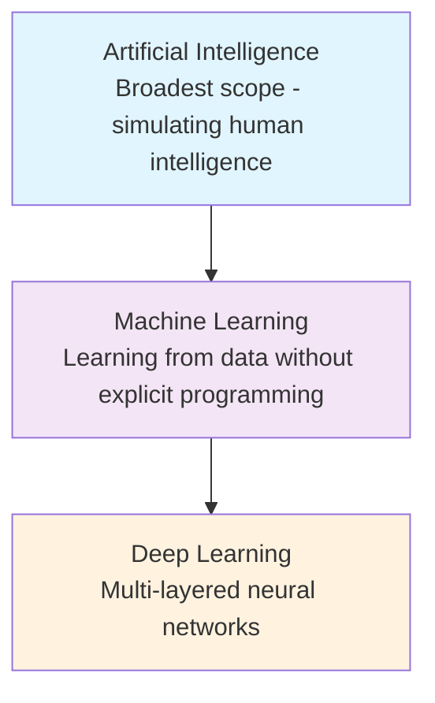

### 2. The Spectrum of AI
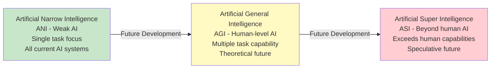

### 3. AI Development Workflow
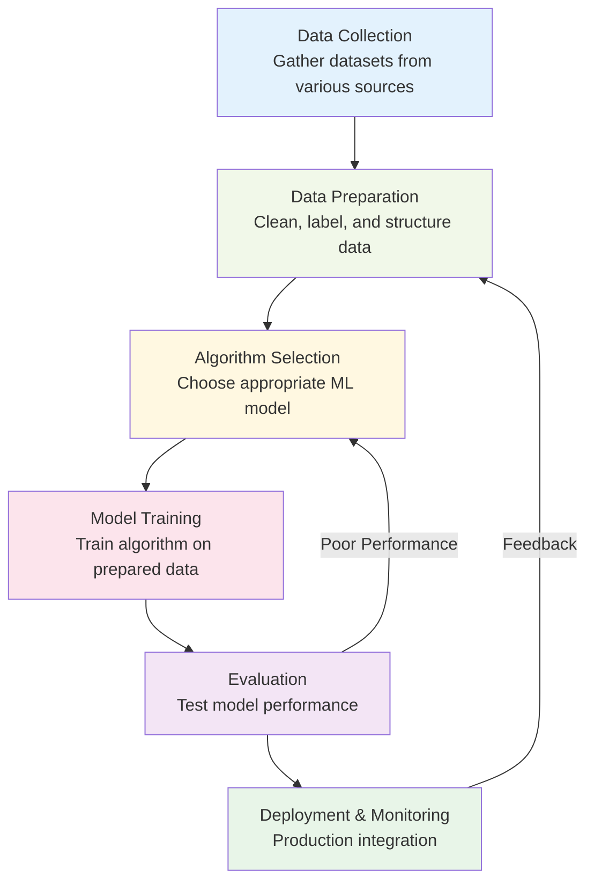

### 4-6. Learning Paradigms
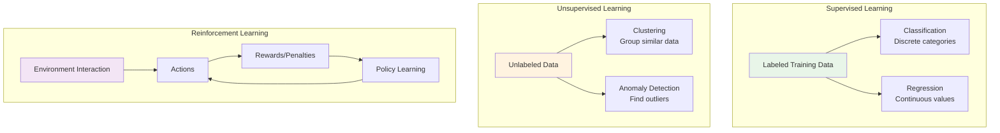

### 7-11. Neural Network Architectures
```mermaid
graph TB
    subgraph "Basic Neural Network"
        I1[Input Layer]
        H1[Hidden Layer 1]
        H2[Hidden Layer 2]
        O1[Output Layer]
        I1 --> H1
        H1 --> H2
        H2 --> O1
    end
    
    subgraph "CNN Architecture"
        CI[Input Image]
        CC[Convolutional Layers]
        CP[Pooling Layers]
        CF[Fully Connected]
        CO[Classification Output]
        CI --> CC
        CC --> CP
        CP --> CF
        CF --> CO
    end
    
    subgraph "RNN Architecture"
        RI[Sequential Input]
        RH[Hidden State]
        RO[Output]
        RI --> RH
        RH --> RO
        RH -->|Memory| RH
    end
    
    subgraph "Transformer Architecture"
        TI[Input Tokens]
        TE[Embedding + Positional]
        TSA[Self-Attention]
        TFF[Feed Forward]
        TO[Output]
        TI --> TE
        TE --> TSA
        TSA --> TFF
        TFF --> TO
    end
    
    style I1 fill:#e3f2fd
    style CI fill:#f1f8e9
    style RI fill:#fff8e1
    style TI fill:#fce4ec
```

### 12-15. Vector Operations and Embeddings
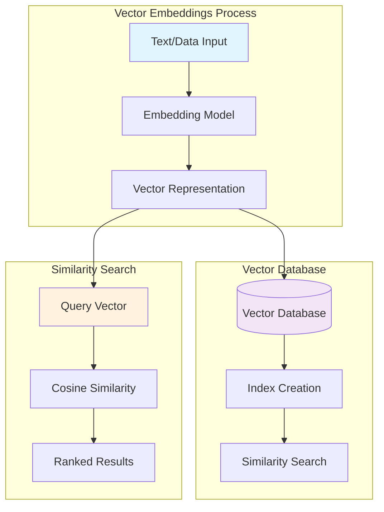

## Part II: Prompt Engineering

### 16-30. Prompt Engineering Techniques
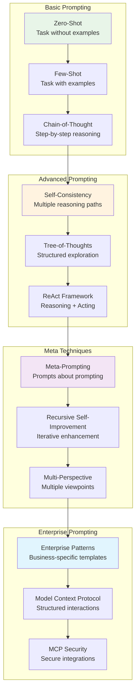

## Part III: AI Application Architecture

### 31-38. Modern AI Architecture
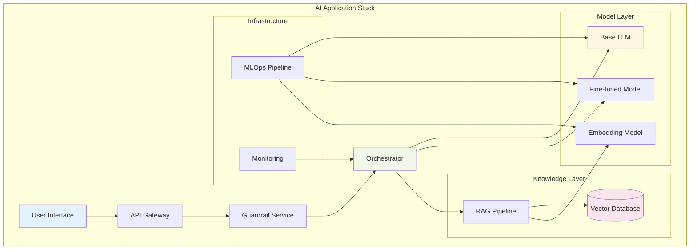

### RAG vs Fine-Tuning Decision Matrix
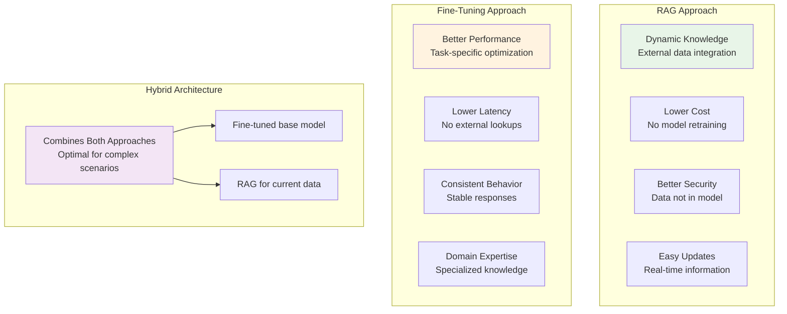

## Part IV: AI Security

### 39-53. AI Security Landscape
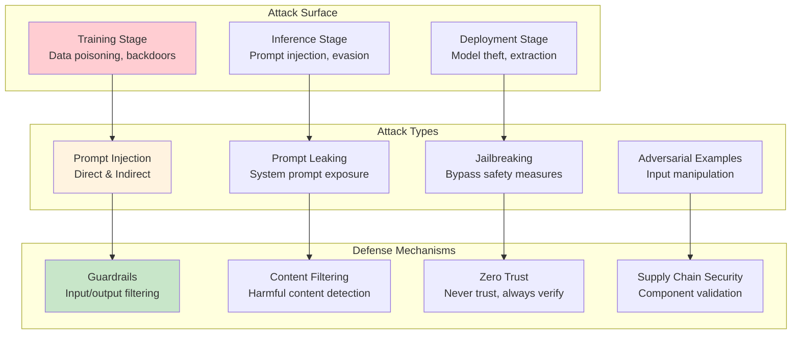

### Enterprise AI Security Framework
```mermaid
graph TB
    subgraph "Security Layers"
        PERI[Perimeter Security<br/>Network & access controls]
        APP[Application Security<br/>API & authentication]
        DATA[Data Security<br/>Encryption & privacy]
        MODEL[Model Security<br/>Integrity & validation]
        INFRA[Infrastructure Security<br/>Compute & storage]
    end
    
    subgraph "Security Operations"
        SOC[Security Operations Center]
        SIEM[Security Information & Event Management]
        IR[Incident Response]
        RT[Red Teaming]
    end
    
    PERI --> APP
    APP --> DATA
    DATA --> MODEL
    MODEL --> INFRA
    
    SOC --> SIEM
    SIEM --> IR
    IR --> RT
    
    style PERI fill:#e3f2fd
    style SOC fill:#f1f8e9
```

## Part V: AI Safety and Governance

### 54-61. AI Safety Framework
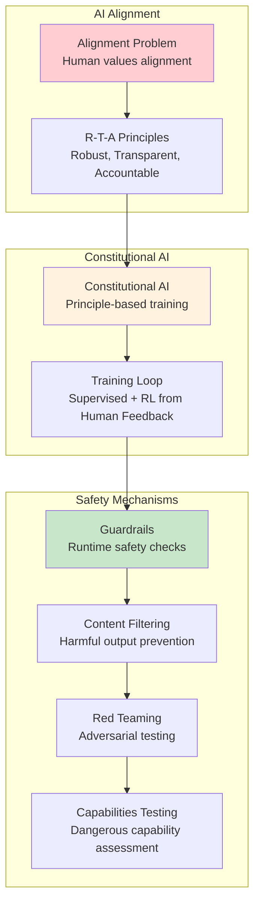

## Part VI: AI Agents

### 62-69. Agentic Systems Architecture
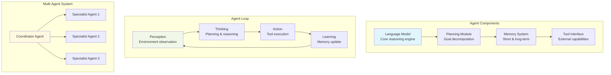

## Part VII: Enterprise Implementation

### 70-75. Enterprise AI Implementation
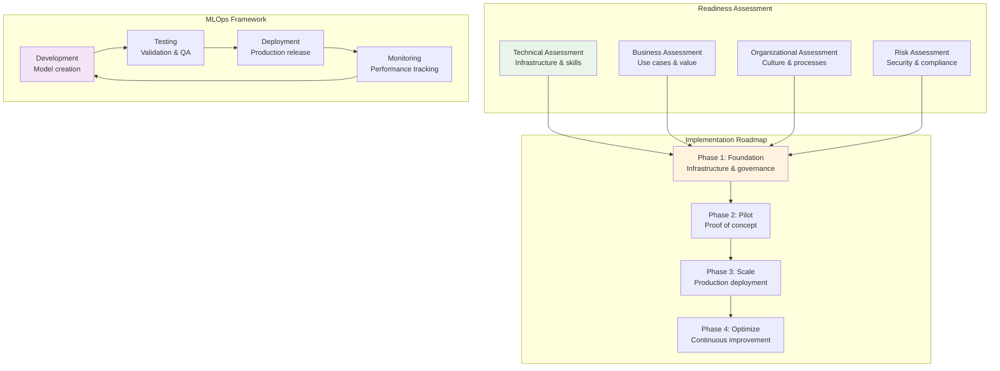

### AI Platform Architecture
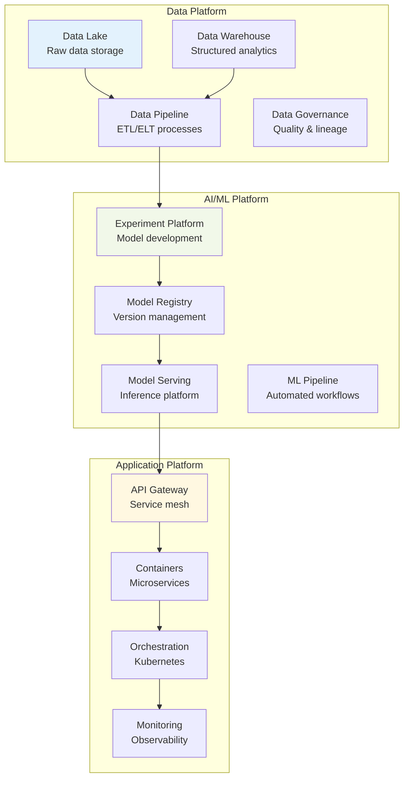

## Advanced Enterprise Concepts (76-90)

### Edge AI and Distributed Intelligence
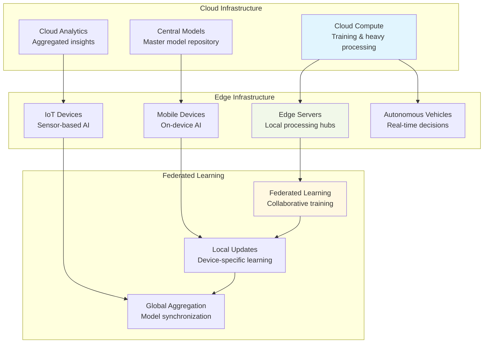

### AI Ethics and Governance Framework
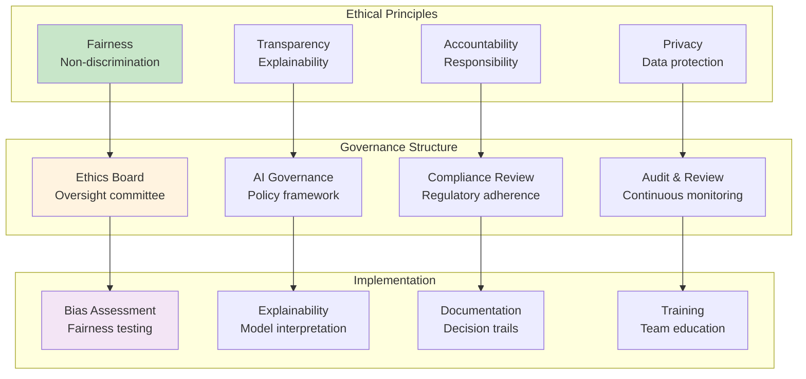

### Comprehensive AI Operations Lifecycle
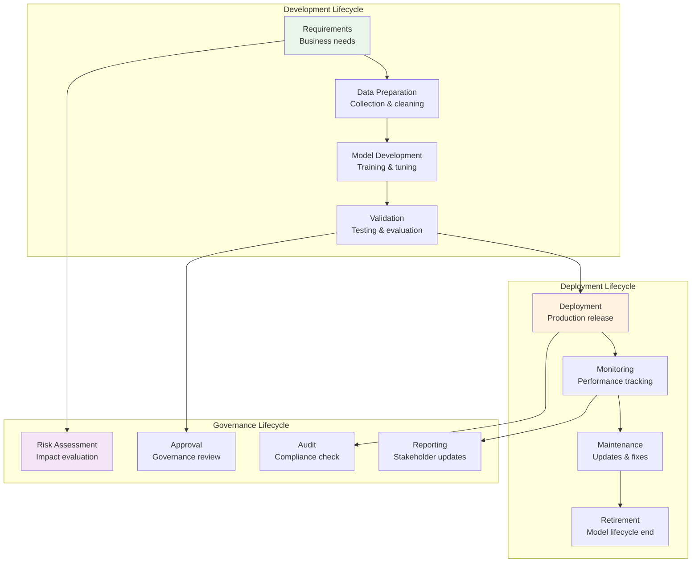

### Future AI Technologies Roadmap
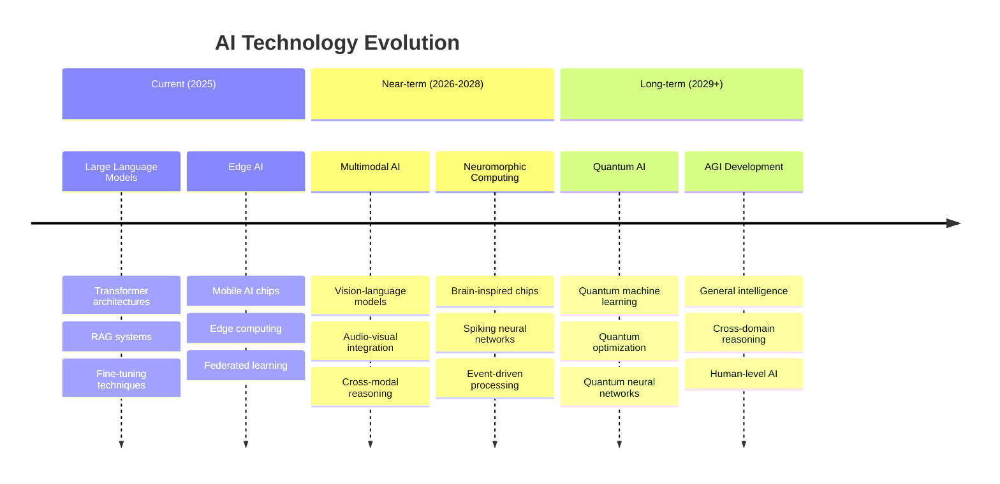

## Integration Architecture Overview
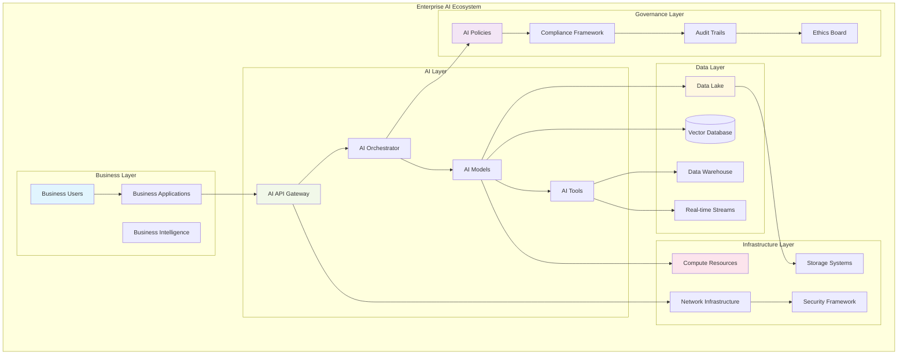

---

*This comprehensive visualization guide covers all 90 concepts from the AI Implementation Guide. Each diagram can be rendered using any MermaidJS-compatible viewer or integrated into documentation systems that support Mermaid syntax.*
