# AI Implementation Guide - Comprehensive Visual Diagrams

This document provides detailed MermaidJS visualizations for all concepts covered in "The Complete Enterprise AI Implementation Guide: 90+ Essential Concepts". Each diagram is presented as an individual section with elaborate explanations to help understand the conceptual relationships and practical applications in enterprise AI implementations.

## Part I: The Foundations of Artificial Intelligence

### 1. The AI Hierarchy - Understanding the Conceptual Layers

The AI hierarchy represents the foundational structure of artificial intelligence as nested domains of increasing specialization and sophistication. This diagram illustrates how Artificial Intelligence serves as the broadest umbrella concept, encompassing all attempts to simulate human intelligence in machines.

```mermaid
%%{init: {'theme':'base', 'themeVariables': { 'primaryColor': '#ffffff', 'primaryTextColor': '#333333', 'primaryBorderColor': '#cccccc', 'lineColor': '#666666'}}}%%
graph TB
    AI[🧠 Artificial Intelligence<br/>The Ultimate Goal<br/>Simulating Human Intelligence<br/>in All Its Forms]
    ML[📊 Machine Learning<br/>Learning from Data<br/>Pattern Recognition<br/>Statistical Inference]
    DL[🔗 Deep Learning<br/>Multi-layered Neural Networks<br/>Hierarchical Feature Learning<br/>Automated Pattern Discovery]
    
    AI --> ML
    ML --> DL
    
    style AI fill:#e1f5fe,stroke:#0277bd,stroke-width:3px
    style ML fill:#f3e5f5,stroke:#7b1fa2,stroke-width:3px
    style DL fill:#fff3e0,stroke:#ef6c00,stroke-width:3px


```



### 2. The Spectrum of AI


### 3. AI Development Workflow

```mermaid
%%{init: {'theme':'base', 'themeVariables': { 'primaryColor': '#ffffff', 'primaryTextColor': '#333333', 'primaryBorderColor': '#cccccc', 'lineColor': '#666666'}}}%%
graph TB
    subgraph "Data Foundation"
        A[📥 Data Collection<br/>Sources: APIs, Databases, Files<br/>Volume: Scale Requirements<br/>Quality: Accuracy Assessment]
        B[🧹 Data Preparation<br/>Cleaning: Remove Noise<br/>Labeling: Supervised Learning<br/>Transformation: Feature Engineering]
    end
    
    subgraph "Model Development"
        C[🔧 Algorithm Selection<br/>Problem Type: Classification/Regression<br/>Data Size: Model Complexity<br/>Performance: Accuracy Requirements]
        D[🎓 Model Training<br/>Learning Process: Parameter Optimization<br/>Validation: Cross-validation<br/>Tuning: Hyperparameter Optimization]
    end
    
    subgraph "Validation & Deployment"
        E[📊 Evaluation<br/>Metrics: Accuracy, Precision, Recall<br/>Testing: Unseen Data<br/>Comparison: Baseline Models]
        F[🚀 Deployment & Monitoring<br/>Production: Integration<br/>Monitoring: Performance Tracking<br/>Maintenance: Model Updates]
    end
    
    A --> B
    B --> C
    C --> D
    D --> E
    E --> F
    F -->|Feedback| B
    E -->|Poor Performance| C
    
    style A fill:#e3f2fd,stroke:#1565c0,stroke-width:3px
    style B fill:#f1f8e9,stroke:#2e7d32,stroke-width:3px
    style C fill:#fff8e1,stroke:#ef6c00,stroke-width:3px
    style D fill:#fce4ec,stroke:#c2185b,stroke-width:3px
    style E fill:#f3e5f5,stroke:#7b1fa2,stroke-width:3px
    style F fill:#e8f5e8,stroke:#388e3c,stroke-width:3px


```


### 4-6. Learning Paradigms


### 7-11. Neural Network Architectures

```mermaid
%%{init: {'theme':'base', 'themeVariables': { 'primaryColor': '#ffffff', 'primaryTextColor': '#333333', 'primaryBorderColor': '#cccccc', 'lineColor': '#666666'}, 'flowchart': {'nodeSpacing': 50, 'rankSpacing': 100, 'curve': 'basis'}}}%%
flowchart TB
    subgraph SG1 ["🧠 Basic Neural Network"]
        direction TB
        I1["Input Layer<br/>📥 Data Input"]
        H1["Hidden Layer 1<br/>🔄 Feature Processing"]
        H2["Hidden Layer 2<br/>🔄 Pattern Recognition"]
        O1["Output Layer<br/>📤 Predictions"]
        I1 --> H1
        H1 --> H2
        H2 --> O1
    end
    
    subgraph SG2 ["🖼️ CNN Architecture"]
        direction TB
        CI["Input Image<br/>📷 Raw Pixels"]
        CC["Convolutional Layers<br/>🔍 Feature Detection"]
        CP["Pooling Layers<br/>📉 Dimensionality Reduction"]
        CF["Fully Connected<br/>🔗 Classification Layer"]
        CO["Classification Output<br/>🏷️ Object Classes"]
        CI --> CC
        CC --> CP
        CP --> CF
        CF --> CO
    end
    
    subgraph SG3 ["📚 RNN Architecture"]
        direction TB
        RI["Sequential Input<br/>📝 Time Series Data"]
        RH["Hidden State<br/>🧠 Memory Cell"]
        RO["Output<br/>📊 Prediction"]
        RI --> RH
        RH --> RO
        RH -.->|"🔄 Memory Loop"| RH
    end
    
    subgraph SG4 ["⚡ Transformer Architecture"]
        direction TB
        TI["Input Tokens<br/>🔤 Text Tokens"]
        TE["Embedding + Positional<br/>📍 Position Encoding"]
        TSA["Self-Attention<br/>👀 Context Understanding"]
        TFF["Feed Forward<br/>⚙️ Processing Layer"]
        TO["Output<br/>📋 Generated Text"]
        TI --> TE
        TE --> TSA
        TSA --> TFF
        TFF --> TO
    end
    
    %% Enhanced Styling for Better Visibility
    style I1 fill:#e3f2fd,stroke:#1565c0,stroke-width:4px,color:#000
    style CI fill:#f1f8e9,stroke:#2e7d32,stroke-width:4px,color:#000
    style RI fill:#fff8e1,stroke:#ef6c00,stroke-width:4px,color:#000
    style TI fill:#fce4ec,stroke:#c2185b,stroke-width:4px,color:#000
    
    style H1 fill:#bbdefb,stroke:#1976d2,stroke-width:3px,color:#000
    style H2 fill:#bbdefb,stroke:#1976d2,stroke-width:3px,color:#000
    style O1 fill:#bbdefb,stroke:#1976d2,stroke-width:3px,color:#000
    
    style CC fill:#c8e6c9,stroke:#388e3c,stroke-width:3px,color:#000
    style CP fill:#c8e6c9,stroke:#388e3c,stroke-width:3px,color:#000
    style CF fill:#c8e6c9,stroke:#388e3c,stroke-width:3px,color:#000
    style CO fill:#c8e6c9,stroke:#388e3c,stroke-width:3px,color:#000
    
    style RH fill:#ffcc80,stroke:#f57c00,stroke-width:3px,color:#000
    style RO fill:#ffcc80,stroke:#f57c00,stroke-width:3px,color:#000
    
    style TE fill:#f8bbd9,stroke:#e91e63,stroke-width:3px,color:#000
    style TSA fill:#f8bbd9,stroke:#e91e63,stroke-width:3px,color:#000
    style TFF fill:#f8bbd9,stroke:#e91e63,stroke-width:3px,color:#000
    style TO fill:#f8bbd9,stroke:#e91e63,stroke-width:3px,color:#000
    
    %% Subgraph Styling
    style SG1 fill:#f8f9fa,stroke:#1565c0,stroke-width:3px
    style SG2 fill:#f8f9fa,stroke:#2e7d32,stroke-width:3px
    style SG3 fill:#f8f9fa,stroke:#ef6c00,stroke-width:3px
    style SG4 fill:#f8f9fa,stroke:#c2185b,stroke-width:3px


```


### 12-15. Vector Operations and Embeddings


## Part II: Prompt Engineering

### 16-30. Prompt Engineering Techniques


## Part III: AI Application Architecture

### 31-38. Modern AI Architecture


### RAG vs Fine-Tuning Decision Matrix


## Part IV: AI Security

### 39-53. AI Security Landscape


### Enterprise AI Security Framework


## Part V: AI Safety and Governance

### 54-61. AI Safety Framework


## Part VI: AI Agents

### 62-69. Agentic Systems Architecture


## Part VII: Enterprise Implementation

### 70-75. Enterprise AI Implementation


### AI Platform Architecture


## Missing Concepts - Additional Core Topics (25-30)

### 25-30. Advanced Prompt Engineering and Enterprise Integration


## Advanced Security Concepts (39-53)

### AI Security Threat Landscape


### Enterprise Security Framework (50-53)


## AI Safety and Governance (54-61)

### AI Safety and Alignment Framework


## Complete Agent Architecture (62-69)

### Advanced Agentic Systems


## Enterprise Implementation Framework (70-75)

### Enterprise AI Implementation Strategy
```mermaid
%%{init: {'theme':'base', 'themeVariables': { 'primaryColor': '#ffffff', 'primaryTextColor': '#333333', 'primaryBorderColor': '#cccccc', 'lineColor': '#666666'}}}%%
graph TB
    subgraph "Readiness & Planning"
        EARA[Enterprise AI Readiness<br/>Assessment framework]
        AIRM[AI Implementation Roadmap<br/>Phase-based methodology]
        MLAIF[MLOps & AI Operations<br/>DevOps for AI]
    end
    
    subgraph "Platform & Architecture"
        AIPATS[AI Platform Architecture<br/>Technology stack]
        CMAAI[Change Management<br/>AI adoption strategy]
        AIVMES[AI Vendor Management<br/>Ecosystem strategy]
    end
    
    EARA --> AIRM
    AIRM --> MLAIF
    MLAIF --> AIPATS
    AIPATS --> CMAAI
    CMAAI --> AIVMES
    
    style EARA fill:#e8f5e8
    style MLAIF fill:#fff3e0
    style CMAAI fill:#f3e5f5

```

## Advanced Enterprise Concepts (76-90)

### Edge AI and Advanced Technologies (76-80)
```mermaid
%%{init: {'theme':'base', 'themeVariables': { 'primaryColor': '#ffffff', 'primaryTextColor': '#333333', 'primaryBorderColor': '#cccccc', 'lineColor': '#666666'}}}%%
graph TB
    subgraph "Distributed AI"
        EADI[Edge AI & Distributed Intelligence<br/>Local processing]
        FLCAI[Federated Learning<br/>Collaborative AI]
        MCO[Model Compression<br/>Optimization techniques]
        AIPMO[AI Performance Monitoring<br/>Observability]
        DPSDG[Data Privacy<br/>Synthetic data generation]
    end
    
    EADI --> FLCAI
    FLCAI --> MCO
    MCO --> AIPMO
    AIPMO --> DPSDG
    
    style EADI fill:#e1f5fe
    style FLCAI fill:#f1f8e9
    style MCO fill:#fff8e1

```

### AI Ethics and Governance (81-85)
```mermaid
%%{init: {'theme':'base', 'themeVariables': { 'primaryColor': '#ffffff', 'primaryTextColor': '#333333', 'primaryBorderColor': '#cccccc', 'lineColor': '#666666'}}}%%
graph TB
    subgraph "Ethics & Compliance"
        AERAIF[AI Ethics<br/>Responsible AI frameworks]
        RCAIG[Regulatory Compliance<br/>AI governance]
        AITQA[AI Testing<br/>Quality assurance]
        MVLM[Model Versioning<br/>Lineage management]
        AIIRC[AI Incident Response<br/>Crisis management]
    end
    
    AERAIF --> RCAIG
    RCAIG --> AITQA
    AITQA --> MVLM
    MVLM --> AIIRC
    
    style AERAIF fill:#c8e6c9
    style RCAIG fill:#fff3e0
    style AIIRC fill:#f3e5f5

```

### Future-Ready Enterprise AI (86-90)
```mermaid
%%{init: {'theme':'base', 'themeVariables': { 'primaryColor': '#ffffff', 'primaryTextColor': '#333333', 'primaryBorderColor': '#cccccc', 'lineColor': '#666666'}}}%%
graph TB
    subgraph "Sustainable & Inclusive AI"
        GAISC[Green AI<br/>Sustainable computing]
        AIAID[AI Accessibility<br/>Inclusive design]
        AIROIBVM[AI ROI<br/>Business value measurement]
        CFAITOOR[Cross-Functional AI Teams<br/>Organizational roles]
        QAIFT[Quantum AI<br/>Future technologies]
    end
    
    GAISC --> AIAID
    AIAID --> AIROIBVM
    AIROIBVM --> CFAITOOR
    CFAITOOR --> QAIFT
    
    style GAISC fill:#c8e6c9
    style AIAID fill:#fff3e0
    style QAIFT fill:#f3e5f5

```

### Comprehensive Technology Evolution Timeline
```mermaid
%%{init: {'theme':'base', 'themeVariables': { 'primaryColor': '#ffffff', 'primaryTextColor': '#333333', 'primaryBorderColor': '#cccccc', 'lineColor': '#666666'}}}%%
timeline
    title Complete AI Technology Evolution (All 90 Concepts)
    
    section Foundations (1-15)
        AI Hierarchy        : Artificial Intelligence
                           : Machine Learning  
                           : Deep Learning
        
        Neural Networks     : Basic Neural Networks
                           : CNNs for Vision
                           : RNNs for Sequences
                           : Transformers
        
        Vector Operations   : Embeddings
                           : Vector Databases
                           : Similarity Search
                           : Generative AI
    
    section Prompt Engineering (16-30)
        Basic Prompting     : Zero-shot
                           : Few-shot
                           : Chain-of-Thought
        
        Advanced Prompting  : Self-Consistency
                           : Tree-of-Thoughts
                           : ReAct Framework
        
        Enterprise         : Meta-Prompting
                          : MCP Integration
                          : Governance
    
    section Architecture & Security (31-53)
        AI Architecture    : Modern App Architecture
                          : RAG vs Fine-tuning
                          : Hybrid Systems
        
        Security Framework : Attack Surface
                          : Prompt Injection
                          : Enterprise Security
                          : Zero Trust AI
    
    section Safety & Agents (54-69)
        AI Safety         : Alignment Problem
                         : Constitutional AI
                         : Guardrails
        
        Agentic Systems   : Agent Architecture
                         : Planning & Memory
                         : Multi-Agent Systems
    
    section Enterprise Implementation (70-90)
        Implementation    : Readiness Assessment
                         : MLOps Framework
                         : Platform Architecture
        
        Advanced Concepts : Edge AI
                         : Ethics & Compliance
                         : Future Technologies
```

### AI Ethics and Governance Framework
```mermaid
%%{init: {'theme':'base', 'themeVariables': { 'primaryColor': '#ffffff', 'primaryTextColor': '#333333', 'primaryBorderColor': '#cccccc', 'lineColor': '#666666'}}}%%
graph TB
    subgraph "Ethical Principles"
        FAIR[Fairness<br/>Non-discrimination]
        TRANS[Transparency<br/>Explainability]
        ACC[Accountability<br/>Responsibility]
        PRIV[Privacy<br/>Data protection]
    end
    
    subgraph "Governance Structure"
        EB[Ethics Board<br/>Oversight committee]
        AG[AI Governance<br/>Policy framework]
        CR[Compliance Review<br/>Regulatory adherence]
        AR[Audit & Review<br/>Continuous monitoring]
    end
    
    subgraph "Implementation"
        BIA[Bias Assessment<br/>Fairness testing]
        EXP[Explainability<br/>Model interpretation]
        DOC[Documentation<br/>Decision trails]
        TRAIN[Training<br/>Team education]
    end
    
    FAIR --> EB
    TRANS --> AG
    ACC --> CR
    PRIV --> AR
    
    EB --> BIA
    AG --> EXP
    CR --> DOC
    AR --> TRAIN
    
    style FAIR fill:#c8e6c9
    style EB fill:#fff3e0
    style BIA fill:#f3e5f5

```

### Comprehensive AI Operations Lifecycle
```mermaid
%%{init: {'theme':'base', 'themeVariables': { 'primaryColor': '#ffffff', 'primaryTextColor': '#333333', 'primaryBorderColor': '#cccccc', 'lineColor': '#666666'}}}%%
graph TB
    subgraph "Development Lifecycle"
        REQ[Requirements<br/>Business needs]
        DATA[Data Preparation<br/>Collection & cleaning]
        MODEL[Model Development<br/>Training & tuning]
        VALID[Validation<br/>Testing & evaluation]
    end
    
    subgraph "Deployment Lifecycle"
        DEPLOY[Deployment<br/>Production release]
        MONITOR[Monitoring<br/>Performance tracking]
        MAIN[Maintenance<br/>Updates & fixes]
        RETIRE[Retirement<br/>Model lifecycle end]
    end
    
    subgraph "Governance Lifecycle"
        ASSESS[Risk Assessment<br/>Impact evaluation]
        APPROVE[Approval<br/>Governance review]
        AUDIT[Audit<br/>Compliance check]
        REPORT[Reporting<br/>Stakeholder updates]
    end
    
    REQ --> DATA
    DATA --> MODEL
    MODEL --> VALID
    VALID --> DEPLOY
    DEPLOY --> MONITOR
    MONITOR --> MAIN
    MAIN --> RETIRE
    
    REQ --> ASSESS
    VALID --> APPROVE
    DEPLOY --> AUDIT
    MONITOR --> REPORT
    
    style REQ fill:#e8f5e8
    style DEPLOY fill:#fff3e0
    style ASSESS fill:#f3e5f5

```

### Future AI Technologies Roadmap
```mermaid
%%{init: {'theme':'base', 'themeVariables': { 'primaryColor': '#ffffff', 'primaryTextColor': '#333333', 'primaryBorderColor': '#cccccc', 'lineColor': '#666666'}}}%%
timeline
    title AI Technology Evolution
    
    section Current (2025)
        Large Language Models : Transformer architectures
                              : RAG systems
                              : Fine-tuning techniques
        
        Edge AI              : Mobile AI chips
                              : Edge computing
                              : Federated learning
    
    section Near-term (2026-2028)
        Multimodal AI        : Vision-language models
                              : Audio-visual integration
                              : Cross-modal reasoning
        
        Neuromorphic Computing : Brain-inspired chips
                              : Spiking neural networks
                              : Event-driven processing
    
    section Long-term (2029+)
        Quantum AI           : Quantum machine learning
                              : Quantum optimization
                              : Quantum neural networks
        
        AGI Development      : General intelligence
                              : Cross-domain reasoning
                              : Human-level AI
```

## Integration Architecture Overview
```mermaid
%%{init: {'theme':'base', 'themeVariables': { 'primaryColor': '#ffffff', 'primaryTextColor': '#333333', 'primaryBorderColor': '#cccccc', 'lineColor': '#666666'}}}%%
graph TB
    subgraph "Enterprise AI Ecosystem"
        subgraph "Business Layer"
            BU[Business Users]
            BA[Business Applications]
            BI[Business Intelligence]
        end
        
        subgraph "AI Layer"
            AI_API[AI API Gateway]
            AI_ORCH[AI Orchestrator]
            AI_MODELS[AI Models]
            AI_TOOLS[AI Tools]
        end
        
        subgraph "Data Layer"
            DATA_LAKE[Data Lake]
            DATA_WARE[Data Warehouse]
            VECTOR_DB[(Vector Database)]
            REAL_TIME[Real-time Streams]
        end
        
        subgraph "Infrastructure Layer"
            COMPUTE[Compute Resources]
            STORAGE[Storage Systems]
            NETWORK[Network Infrastructure]
            SECURITY[Security Framework]
        end
        
        subgraph "Governance Layer"
            POLICY[AI Policies]
            COMPLIANCE[Compliance Framework]
            AUDIT[Audit Trails]
            ETHICS[Ethics Board]
        end
    end
    
    BU --> BA
    BA --> AI_API
    AI_API --> AI_ORCH
    AI_ORCH --> AI_MODELS
    AI_MODELS --> AI_TOOLS
    
    AI_MODELS --> DATA_LAKE
    AI_MODELS --> VECTOR_DB
    AI_TOOLS --> DATA_WARE
    AI_TOOLS --> REAL_TIME
    
    AI_MODELS --> COMPUTE
    DATA_LAKE --> STORAGE
    AI_API --> NETWORK
    NETWORK --> SECURITY
    
    AI_ORCH --> POLICY
    POLICY --> COMPLIANCE
    COMPLIANCE --> AUDIT
    AUDIT --> ETHICS
    
    style BU fill:#e1f5fe
    style AI_API fill:#f1f8e9
    style DATA_LAKE fill:#fff8e1
    style COMPUTE fill:#fce4ec
    style POLICY fill:#f3e5f5

```

---

*This comprehensive visualization guide covers all 90 concepts from the AI Implementation Guide. Each diagram can be rendered using any MermaidJS-compatible viewer or integrated into documentation systems that support Mermaid syntax.*
