# AI Implementation Guide - Comprehensive Visual Diagrams

This document provides detailed MermaidJS visualizations for all concepts covered in "The Complete Enterprise AI Implementation Guide: 90+ Essential Concepts". Each diagram is presented as an individual section with elaborate explanations to help understand the conceptual relationships and practical applications in enterprise AI implementations.

## Part I: The Foundations of Artificial Intelligence

### 1. The AI Hierarchy - Understanding the Conceptual Layers

The AI hierarchy represents the foundational structure of artificial intelligence as nested domains of increasing specialization and sophistication. This diagram illustrates how Artificial Intelligence serves as the broadest umbrella concept, encompassing all attempts to simulate human intelligence in machines.


**Detailed Explanation:**
- **Artificial Intelligence (Outer Layer)**: The broadest concept encompassing any technique that enables machines to mimic human intelligence, including rule-based systems, expert systems, and symbolic reasoning.
- **Machine Learning (Middle Layer)**: A subset of AI that focuses on algorithms that can learn and improve from experience without being explicitly programmed for every scenario.
- **Deep Learning (Inner Core)**: The most specialized subset, using multi-layered neural networks to automatically discover intricate structures in large amounts of data.

The progression from outer to inner represents increasing autonomy and decreasing human intervention in the intelligence creation process.

### 2. The Spectrum of AI Intelligence - Current Reality to Future Possibilities

This spectrum visualization depicts the evolution of AI capabilities from today's narrow applications to hypothetical future general and super intelligence systems. Understanding this spectrum is crucial for setting realistic expectations and planning AI investments.

```mermaid
graph LR
    subgraph "Current Reality - 2025"
        ANI[🎯 Artificial Narrow Intelligence<br/>Weak AI<br/>Single Task Focus<br/>Domain-Specific Excellence]
        
        subgraph "ANI Examples"
            ANI_EX1[🔍 Search Engines]
            ANI_EX2[🎵 Music Recommendation]
            ANI_EX3[🚗 Self-Driving Cars]
            ANI_EX4[💬 ChatGPT]
            ANI_EX5[🖼️ Image Recognition]
        end
    end
    
    subgraph "Theoretical Future"
        AGI[🧠 Artificial General Intelligence<br/>Human-Level AI<br/>Cross-Domain Reasoning<br/>Adaptable Intelligence]
        
        ASI[⚡ Artificial Super Intelligence<br/>Beyond Human Capability<br/>Recursive Self-Improvement<br/>Unprecedented Problem-Solving]
    end
    
    ANI -->|"Years to Decades"| AGI
    AGI -->|"Highly Uncertain Timeline"| ASI
    
    ANI -.-> ANI_EX1
    ANI -.-> ANI_EX2
    ANI -.-> ANI_EX3
    ANI -.-> ANI_EX4
    ANI -.-> ANI_EX5
    
    style ANI fill:#c8e6c9,stroke:#2E7D32,stroke-width:3px
    style AGI fill:#fff9c4,stroke:#F57F17,stroke-width:2px
    style ASI fill:#ffcdd2,stroke:#C62828,stroke-width:2px
```



**Detailed Explanation:**
- **ANI (Current State)**: All existing AI systems fall into this category. They excel at specific tasks but cannot transfer their learning to unrelated domains. Examples include language models, recommendation systems, and computer vision applications.
- **AGI (Future Goal)**: A hypothetical AI that can understand, learn, and apply intelligence across diverse domains like humans. It would be able to solve novel problems without domain-specific training.
- **ASI (Speculative Future)**: An AI system that exceeds human cognitive abilities across all domains. This represents both the ultimate goal and the greatest risk in AI development.

### 3. AI Development Workflow - The Iterative Journey from Data to Deployment

The AI development workflow represents the systematic process of creating intelligent systems. Unlike traditional software development, AI development is inherently iterative and data-centric, requiring continuous refinement and validation.

```mermaid
graph TB
    subgraph "Data Foundation"
        A[📥 Data Collection<br/>Sources: APIs, Databases, Files<br/>Volume: Scale Requirements<br/>Quality: Accuracy Assessment]
        B[🧹 Data Preparation<br/>Cleaning: Remove Noise<br/>Labeling: Supervised Learning<br/>Transformation: Feature Engineering]
    end
    
    subgraph "Model Development"
        C[🔧 Algorithm Selection<br/>Problem Type: Classification/Regression<br/>Data Size: Model Complexity<br/>Performance: Accuracy Requirements]
        D[🎓 Model Training<br/>Learning Process: Parameter Optimization<br/>Validation: Cross-validation<br/>Tuning: Hyperparameter Optimization]
    end
    
    subgraph "Validation & Deployment"
        E[📊 Evaluation<br/>Metrics: Accuracy, Precision, Recall<br/>Testing: Unseen Data<br/>Comparison: Baseline Models]
        F[🚀 Deployment & Monitoring<br/>Production: Integration<br/>Monitoring: Performance Tracking<br/>Maintenance: Model Updates]
    end
    
    A --> B
    B --> C
    C --> D
    D --> E
    E --> F
    
    %% Feedback loops
    F -.->|"Performance Degradation"| B
    E -.->|"Poor Results"| C
    D -.->|"Training Issues"| B
    F -.->|"New Data"| A
    
    %% Quality gates
    B -->|"Data Quality Check"| QG1{Quality Gate 1<br/>Data Ready?}
    D -->|"Model Performance Check"| QG2{Quality Gate 2<br/>Model Ready?}
    E -->|"Production Readiness"| QG3{Quality Gate 3<br/>Deploy Ready?}
    
    QG1 -->|No| A
    QG1 -->|Yes| C
    QG2 -->|No| C
    QG2 -->|Yes| E
    QG3 -->|No| D
    QG3 -->|Yes| F
    
    style A fill:#e3f2fd,stroke:#1976D2,stroke-width:2px
    style B fill:#f1f8e9,stroke:#388E3C,stroke-width:2px
    style C fill:#fff8e1,stroke:#F57C00,stroke-width:2px
    style D fill:#fce4ec,stroke:#C2185B,stroke-width:2px
    style E fill:#f3e5f5,stroke:#7B1FA2,stroke-width:2px
    style F fill:#e8f5e8,stroke:#2E7D32,stroke-width:2px
```



**Detailed Explanation:**
- **Data Collection**: The foundation where raw information is gathered from various sources. Quality and quantity directly impact model performance.
- **Data Preparation**: Often the most time-consuming phase, involving cleaning, labeling, and transforming raw data into a format suitable for machine learning.
- **Algorithm Selection**: Choosing the right approach based on problem type, data characteristics, and performance requirements.
- **Model Training**: The core learning process where algorithms adjust their parameters to minimize prediction errors.
- **Evaluation**: Testing the trained model on unseen data to assess its real-world performance.
- **Deployment & Monitoring**: Moving the model to production and continuously monitoring its performance, as real-world data may differ from training data over time.

The feedback loops demonstrate the iterative nature of AI development, where insights from later stages inform improvements in earlier stages.
### 4. Supervised Learning - Learning from Labeled Examples

Supervised learning is the most common and well-understood approach to machine learning, where models learn from input-output pairs to make predictions on new, unseen data. This paradigm forms the backbone of many commercial AI applications.

```mermaid
graph TB
    subgraph "Supervised Learning Process"
        LD[📚 Labeled Dataset<br/>Input-Output Pairs<br/>Ground Truth Examples<br/>Training Foundation]
        
        subgraph "Learning Process"
            ALG[🔧 Algorithm<br/>Mathematical Model<br/>Parameter Learning<br/>Pattern Recognition]
            TRAIN[🎓 Training Process<br/>Error Minimization<br/>Parameter Adjustment<br/>Optimization]
        end
        
        subgraph "Task Types"
            CLASS[📊 Classification<br/>Discrete Categories<br/>Decision Boundaries<br/>Class Prediction]
            REG[📈 Regression<br/>Continuous Values<br/>Trend Analysis<br/>Numeric Prediction]
        end
        
        subgraph "Applications"
            CLASS_EX1[📧 Email Spam Detection]
            CLASS_EX2[🖼️ Image Recognition]
            CLASS_EX3[💬 Sentiment Analysis]
            
            REG_EX1[🏠 House Price Prediction]
            REG_EX2[📊 Stock Price Forecasting]
            REG_EX3[🌡️ Temperature Prediction]
        end
        
        MODEL[🎯 Trained Model<br/>Learned Patterns<br/>Prediction Capability<br/>Generalization]
        
        NEWDATA[🔍 New Data<br/>Unlabeled Input<br/>Real-world Examples]
        
        PREDICTION[📤 Predictions<br/>Model Output<br/>Confidence Scores<br/>Decision Support]
    end
    
    LD --> ALG
    ALG --> TRAIN
    TRAIN --> MODEL
    
    LD --> CLASS
    LD --> REG
    
    CLASS -.-> CLASS_EX1
    CLASS -.-> CLASS_EX2
    CLASS -.-> CLASS_EX3
    
    REG -.-> REG_EX1
    REG -.-> REG_EX2
    REG -.-> REG_EX3
    
    MODEL --> PREDICTION
    NEWDATA --> MODEL
    
    style LD fill:#e8f5e8,stroke:#2E7D32,stroke-width:3px
    style ALG fill:#fff3e0,stroke:#F57C00,stroke-width:2px
    style CLASS fill:#e3f2fd,stroke:#1976D2,stroke-width:2px
    style REG fill:#fce4ec,stroke:#C2185B,stroke-width:2px
    style MODEL fill:#f3e5f5,stroke:#7B1FA2,stroke-width:3px
```



**Detailed Explanation:**
Supervised learning operates on the principle of learning from examples. The algorithm examines many input-output pairs during training, gradually learning to map inputs to correct outputs. Classification tasks predict discrete categories (spam/not spam, cat/dog), while regression tasks predict continuous values (prices, temperatures). The quality and quantity of labeled data directly determine the model's performance.

### 5. Unsupervised Learning - Discovering Hidden Patterns

Unsupervised learning tackles the challenge of finding structure in data without explicit labels or guidance. This approach is particularly valuable for exploratory data analysis and discovering hidden insights in complex datasets.

```mermaid
graph TB
    subgraph "Unsupervised Learning Universe"
        UD[📦 Unlabeled Data<br/>Raw Information<br/>No Target Variable<br/>Hidden Patterns]
        
        subgraph "Core Techniques"
            CLUSTER[🎯 Clustering<br/>Group Similar Items<br/>Natural Segmentation<br/>Pattern Discovery]
            
            ANOM[⚠️ Anomaly Detection<br/>Identify Outliers<br/>Unusual Patterns<br/>Exception Finding]
            
            DIMRED[📐 Dimensionality Reduction<br/>Feature Compression<br/>Visualization<br/>Noise Removal]
            
            ASSOC[🔗 Association Rules<br/>Relationship Mining<br/>Frequent Patterns<br/>Market Basket Analysis]
        end
        
        subgraph "Clustering Applications"
            CUST[👥 Customer Segmentation<br/>Marketing Personas<br/>Behavioral Groups]
            GENE[🧬 Gene Sequencing<br/>Biological Classification<br/>Disease Patterns]
            DOC[📄 Document Organization<br/>Topic Modeling<br/>Content Grouping]
        end
        
        subgraph "Anomaly Detection Applications"
            FRAUD[💳 Fraud Detection<br/>Unusual Transactions<br/>Security Monitoring]
            CYBER[🛡️ Cybersecurity<br/>Intrusion Detection<br/>Threat Identification]
            QUAL[⚙️ Quality Control<br/>Manufacturing Defects<br/>Equipment Monitoring]
        end
        
        INSIGHTS[💡 Data Insights<br/>Hidden Structures<br/>Business Intelligence<br/>Strategic Decisions]
    end
    
    UD --> CLUSTER
    UD --> ANOM
    UD --> DIMRED
    UD --> ASSOC
    
    CLUSTER -.-> CUST
    CLUSTER -.-> GENE
    CLUSTER -.-> DOC
    
    ANOM -.-> FRAUD
    ANOM -.-> CYBER
    ANOM -.-> QUAL
    
    CLUSTER --> INSIGHTS
    ANOM --> INSIGHTS
    DIMRED --> INSIGHTS
    ASSOC --> INSIGHTS
    
    style UD fill:#fff3e0,stroke:#F57C00,stroke-width:3px
    style CLUSTER fill:#e8f5e8,stroke:#2E7D32,stroke-width:2px
    style ANOM fill:#ffcdd2,stroke:#C62828,stroke-width:2px
    style DIMRED fill:#e3f2fd,stroke:#1976D2,stroke-width:2px
    style ASSOC fill:#f3e5f5,stroke:#7B1FA2,stroke-width:2px
    style INSIGHTS fill:#fff9c4,stroke:#F57F17,stroke-width:3px
```



**Detailed Explanation:**
Unsupervised learning algorithms explore data to find natural groupings, outliers, or simplified representations without predefined answers. Clustering algorithms group similar data points, anomaly detection identifies unusual patterns, dimensionality reduction simplifies complex data while preserving important information, and association rules discover relationships between variables. These techniques are essential for data exploration and understanding business patterns.

### 6. Reinforcement Learning - Learning Through Trial and Error

Reinforcement learning represents a paradigm where agents learn optimal behavior through interaction with an environment, receiving feedback in the form of rewards and penalties. This approach mimics how humans and animals learn through experience.

```mermaid
graph TB
    subgraph "Reinforcement Learning Ecosystem"
        ENV[🌍 Environment<br/>State Space<br/>Rules & Dynamics<br/>Reward System]
        
        AGENT[🤖 Agent<br/>Decision Maker<br/>Learning Entity<br/>Action Selector]
        
        subgraph "Learning Loop"
            STATE[📊 State<br/>Current Situation<br/>Environment Observation<br/>Context Information]
            
            ACTION[⚡ Action<br/>Agent Decision<br/>Environment Interaction<br/>Strategy Implementation]
            
            REWARD[🎯 Reward<br/>Feedback Signal<br/>Performance Measure<br/>Learning Guidance]
            
            POLICY[📋 Policy<br/>Action Strategy<br/>Decision Rules<br/>Learned Behavior]
        end
        
        subgraph "Key Concepts"
            EXPLORE[🔍 Exploration<br/>Try New Actions<br/>Discover Possibilities<br/>Knowledge Gathering]
            
            EXPLOIT[💎 Exploitation<br/>Use Known Good Actions<br/>Maximize Known Rewards<br/>Performance Optimization]
            
            QTABLE[📊 Q-Table/Function<br/>Action-Value Mapping<br/>Expected Rewards<br/>Decision Support]
        end
        
        subgraph "Applications"
            GAME[🎮 Game Playing<br/>Chess, Go, Poker<br/>Strategic Decision Making]
            
            ROBOT[🤖 Robotics<br/>Navigation, Manipulation<br/>Physical World Interaction]
            
            FINANCE[💰 Trading<br/>Portfolio Management<br/>Risk Assessment]
            
            AUTO[🚗 Autonomous Systems<br/>Self-driving Cars<br/>Adaptive Control]
        end
    end
    
    ENV <--> AGENT
    
    AGENT --> STATE
    STATE --> ACTION
    ACTION --> REWARD
    REWARD --> POLICY
    POLICY --> ACTION
    
    STATE --> ENV
    ACTION --> ENV
    ENV --> REWARD
    ENV --> STATE
    
    POLICY -.-> EXPLORE
    POLICY -.-> EXPLOIT
    AGENT -.-> QTABLE
    
    AGENT -.-> GAME
    AGENT -.-> ROBOT
    AGENT -.-> FINANCE
    AGENT -.-> AUTO
    
    style ENV fill:#e8f5e8,stroke:#2E7D32,stroke-width:3px
    style AGENT fill:#e3f2fd,stroke:#1976D2,stroke-width:3px
    style REWARD fill:#fff9c4,stroke:#F57F17,stroke-width:2px
    style POLICY fill:#f3e5f5,stroke:#7B1FA2,stroke-width:2px
    style EXPLORE fill:#fff3e0,stroke:#F57C00,stroke-width:2px
    style EXPLOIT fill:#fce4ec,stroke:#C2185B,stroke-width:2px
```



**Detailed Explanation:**
Reinforcement learning operates through a continuous feedback loop where an agent takes actions in an environment and receives rewards or penalties. The agent learns to maximize cumulative rewards by developing optimal policies. The exploration-exploitation tradeoff is crucial: the agent must balance trying new actions (exploration) with leveraging known good actions (exploitation). This paradigm has achieved remarkable success in game playing, robotics, and autonomous systems where optimal strategies emerge through experience rather than explicit programming.

### 7. Neural Network Architecture - The Building Blocks of Deep Learning

Neural networks form the foundation of modern deep learning, mimicking the structure and function of biological neural networks. Understanding their architecture is essential for grasping how AI systems process information and learn complex patterns.

```mermaid
graph TB
    subgraph "Neural Network Architecture"
        subgraph "Input Processing"
            INPUT[📥 Input Layer<br/>Raw Data Reception<br/>Feature Vector<br/>Data Preprocessing]
            
            WEIGHTS1[⚖️ Weights & Biases<br/>Connection Strengths<br/>Learned Parameters<br/>Signal Modulation]
        end
        
        subgraph "Hidden Processing"
            HIDDEN1[🧠 Hidden Layer 1<br/>Feature Detection<br/>Pattern Recognition<br/>Non-linear Transformation]
            
            WEIGHTS2[⚖️ Weights & Biases<br/>Layer 1 → Layer 2<br/>Feature Combination<br/>Signal Processing]
            
            HIDDEN2[🧠 Hidden Layer 2<br/>Complex Feature Learning<br/>Abstract Representations<br/>Higher-order Patterns]
            
            WEIGHTS3[⚖️ Weights & Biases<br/>Layer 2 → Output<br/>Decision Formation<br/>Final Processing]
        end
        
        subgraph "Output Generation"
            OUTPUT[📤 Output Layer<br/>Final Predictions<br/>Classification/Regression<br/>Result Generation]
        end
        
        subgraph "Neuron Components"
            NEURON[🔗 Individual Neuron<br/>Weighted Sum<br/>Activation Function<br/>Output Signal]
            
            ACTIVATION[📊 Activation Functions<br/>ReLU, Sigmoid, Tanh<br/>Non-linearity Introduction<br/>Signal Normalization]
        end
        
        subgraph "Learning Process"
            FORWARD[➡️ Forward Pass<br/>Input to Output<br/>Prediction Generation<br/>Information Flow]
            
            BACKWARD[⬅️ Backward Pass<br/>Error Propagation<br/>Gradient Calculation<br/>Weight Updates]
            
            OPTIMIZE[🎯 Optimization<br/>Gradient Descent<br/>Loss Minimization<br/>Parameter Tuning]
        end
    end
    
    INPUT --> WEIGHTS1
    WEIGHTS1 --> HIDDEN1
    HIDDEN1 --> WEIGHTS2
    WEIGHTS2 --> HIDDEN2
    HIDDEN2 --> WEIGHTS3
    WEIGHTS3 --> OUTPUT
    
    HIDDEN1 -.-> NEURON
    NEURON -.-> ACTIVATION
    
    INPUT --> FORWARD
    FORWARD --> OUTPUT
    OUTPUT --> BACKWARD
    BACKWARD --> OPTIMIZE
    OPTIMIZE -.-> WEIGHTS1
    OPTIMIZE -.-> WEIGHTS2
    OPTIMIZE -.-> WEIGHTS3
    
    style INPUT fill:#e3f2fd,stroke:#1976D2,stroke-width:3px
    style HIDDEN1 fill:#f1f8e9,stroke:#388E3C,stroke-width:2px
    style HIDDEN2 fill:#f1f8e9,stroke:#388E3C,stroke-width:2px
    style OUTPUT fill:#fce4ec,stroke:#C2185B,stroke-width:3px
    style NEURON fill:#fff3e0,stroke:#F57C00,stroke-width:2px
    style FORWARD fill:#e8f5e8,stroke:#2E7D32,stroke-width:2px
    style BACKWARD fill:#ffcdd2,stroke:#C62828,stroke-width:2px
```



**Detailed Explanation:**
Neural networks consist of interconnected layers of artificial neurons, each performing weighted calculations and applying activation functions. The input layer receives data, hidden layers progressively extract more complex features, and the output layer generates final predictions. Learning occurs through backpropagation, where errors are propagated backward to adjust weights. The depth (number of layers) allows the network to learn hierarchical representations, making it powerful for complex pattern recognition tasks.

### 8. Convolutional Neural Network (CNN) - Mastering Visual Pattern Recognition

CNNs revolutionized computer vision by introducing spatial awareness and parameter sharing, making them exceptionally effective for image processing and pattern recognition tasks.

```mermaid
graph TB
    subgraph "CNN Architecture Pipeline"
        subgraph "Input Processing"
            IMAGE[🖼️ Input Image<br/>Pixel Matrix<br/>RGB Channels<br/>Spatial Structure]
        end
        
        subgraph "Feature Extraction"
            CONV1[🔍 Convolutional Layer 1<br/>Edge Detection<br/>Local Features<br/>Filter Application]
            
            POOL1[📉 Pooling Layer 1<br/>Spatial Reduction<br/>Feature Consolidation<br/>Translation Invariance]
            
            CONV2[🔍 Convolutional Layer 2<br/>Pattern Combination<br/>Complex Features<br/>Hierarchical Learning]
            
            POOL2[📉 Pooling Layer 2<br/>Further Reduction<br/>Robust Features<br/>Noise Reduction]
        end
        
        subgraph "Classification"
            FLATTEN[📏 Flatten Layer<br/>2D to 1D Conversion<br/>Feature Vector<br/>Dense Input Preparation]
            
            DENSE[🧠 Dense Layer<br/>Fully Connected<br/>Feature Integration<br/>Decision Making]
            
            OUTPUT_CNN[📊 Output Layer<br/>Class Probabilities<br/>Final Classification<br/>Prediction Confidence]
        end
        
        subgraph "CNN Components"
            FILTER[🎯 Filters/Kernels<br/>Feature Detectors<br/>Learnable Parameters<br/>Pattern Recognition]
            
            STRIDE[👣 Stride & Padding<br/>Movement Control<br/>Output Size Management<br/>Border Handling]
            
            ACTIVATION_CNN[⚡ Activation Maps<br/>Feature Responses<br/>Spatial Relationships<br/>Pattern Activation]
        end
        
        subgraph "Applications"
            VISION[👁️ Computer Vision<br/>Object Recognition<br/>Scene Understanding]
            
            MEDICAL[🏥 Medical Imaging<br/>Disease Detection<br/>Diagnostic Support]
            
            AUTO_VISION[🚗 Autonomous Vehicles<br/>Object Detection<br/>Scene Analysis]
        end
    end
    
    IMAGE --> CONV1
    CONV1 --> POOL1
    POOL1 --> CONV2
    CONV2 --> POOL2
    POOL2 --> FLATTEN
    FLATTEN --> DENSE
    DENSE --> OUTPUT_CNN
    
    CONV1 -.-> FILTER
    CONV1 -.-> STRIDE
    CONV1 -.-> ACTIVATION_CNN
    
    CONV2 -.-> FILTER
    CONV2 -.-> STRIDE
    CONV2 -.-> ACTIVATION_CNN
    
    OUTPUT_CNN -.-> VISION
    OUTPUT_CNN -.-> MEDICAL
    OUTPUT_CNN -.-> AUTO_VISION
    
    style IMAGE fill:#e3f2fd,stroke:#1976D2,stroke-width:3px
    style CONV1 fill:#f1f8e9,stroke:#388E3C,stroke-width:2px
    style CONV2 fill:#f1f8e9,stroke:#388E3C,stroke-width:2px
    style POOL1 fill:#fff3e0,stroke:#F57C00,stroke-width:2px
    style POOL2 fill:#fff3e0,stroke:#F57C00,stroke-width:2px
    style OUTPUT_CNN fill:#fce4ec,stroke:#C2185B,stroke-width:3px
    style FILTER fill:#f3e5f5,stroke:#7B1FA2,stroke-width:2px
```



**Detailed Explanation:**
CNNs use convolutional layers that apply filters across input images to detect features like edges, textures, and shapes. Pooling layers reduce spatial dimensions while preserving important information. The hierarchical structure enables learning from simple edges to complex objects. Parameter sharing through filters makes CNNs efficient and translation-invariant, meaning they recognize patterns regardless of position in the image.

### 9. Recurrent Neural Network (RNN) - Processing Sequential Information

RNNs are designed to handle sequential data by maintaining memory of previous inputs, making them ideal for tasks involving time series, natural language, and any data where order matters.


**Detailed Explanation:**
RNNs process sequences by maintaining a hidden state that captures information from previous time steps. This creates a form of memory that allows the network to understand context and temporal dependencies. However, simple RNNs suffer from vanishing gradient problems that make learning long-term dependencies difficult. Advanced variants like LSTM and GRU use gating mechanisms to selectively remember and forget information, enabling better long-term memory and more stable training.

### 10. Transformer Architecture - The Foundation of Modern AI

The Transformer architecture revolutionized natural language processing and became the backbone of large language models. Its parallel processing capabilities and attention mechanisms enable understanding of complex relationships in sequential data.


**Detailed Explanation:**
The Transformer architecture eliminates the sequential processing limitations of RNNs by using self-attention mechanisms that can process all positions in parallel. The encoder stack builds rich representations of the input, while the decoder stack generates output autoregressively. Key innovations include positional encoding to maintain order information, multi-head attention for capturing different types of relationships, and layer normalization for stable training. This architecture's parallelizability and ability to handle long-range dependencies made it the foundation for large language models.

### 11. Self-Attention Mechanism - Understanding Contextual Relationships

Self-attention is the core mechanism that allows Transformers to weigh the importance of different parts of the input when processing each element, enabling rich contextual understanding without recurrence.

```mermaid
graph TB
    subgraph "Self-Attention Mechanism"
        subgraph "Input Preparation"
            INPUT_TOKENS[📝 Input Tokens<br/>"The cat sat on the mat"<br/>Sequence Elements<br/>Context Window]
            
            TOKEN_EMBED[📊 Token Embeddings<br/>Dense Vector Representations<br/>Learned Semantic Encoding<br/>High-dimensional Space]
        end
        
        subgraph "Attention Components"
            QUERY[🔍 Query (Q)<br/>What am I looking for?<br/>Search Vector<br/>Attention Source]
            
            KEY[🗝️ Key (K)<br/>What do I contain?<br/>Content Vector<br/>Attention Target]
            
            VALUE[💎 Value (V)<br/>What information do I carry?<br/>Content Payload<br/>Information Vector]
            
            QKV_TRANSFORM[🔄 Linear Transformations<br/>Learned Weight Matrices<br/>W_Q, W_K, W_V<br/>Feature Projection]
        end
        
        subgraph "Attention Computation"
            DOT_PRODUCT[✖️ Dot Product Attention<br/>Q · K^T<br/>Similarity Calculation<br/>Relevance Scoring]
            
            SCALING[📐 Scaling<br/>√d_k normalization<br/>Gradient Stability<br/>Score Normalization]
            
            SOFTMAX_ATTN[📊 Softmax<br/>Probability Distribution<br/>Attention Weights<br/>Normalized Scores]
            
            WEIGHTED_SUM[➕ Weighted Sum<br/>Attention × Values<br/>Context Integration<br/>Final Representation]
        end
        
        subgraph "Multi-Head Attention"
            HEAD1[👁️ Head 1<br/>Syntactic Relations<br/>Grammar Patterns<br/>Structural Understanding]
            
            HEAD2[👁️ Head 2<br/>Semantic Relations<br/>Meaning Connections<br/>Conceptual Links]
            
            HEAD3[👁️ Head 3<br/>Coreference Relations<br/>Entity Tracking<br/>Reference Resolution]
            
            CONCAT[🔗 Concatenate<br/>Multi-perspective Fusion<br/>Rich Representation<br/>Comprehensive Context]
        end
        
        subgraph "Attention Patterns"
            LOCAL[🏠 Local Attention<br/>Adjacent Words<br/>Phrase-level Relations<br/>Immediate Context]
            
            GLOBAL[🌍 Global Attention<br/>Long-range Dependencies<br/>Document-level Relations<br/>Distant Context]
            
            SYNTACTIC[🌳 Syntactic Attention<br/>Grammar Structure<br/>Dependency Relations<br/>Language Rules]
            
            SEMANTIC[💭 Semantic Attention<br/>Meaning Relations<br/>Topic Coherence<br/>Conceptual Links]
        end
    end
    
    INPUT_TOKENS --> TOKEN_EMBED
    TOKEN_EMBED --> QKV_TRANSFORM
    
    QKV_TRANSFORM --> QUERY
    QKV_TRANSFORM --> KEY
    QKV_TRANSFORM --> VALUE
    
    QUERY --> DOT_PRODUCT
    KEY --> DOT_PRODUCT
    DOT_PRODUCT --> SCALING
    SCALING --> SOFTMAX_ATTN
    SOFTMAX_ATTN --> WEIGHTED_SUM
    VALUE --> WEIGHTED_SUM
    
    WEIGHTED_SUM --> HEAD1
    WEIGHTED_SUM --> HEAD2
    WEIGHTED_SUM --> HEAD3
    
    HEAD1 --> CONCAT
    HEAD2 --> CONCAT
    HEAD3 --> CONCAT
    
    HEAD1 -.-> LOCAL
    HEAD2 -.-> GLOBAL
    HEAD3 -.-> SYNTACTIC
    CONCAT -.-> SEMANTIC
    
    style INPUT_TOKENS fill:#e3f2fd,stroke:#1976D2,stroke-width:3px
    style QUERY fill:#f1f8e9,stroke:#388E3C,stroke-width:2px
    style KEY fill:#fff3e0,stroke:#F57C00,stroke-width:2px
    style VALUE fill:#fce4ec,stroke:#C2185B,stroke-width:2px
    style SOFTMAX_ATTN fill:#f3e5f5,stroke:#7B1FA2,stroke-width:3px
    style CONCAT fill:#e8f5e8,stroke:#2E7D32,stroke-width:3px
```

**Detailed Explanation:**
Self-attention computes attention weights by comparing query vectors (what each token is looking for) with key vectors (what each token offers) through dot products. The resulting scores are normalized with softmax to create attention weights, which are used to compute weighted sums of value vectors. Multi-head attention runs this process in parallel with different learned transformations, allowing the model to capture various types of relationships simultaneously. This mechanism enables the model to focus on relevant parts of the input when processing each token, creating rich contextual representations.
### 12. Vector Embeddings - Transforming Data into Mathematical Representations

Vector embeddings are the foundation of modern AI systems, converting discrete data like text, images, and audio into dense numerical representations that capture semantic meaning and enable mathematical operations.

```mermaid
graph TB
    subgraph "Vector Embedding Process"
        subgraph "Data Input"
            TEXT[📝 Text Data<br/>"artificial intelligence"<br/>Raw Words<br/>Discrete Symbols]
            
            IMAGE[🖼️ Image Data<br/>Pixel Matrices<br/>Visual Information<br/>Spatial Patterns]
            
            AUDIO[🎵 Audio Data<br/>Sound Waves<br/>Frequency Patterns<br/>Temporal Signals]
            
            OTHER[📊 Other Data<br/>Structured Data<br/>Categorical Variables<br/>Complex Objects]
        end
        
        subgraph "Embedding Models"
            TRANSFORMER_EMB[🤖 Transformer Models<br/>BERT, GPT, T5<br/>Contextual Embeddings<br/>Language Understanding]
            
            CNN_EMB[🖼️ CNN Models<br/>ResNet, VGG<br/>Visual Embeddings<br/>Image Features]
            
            AUDIO_EMB[🎵 Audio Models<br/>Wav2Vec, Whisper<br/>Audio Embeddings<br/>Sound Features]
            
            CUSTOM_EMB[⚙️ Custom Models<br/>Domain-specific<br/>Task-optimized<br/>Specialized Embeddings]
        end
        
        subgraph "Vector Space"
            DENSE_VECTOR[📊 Dense Vectors<br/>High-dimensional Arrays<br/>Floating-point Numbers<br/>Continuous Representations]
            
            SEMANTIC_SPACE[🌌 Semantic Space<br/>Meaning Preservation<br/>Similarity Relationships<br/>Mathematical Operations]
            
            VECTOR_MATH[➕ Vector Mathematics<br/>Addition, Subtraction<br/>Cosine Similarity<br/>Distance Metrics]
        end
        
        subgraph "Embedding Properties"
            SIMILARITY[🤝 Semantic Similarity<br/>Related concepts close<br/>Distance relationships<br/>Contextual meaning]
            
            COMPOSITIONALITY[🧩 Compositionality<br/>King - Man + Woman = Queen<br/>Relationship vectors<br/>Algebraic operations]
            
            DIMENSIONALITY[📐 Dimensionality<br/>256, 512, 1024+ dimensions<br/>Information density<br/>Representation capacity]
            
            CLUSTERING[🎯 Natural Clustering<br/>Automatic grouping<br/>Category formation<br/>Concept organization]
        end
        
        subgraph "Applications"
            SEARCH[🔍 Semantic Search<br/>Meaning-based retrieval<br/>Context understanding<br/>Intelligent matching]
            
            RECOMMENDATION[💡 Recommendation Systems<br/>Content similarity<br/>User preferences<br/>Personalization]
            
            TRANSLATION[🌐 Language Translation<br/>Cross-lingual mapping<br/>Meaning preservation<br/>Cultural adaptation]
            
            RAG[📚 RAG Systems<br/>Knowledge retrieval<br/>Context injection<br/>Factual grounding]
        end
    end
    
    TEXT --> TRANSFORMER_EMB
    IMAGE --> CNN_EMB
    AUDIO --> AUDIO_EMB
    OTHER --> CUSTOM_EMB
    
    TRANSFORMER_EMB --> DENSE_VECTOR
    CNN_EMB --> DENSE_VECTOR
    AUDIO_EMB --> DENSE_VECTOR
    CUSTOM_EMB --> DENSE_VECTOR
    
    DENSE_VECTOR --> SEMANTIC_SPACE
    SEMANTIC_SPACE --> VECTOR_MATH
    
    VECTOR_MATH --> SIMILARITY
    VECTOR_MATH --> COMPOSITIONALITY
    VECTOR_MATH --> DIMENSIONALITY
    VECTOR_MATH --> CLUSTERING
    
    SIMILARITY --> SEARCH
    COMPOSITIONALITY --> RECOMMENDATION
    CLUSTERING --> TRANSLATION
    DIMENSIONALITY --> RAG
    
    style TEXT fill:#e3f2fd,stroke:#1976D2,stroke-width:3px
    style TRANSFORMER_EMB fill:#f1f8e9,stroke:#388E3C,stroke-width:2px
    style DENSE_VECTOR fill:#fff3e0,stroke:#F57C00,stroke-width:3px
    style SEMANTIC_SPACE fill:#fce4ec,stroke:#C2185B,stroke-width:3px
    style SIMILARITY fill:#f3e5f5,stroke:#7B1FA2,stroke-width:2px
    style SEARCH fill:#e8f5e8,stroke:#2E7D32,stroke-width:2px
```

**Detailed Explanation:**
Vector embeddings transform discrete data into continuous, high-dimensional vectors where similar items are positioned close together in the vector space. These embeddings capture semantic relationships, enabling mathematical operations on meaning. The famous example "King - Man + Woman = Queen" demonstrates how embeddings encode relationships as vectors. Modern embedding models like BERT and GPT create contextual embeddings where the same word has different vectors depending on context, enabling nuanced understanding of language and meaning.

### 13. Vector Database - Efficient Storage and Retrieval of High-Dimensional Data

Vector databases are specialized systems designed to store, index, and query high-dimensional vector embeddings efficiently, enabling fast similarity search at scale for AI applications.

```mermaid
graph TB
    subgraph "Vector Database Architecture"
        subgraph "Data Ingestion"
            RAW_DATA[📥 Raw Data<br/>Documents, Images, Audio<br/>Unstructured Content<br/>Business Information]
            
            EMBEDDING_PIPELINE[🔄 Embedding Pipeline<br/>Model Processing<br/>Vector Generation<br/>Batch/Stream Processing]
            
            METADATA[📋 Metadata<br/>Document Properties<br/>Timestamp, Author<br/>Business Context]
        end
        
        subgraph "Storage Layer"
            VECTOR_STORE[💾 Vector Storage<br/>High-dimensional Arrays<br/>Compressed Formats<br/>Distributed Storage]
            
            INDEX_STRUCTURES[🗂️ Index Structures<br/>HNSW, IVF, LSH<br/>Approximate Search<br/>Performance Optimization]
            
            METADATA_STORE[📊 Metadata Storage<br/>Relational Data<br/>Filtering Criteria<br/>Business Logic]
        end
        
        subgraph "Query Processing"
            QUERY_VECTOR[🎯 Query Vector<br/>Search Embedding<br/>User Intent<br/>Similarity Target]
            
            ANN_SEARCH[⚡ ANN Search<br/>Approximate Nearest Neighbor<br/>Fast Similarity Computation<br/>Scalable Retrieval]
            
            FILTERING[🔍 Metadata Filtering<br/>Business Rules<br/>Access Control<br/>Result Refinement]
            
            RANKING[📊 Result Ranking<br/>Similarity Scores<br/>Relevance Ordering<br/>Quality Assessment]
        end
        
        subgraph "Performance Features"
            HORIZONTAL_SCALE[📈 Horizontal Scaling<br/>Distributed Computing<br/>Load Distribution<br/>Elastic Capacity]
            
            CACHING[⚡ Intelligent Caching<br/>Frequent Queries<br/>Response Optimization<br/>Latency Reduction]
            
            COMPRESSION[🗜️ Vector Compression<br/>Storage Efficiency<br/>Memory Optimization<br/>Cost Reduction]
            
            REAL_TIME[⏱️ Real-time Updates<br/>Dynamic Indexing<br/>Incremental Updates<br/>Fresh Data]
        end
        
        subgraph "Use Cases"
            SEMANTIC_SEARCH[🔍 Semantic Search<br/>Content Discovery<br/>Knowledge Retrieval<br/>Intelligent Search]
            
            RAG_SYSTEM[📚 RAG Systems<br/>Context Retrieval<br/>Knowledge Injection<br/>AI Enhancement]
            
            RECOMMENDATION[💡 Recommendations<br/>Content Similarity<br/>User Preferences<br/>Personalization]
            
            ANOMALY_DETECTION[⚠️ Anomaly Detection<br/>Outlier Identification<br/>Pattern Recognition<br/>Security Monitoring]
        end
    end
    
    RAW_DATA --> EMBEDDING_PIPELINE
    RAW_DATA --> METADATA
    EMBEDDING_PIPELINE --> VECTOR_STORE
    METADATA --> METADATA_STORE
    
    VECTOR_STORE --> INDEX_STRUCTURES
    INDEX_STRUCTURES --> ANN_SEARCH
    
    QUERY_VECTOR --> ANN_SEARCH
    ANN_SEARCH --> FILTERING
    METADATA_STORE --> FILTERING
    FILTERING --> RANKING
    
    INDEX_STRUCTURES -.-> HORIZONTAL_SCALE
    ANN_SEARCH -.-> CACHING
    VECTOR_STORE -.-> COMPRESSION
    EMBEDDING_PIPELINE -.-> REAL_TIME
    
    RANKING --> SEMANTIC_SEARCH
    RANKING --> RAG_SYSTEM
    RANKING --> RECOMMENDATION
    RANKING --> ANOMALY_DETECTION
    
    style RAW_DATA fill:#e3f2fd,stroke:#1976D2,stroke-width:3px
    style VECTOR_STORE fill:#f1f8e9,stroke:#388E3C,stroke-width:3px
    style INDEX_STRUCTURES fill:#fff3e0,stroke:#F57C00,stroke-width:2px
    style ANN_SEARCH fill:#fce4ec,stroke:#C2185B,stroke-width:3px
    style HORIZONTAL_SCALE fill:#f3e5f5,stroke:#7B1FA2,stroke-width:2px
    style SEMANTIC_SEARCH fill:#e8f5e8,stroke:#2E7D32,stroke-width:2px
```



**Detailed Explanation:**
Vector databases solve the challenge of efficiently searching through millions or billions of high-dimensional vectors. They use specialized indexing algorithms like HNSW (Hierarchical Navigable Small World) or IVF (Inverted File Index) to enable approximate nearest neighbor search with sub-linear time complexity. These systems support real-time ingestion, metadata filtering, and horizontal scaling, making them essential infrastructure for modern AI applications that require fast similarity search over large datasets.

### 14. Similarity Search - Finding Relevant Information Through Mathematical Proximity

Similarity search is the core operation of vector databases, enabling the discovery of related content based on semantic meaning rather than exact keyword matches.

```mermaid
graph TB
    subgraph "Similarity Search Process"
        subgraph "Query Processing"
            USER_QUERY[👤 User Query<br/>"How to implement AI safety?"<br/>Natural Language<br/>Information Need]
            
            QUERY_EMBEDDING[🔄 Query Embedding<br/>Text to Vector<br/>Semantic Encoding<br/>Search Vector]
            
            QUERY_OPTIMIZATION[⚙️ Query Optimization<br/>Vector Normalization<br/>Dimension Reduction<br/>Search Enhancement]
        end
        
        subgraph "Distance Metrics"
            COSINE_SIM[📐 Cosine Similarity<br/>cos(θ) between vectors<br/>Angle measurement<br/>Normalized comparison]
            
            EUCLIDEAN_DIST[📏 Euclidean Distance<br/>Straight-line distance<br/>Magnitude sensitive<br/>Geometric proximity]
            
            DOT_PRODUCT[✖️ Dot Product<br/>Vector multiplication<br/>Alignment measure<br/>Magnitude included]
            
            MANHATTAN_DIST[🗺️ Manhattan Distance<br/>City block distance<br/>Sum of differences<br/>Grid-based measurement]
        end
        
        subgraph "Search Algorithms"
            EXACT_SEARCH[🎯 Exact Search<br/>Brute Force KNN<br/>Perfect Accuracy<br/>O(n) Complexity]
            
            ANN_ALGORITHMS[⚡ ANN Algorithms<br/>Approximate Methods<br/>Speed vs Accuracy<br/>Scalable Solutions]
            
            HNSW[🕸️ HNSW<br/>Hierarchical Graph<br/>Navigable Structure<br/>Log Complexity]
            
            IVF[📊 IVF<br/>Inverted File Index<br/>Cluster-based Search<br/>Divide & Conquer]
        end
        
        subgraph "Result Processing"
            CANDIDATE_SET[📋 Candidate Set<br/>Initial Matches<br/>Similarity Scores<br/>Rough Filtering]
            
            PRECISION_RANKING[🎯 Precision Ranking<br/>Score Refinement<br/>Exact Calculations<br/>Final Ordering]
            
            TOP_K_RESULTS[🏆 Top-K Results<br/>Best Matches<br/>Relevance Ranking<br/>User Response]
            
            CONFIDENCE_SCORES[📊 Confidence Scores<br/>Match Quality<br/>Reliability Metrics<br/>Trust Indicators]
        end
        
        subgraph "Performance Optimization"
            INDEXING[🗂️ Pre-computed Indexes<br/>Structure Building<br/>Search Acceleration<br/>Memory Trade-offs]
            
            CACHING[💾 Result Caching<br/>Query Repetition<br/>Response Speed<br/>Resource Efficiency]
            
            PARALLEL_SEARCH[⚡ Parallel Processing<br/>Multi-core Utilization<br/>Distributed Computing<br/>Latency Reduction]
            
            APPROXIMATION[⚖️ Quality-Speed Trade-off<br/>Accuracy vs Performance<br/>Business Requirements<br/>User Experience]
        end
        
        subgraph "Applications"
            DOCUMENT_SEARCH[📄 Document Search<br/>Content Discovery<br/>Knowledge Mining<br/>Research Assistance]
            
            IMAGE_SEARCH[🖼️ Image Search<br/>Visual Similarity<br/>Content-based Retrieval<br/>Visual Commerce]
            
            PRODUCT_RECOMMENDATION[🛍️ Product Recommendation<br/>Item Similarity<br/>User Preferences<br/>Cross-selling]
            
            CHATBOT_KNOWLEDGE[🤖 Chatbot Knowledge<br/>Context Retrieval<br/>Answer Grounding<br/>Response Enhancement]
        end
    end
    
    USER_QUERY --> QUERY_EMBEDDING
    QUERY_EMBEDDING --> QUERY_OPTIMIZATION
    
    QUERY_OPTIMIZATION --> COSINE_SIM
    QUERY_OPTIMIZATION --> EUCLIDEAN_DIST
    QUERY_OPTIMIZATION --> DOT_PRODUCT
    QUERY_OPTIMIZATION --> MANHATTAN_DIST
    
    COSINE_SIM --> ANN_ALGORITHMS
    EUCLIDEAN_DIST --> EXACT_SEARCH
    DOT_PRODUCT --> HNSW
    MANHATTAN_DIST --> IVF
    
    ANN_ALGORITHMS --> CANDIDATE_SET
    EXACT_SEARCH --> CANDIDATE_SET
    HNSW --> CANDIDATE_SET
    IVF --> CANDIDATE_SET
    
    CANDIDATE_SET --> PRECISION_RANKING
    PRECISION_RANKING --> TOP_K_RESULTS
    TOP_K_RESULTS --> CONFIDENCE_SCORES
    
    CANDIDATE_SET -.-> INDEXING
    PRECISION_RANKING -.-> CACHING
    TOP_K_RESULTS -.-> PARALLEL_SEARCH
    CONFIDENCE_SCORES -.-> APPROXIMATION
    
    CONFIDENCE_SCORES --> DOCUMENT_SEARCH
    CONFIDENCE_SCORES --> IMAGE_SEARCH
    CONFIDENCE_SCORES --> PRODUCT_RECOMMENDATION
    CONFIDENCE_SCORES --> CHATBOT_KNOWLEDGE
    
    style USER_QUERY fill:#e3f2fd,stroke:#1976D2,stroke-width:3px
    style COSINE_SIM fill:#f1f8e9,stroke:#388E3C,stroke-width:2px
    style ANN_ALGORITHMS fill:#fff3e0,stroke:#F57C00,stroke-width:3px
    style TOP_K_RESULTS fill:#fce4ec,stroke:#C2185B,stroke-width:3px
    style INDEXING fill:#f3e5f5,stroke:#7B1FA2,stroke-width:2px
    style DOCUMENT_SEARCH fill:#e8f5e8,stroke:#2E7D32,stroke-width:2px
```

**Detailed Explanation:**
Similarity search transforms the traditional exact-match paradigm into semantic-based discovery. By converting queries and documents into vectors, the system can find conceptually related content even when using different terminology. Distance metrics like cosine similarity measure the angle between vectors, focusing on direction rather than magnitude, which works well for text. Approximate nearest neighbor algorithms trade perfect accuracy for speed, enabling real-time search over massive datasets while maintaining high relevance in results.

### 15. Generative AI - Creating New Content from Learned Patterns

Generative AI represents a paradigm shift from analytical AI to creative AI, capable of producing novel content across multiple modalities while maintaining coherence and quality.

```mermaid
graph TB
    subgraph "Generative AI Ecosystem"
        subgraph "Training Foundation"
            MASSIVE_DATA[🌊 Massive Training Data<br/>Internet-scale Datasets<br/>Diverse Content Types<br/>Cultural Knowledge]
            
            PATTERN_LEARNING[🧠 Pattern Learning<br/>Statistical Regularities<br/>Style Recognition<br/>Structure Understanding]
            
            GENERATIVE_MODELS[🎭 Generative Models<br/>Probabilistic Frameworks<br/>Creative Architectures<br/>Content Generation]
        end
        
        subgraph "Generation Techniques"
            AUTOREGRESSIVE[📝 Autoregressive Generation<br/>Sequential Prediction<br/>Token-by-token Creation<br/>Context Dependence]
            
            DIFFUSION[🌟 Diffusion Models<br/>Noise-to-signal Process<br/>Iterative Refinement<br/>High-quality Synthesis]
            
            GAN[⚔️ Generative Adversarial Networks<br/>Generator vs Discriminator<br/>Adversarial Training<br/>Realistic Content]
            
            VAE[🔄 Variational Autoencoders<br/>Latent Space Learning<br/>Probabilistic Generation<br/>Controlled Synthesis]
        end
        
        subgraph "Content Modalities"
            TEXT_GEN[📝 Text Generation<br/>Natural Language<br/>Creative Writing<br/>Code Generation]
            
            IMAGE_GEN[🖼️ Image Generation<br/>Visual Art Creation<br/>Photo Synthesis<br/>Style Transfer]
            
            AUDIO_GEN[🎵 Audio Generation<br/>Music Composition<br/>Voice Synthesis<br/>Sound Effects]
            
            VIDEO_GEN[🎬 Video Generation<br/>Motion Synthesis<br/>Scene Creation<br/>Animation]
            
            CODE_GEN[💻 Code Generation<br/>Programming Assistance<br/>Algorithm Creation<br/>Bug Fixing]
            
            MULTIMODAL[🌈 Multimodal Generation<br/>Text-to-image<br/>Cross-modal Synthesis<br/>Rich Content Creation]
        end
        
        subgraph "Quality Control"
            COHERENCE[🔗 Coherence<br/>Logical Consistency<br/>Narrative Flow<br/>Contextual Relevance]
            
            CREATIVITY[🎨 Creativity<br/>Novel Combinations<br/>Original Ideas<br/>Innovative Solutions]
            
            FACTUAL_ACCURACY[✅ Factual Accuracy<br/>Knowledge Verification<br/>Hallucination Prevention<br/>Truth Grounding]
            
            STYLE_CONTROL[🎭 Style Control<br/>Tone Adjustment<br/>Format Adherence<br/>Brand Consistency]
        end
        
        subgraph "Applications"
            CONTENT_CREATION[✍️ Content Creation<br/>Marketing Copy<br/>Blog Articles<br/>Social Media]
            
            CREATIVE_ASSISTANCE[🎨 Creative Assistance<br/>Brainstorming Support<br/>Idea Generation<br/>Artistic Collaboration]
            
            EDUCATION[📚 Educational Content<br/>Personalized Learning<br/>Adaptive Materials<br/>Interactive Tutorials]
            
            PROGRAMMING[💻 Programming Support<br/>Code Completion<br/>Documentation<br/>Testing Generation]
            
            RESEARCH[🔬 Research Assistance<br/>Hypothesis Generation<br/>Literature Review<br/>Data Analysis]
        end
        
        subgraph "Challenges & Considerations"
            BIAS[⚠️ Bias & Fairness<br/>Training Data Bias<br/>Representation Issues<br/>Ethical Concerns]
            
            HALLUCINATION[🌀 Hallucination<br/>False Information<br/>Confidence Issues<br/>Fact Checking Needs]
            
            COPYRIGHT[⚖️ Copyright Issues<br/>Training Data Rights<br/>Generated Content Ownership<br/>Fair Use Questions]
            
            ENERGY[🔋 Computational Cost<br/>Energy Consumption<br/>Environmental Impact<br/>Sustainability Concerns]
        end
    end
    
    MASSIVE_DATA --> PATTERN_LEARNING
    PATTERN_LEARNING --> GENERATIVE_MODELS
    
    GENERATIVE_MODELS --> AUTOREGRESSIVE
    GENERATIVE_MODELS --> DIFFUSION
    GENERATIVE_MODELS --> GAN
    GENERATIVE_MODELS --> VAE
    
    AUTOREGRESSIVE --> TEXT_GEN
    DIFFUSION --> IMAGE_GEN
    GAN --> AUDIO_GEN
    VAE --> VIDEO_GEN
    AUTOREGRESSIVE --> CODE_GEN
    DIFFUSION --> MULTIMODAL
    
    TEXT_GEN --> COHERENCE
    IMAGE_GEN --> CREATIVITY
    AUDIO_GEN --> FACTUAL_ACCURACY
    VIDEO_GEN --> STYLE_CONTROL
    
    COHERENCE --> CONTENT_CREATION
    CREATIVITY --> CREATIVE_ASSISTANCE
    FACTUAL_ACCURACY --> EDUCATION
    STYLE_CONTROL --> PROGRAMMING
    MULTIMODAL --> RESEARCH
    
    CONTENT_CREATION -.-> BIAS
    CREATIVE_ASSISTANCE -.-> HALLUCINATION
    EDUCATION -.-> COPYRIGHT
    PROGRAMMING -.-> ENERGY
    
    style MASSIVE_DATA fill:#e3f2fd,stroke:#1976D2,stroke-width:3px
    style GENERATIVE_MODELS fill:#f1f8e9,stroke:#388E3C,stroke-width:3px
    style TEXT_GEN fill:#fff3e0,stroke:#F57C00,stroke-width:2px
    style IMAGE_GEN fill:#fce4ec,stroke:#C2185B,stroke-width:2px
    style COHERENCE fill:#f3e5f5,stroke:#7B1FA2,stroke-width:2px
    style CONTENT_CREATION fill:#e8f5e8,stroke:#2E7D32,stroke-width:2px
    style BIAS fill:#ffcdd2,stroke:#C62828,stroke-width:2px
```



**Detailed Explanation:**
Generative AI systems learn the statistical patterns and structures present in vast training datasets to create novel content that follows learned conventions while introducing creative variations. Different generation techniques serve different purposes: autoregressive models excel at sequential content like text, diffusion models produce high-quality images, and GANs create realistic synthetic data. The challenge lies in balancing creativity with accuracy, ensuring generated content is both novel and reliable while addressing ethical concerns around bias, copyright, and environmental impact.

## Part II: Prompt Engineering

### 16-30. Prompt Engineering Techniques


## Part III: AI Application Architecture

### 31-38. Modern AI Architecture


### RAG vs Fine-Tuning Decision Matrix


## Part IV: AI Security

### 39-53. AI Security Landscape


### Enterprise AI Security Framework


## Part V: AI Safety and Governance

### 54-61. AI Safety Framework
```mermaid
graph TB
    subgraph "AI Alignment"
        AP[Alignment Problem<br/>Human values alignment]
        RTA[R-T-A Principles<br/>Robust, Transparent, Accountable]
    end
    
    subgraph "Constitutional AI"
        CAI[Constitutional AI<br/>Principle-based training]
        CTL[Training Loop<br/>Supervised + RL from Human Feedback]
    end
    
    subgraph "Safety Mechanisms"
        GR[Guardrails<br/>Runtime safety checks]
        CF[Content Filtering<br/>Harmful output prevention]
        RT[Red Teaming<br/>Adversarial testing]
        CT[Capabilities Testing<br/>Dangerous capability assessment]
    end
    
    AP --> RTA
    RTA --> CAI
    CAI --> CTL
    CTL --> GR
    GR --> CF
    CF --> RT
    RT --> CT
    
    style AP fill:#ffcdd2
    style CAI fill:#fff3e0
    style GR fill:#c8e6c9
```

## Part VI: AI Agents

### 62-69. Agentic Systems Architecture
```mermaid
graph TB
    subgraph "Agent Components"
        LLM[Language Model<br/>Core reasoning engine]
        PLAN[Planning Module<br/>Goal decomposition]
        MEM[Memory System<br/>Short & long-term]
        TOOLS[Tool Interface<br/>External capabilities]
    end
    
    subgraph "Agent Loop"
        PERC[Perception<br/>Environment observation]
        THINK[Thinking<br/>Planning & reasoning]
        ACT[Action<br/>Tool execution]
        LEARN[Learning<br/>Memory update]
    end
    
    subgraph "Multi-Agent System"
        COORD[Coordinator Agent]
        SPEC1[Specialist Agent 1]
        SPEC2[Specialist Agent 2]
        SPEC3[Specialist Agent 3]
    end
    
    LLM --> PLAN
    PLAN --> MEM
    MEM --> TOOLS
    
    PERC --> THINK
    THINK --> ACT
    ACT --> LEARN
    LEARN --> PERC
    
    COORD --> SPEC1
    COORD --> SPEC2
    COORD --> SPEC3
    
    style LLM fill:#e1f5fe
    style PERC fill:#f1f8e9
    style COORD fill:#fff8e1
```

## Part VII: Enterprise Implementation

### 70-75. Enterprise AI Implementation
```mermaid
graph TB
    subgraph "Readiness Assessment"
        TA[Technical Assessment<br/>Infrastructure & skills]
        BA[Business Assessment<br/>Use cases & value]
        OA[Organizational Assessment<br/>Culture & processes]
        RA[Risk Assessment<br/>Security & compliance]
    end
    
    subgraph "Implementation Roadmap"
        P1[Phase 1: Foundation<br/>Infrastructure & governance]
        P2[Phase 2: Pilot<br/>Proof of concept]
        P3[Phase 3: Scale<br/>Production deployment]
        P4[Phase 4: Optimize<br/>Continuous improvement]
    end
    
    subgraph "MLOps Framework"
        DEV[Development<br/>Model creation]
        TEST[Testing<br/>Validation & QA]
        DEPLOY[Deployment<br/>Production release]
        MONITOR[Monitoring<br/>Performance tracking]
    end
    
    TA --> P1
    BA --> P1
    OA --> P1
    RA --> P1
    
    P1 --> P2
    P2 --> P3
    P3 --> P4
    
    DEV --> TEST
    TEST --> DEPLOY
    DEPLOY --> MONITOR
    MONITOR --> DEV
    
    style TA fill:#e8f5e8
    style P1 fill:#fff3e0
    style DEV fill:#f3e5f5
```

### AI Platform Architecture
```mermaid
graph TB
    subgraph "Data Platform"
        DL[Data Lake<br/>Raw data storage]
        DW[Data Warehouse<br/>Structured analytics]
        DP[Data Pipeline<br/>ETL/ELT processes]
        DG[Data Governance<br/>Quality & lineage]
    end
    
    subgraph "AI/ML Platform"
        EXP[Experiment Platform<br/>Model development]
        REG[Model Registry<br/>Version management]
        SERVE[Model Serving<br/>Inference platform]
        PIPE[ML Pipeline<br/>Automated workflows]
    end
    
    subgraph "Application Platform"
        API[API Gateway<br/>Service mesh]
        CONT[Containers<br/>Microservices]
        ORCH[Orchestration<br/>Kubernetes]
        MON[Monitoring<br/>Observability]
    end
    
    DL --> DP
    DW --> DP
    DP --> EXP
    EXP --> REG
    REG --> SERVE
    SERVE --> API
    API --> CONT
    CONT --> ORCH
    ORCH --> MON
    
    style DL fill:#e3f2fd
    style EXP fill:#f1f8e9
    style API fill:#fff8e1
```

## Missing Concepts - Additional Core Topics (25-30)

### 25-30. Advanced Prompt Engineering and Enterprise Integration
```mermaid
graph TB
    subgraph "Advanced Prompting Techniques"
        MPP[Multi-Perspective Prompting<br/>Multiple viewpoints analysis]
        APEE[Advanced Prompt Engineering<br/>Enterprise patterns]
        MCPF[MCP Fundamentals<br/>Structured model interactions]
        MCPSA[MCP Server Architecture<br/>Security & scalability]
    end
    
    subgraph "Enterprise Integration"
        EAIP[Enterprise AI Integration<br/>Patterns & best practices]
        AGCF[AI Governance Framework<br/>Compliance & oversight]
    end
    
    MPP --> APEE
    APEE --> MCPF
    MCPF --> MCPSA
    MCPSA --> EAIP
    EAIP --> AGCF
    
    style MPP fill:#e8f5e8
    style MCPF fill:#fff3e0
    style EAIP fill:#f3e5f5
```

## Advanced Security Concepts (39-53)

### AI Security Threat Landscape
```mermaid
graph TB
    subgraph "Attack Vectors"
        AS[AI Attack Surface<br/>Training, Inference, Deployment]
        APSE[AI-Powered Social Engineering<br/>Deepfakes, voice cloning]
        DPI[Direct Prompt Injection<br/>Malicious input manipulation]
        IPI[Indirect Prompt Injection<br/>Third-party content attacks]
    end
    
    subgraph "Advanced Attacks"
        PL[Prompt Leaking<br/>System prompt exposure]
        JB[Jailbreaking<br/>Safety bypass attempts]
        DP[Data Poisoning<br/>Training data corruption]
        BA[Backdoor Attacks<br/>Hidden triggers]
    end
    
    subgraph "Model Attacks"
        MI[Model Inversion<br/>Reconstruct training data]
        MT[Model Theft<br/>Extract model parameters]
        EA[Evasion Attacks<br/>Adversarial examples]
    end
    
    AS --> APSE
    APSE --> DPI
    DPI --> IPI
    IPI --> PL
    PL --> JB
    JB --> DP
    DP --> BA
    BA --> MI
    MI --> MT
    MT --> EA
    
    style AS fill:#ffcdd2
    style DPI fill:#fff3e0
    style MI fill:#f3e5f5
```

### Enterprise Security Framework (50-53)
```mermaid
graph TB
    subgraph "MCP Security Architecture"
        MCPSA[MCP Server Security<br/>Authentication & authorization]
        MCPENC[MCP Encryption<br/>Data in transit/rest]
        MCPAUD[MCP Audit<br/>Logging & monitoring]
    end
    
    subgraph "Enterprise AI Security"
        EASF[Enterprise AI Security Framework<br/>Layered defense]
        ZTAI[Zero Trust AI Architecture<br/>Never trust, always verify]
        AISCS[AI Supply Chain Security<br/>Component validation]
    end
    
    MCPSA --> MCPENC
    MCPENC --> MCPAUD
    MCPAUD --> EASF
    EASF --> ZTAI
    ZTAI --> AISCS
    
    style MCPSA fill:#c8e6c9
    style EASF fill:#e1f5fe
    style ZTAI fill:#fff3e0
```

## AI Safety and Governance (54-61)

### AI Safety and Alignment Framework
```mermaid
graph TB
    subgraph "Core Safety Principles"
        AAP[AI Alignment Problem<br/>Human values alignment]
        RTA[R-T-A Principles<br/>Robust, Transparent, Accountable]
        CAI[Constitutional AI<br/>Principle-based training]
        CAITL[Constitutional AI Training Loop<br/>SFT + RLHF]
    end
    
    subgraph "Safety Mechanisms"
        AG[AI Guardrails<br/>Runtime safety checks]
        CF[Content Filtering<br/>Harmful content detection]
        ART[AI Red Teaming<br/>Adversarial testing]
        RTCT[Red Team Capabilities Testing<br/>Dangerous capability assessment]
    end
    
    AAP --> RTA
    RTA --> CAI
    CAI --> CAITL
    CAITL --> AG
    AG --> CF
    CF --> ART
    ART --> RTCT
    
    style AAP fill:#ffcdd2
    style CAI fill:#fff3e0
    style AG fill:#c8e6c9
    style ART fill:#f3e5f5
```

## Complete Agent Architecture (62-69)

### Advanced Agentic Systems
```mermaid
graph TB
    subgraph "Agent Core Components"
        AAA[Anatomy of AI Agent<br/>Core reasoning engine]
        AGARCH[Agentic Architectures<br/>Design patterns]
        PM[Planning Module<br/>Goal decomposition]
        PEL[Plan-Execute Loop<br/>Iterative execution]
    end
    
    subgraph "Memory Systems"
        STMEM[Short-Term Memory<br/>Working context]
        LTMEM[Long-Term Memory<br/>Persistent knowledge]
        ATU[Agentic Tool Use<br/>External capabilities]
        MAS[Multi-Agent Systems<br/>Collaborative agents]
    end
    
    AAA --> AGARCH
    AGARCH --> PM
    PM --> PEL
    PEL --> STMEM
    STMEM --> LTMEM
    LTMEM --> ATU
    ATU --> MAS
    
    style AAA fill:#e1f5fe
    style PM fill:#f1f8e9
    style STMEM fill:#fff8e1
    style MAS fill:#fce4ec
```

## Enterprise Implementation Framework (70-75)

### Enterprise AI Implementation Strategy
```mermaid
graph TB
    subgraph "Readiness & Planning"
        EARA[Enterprise AI Readiness<br/>Assessment framework]
        AIRM[AI Implementation Roadmap<br/>Phase-based methodology]
        MLAIF[MLOps & AI Operations<br/>DevOps for AI]
    end
    
    subgraph "Platform & Architecture"
        AIPATS[AI Platform Architecture<br/>Technology stack]
        CMAAI[Change Management<br/>AI adoption strategy]
        AIVMES[AI Vendor Management<br/>Ecosystem strategy]
    end
    
    EARA --> AIRM
    AIRM --> MLAIF
    MLAIF --> AIPATS
    AIPATS --> CMAAI
    CMAAI --> AIVMES
    
    style EARA fill:#e8f5e8
    style MLAIF fill:#fff3e0
    style CMAAI fill:#f3e5f5
```

## Advanced Enterprise Concepts (76-90)

### Edge AI and Advanced Technologies (76-80)
```mermaid
graph TB
    subgraph "Distributed AI"
        EADI[Edge AI & Distributed Intelligence<br/>Local processing]
        FLCAI[Federated Learning<br/>Collaborative AI]
        MCO[Model Compression<br/>Optimization techniques]
        AIPMO[AI Performance Monitoring<br/>Observability]
        DPSDG[Data Privacy<br/>Synthetic data generation]
    end
    
    EADI --> FLCAI
    FLCAI --> MCO
    MCO --> AIPMO
    AIPMO --> DPSDG
    
    style EADI fill:#e1f5fe
    style FLCAI fill:#f1f8e9
    style MCO fill:#fff8e1
```

### AI Ethics and Governance (81-85)
```mermaid
graph TB
    subgraph "Ethics & Compliance"
        AERAIF[AI Ethics<br/>Responsible AI frameworks]
        RCAIG[Regulatory Compliance<br/>AI governance]
        AITQA[AI Testing<br/>Quality assurance]
        MVLM[Model Versioning<br/>Lineage management]
        AIIRC[AI Incident Response<br/>Crisis management]
    end
    
    AERAIF --> RCAIG
    RCAIG --> AITQA
    AITQA --> MVLM
    MVLM --> AIIRC
    
    style AERAIF fill:#c8e6c9
    style RCAIG fill:#fff3e0
    style AIIRC fill:#f3e5f5
```

### Future-Ready Enterprise AI (86-90)
```mermaid
graph TB
    subgraph "Sustainable & Inclusive AI"
        GAISC[Green AI<br/>Sustainable computing]
        AIAID[AI Accessibility<br/>Inclusive design]
        AIROIBVM[AI ROI<br/>Business value measurement]
        CFAITOOR[Cross-Functional AI Teams<br/>Organizational roles]
        QAIFT[Quantum AI<br/>Future technologies]
    end
    
    GAISC --> AIAID
    AIAID --> AIROIBVM
    AIROIBVM --> CFAITOOR
    CFAITOOR --> QAIFT
    
    style GAISC fill:#c8e6c9
    style AIAID fill:#fff3e0
    style QAIFT fill:#f3e5f5
```

### Comprehensive Technology Evolution Timeline
```mermaid
timeline
    title Complete AI Technology Evolution (All 90 Concepts)
    
    section Foundations (1-15)
        AI Hierarchy        : Artificial Intelligence
                           : Machine Learning  
                           : Deep Learning
        
        Neural Networks     : Basic Neural Networks
                           : CNNs for Vision
                           : RNNs for Sequences
                           : Transformers
        
        Vector Operations   : Embeddings
                           : Vector Databases
                           : Similarity Search
                           : Generative AI
    
    section Prompt Engineering (16-30)
        Basic Prompting     : Zero-shot
                           : Few-shot
                           : Chain-of-Thought
        
        Advanced Prompting  : Self-Consistency
                           : Tree-of-Thoughts
                           : ReAct Framework
        
        Enterprise         : Meta-Prompting
                          : MCP Integration
                          : Governance
    
    section Architecture & Security (31-53)
        AI Architecture    : Modern App Architecture
                          : RAG vs Fine-tuning
                          : Hybrid Systems
        
        Security Framework : Attack Surface
                          : Prompt Injection
                          : Enterprise Security
                          : Zero Trust AI
    
    section Safety & Agents (54-69)
        AI Safety         : Alignment Problem
                         : Constitutional AI
                         : Guardrails
        
        Agentic Systems   : Agent Architecture
                         : Planning & Memory
                         : Multi-Agent Systems
    
    section Enterprise Implementation (70-90)
        Implementation    : Readiness Assessment
                         : MLOps Framework
                         : Platform Architecture
        
        Advanced Concepts : Edge AI
                         : Ethics & Compliance
                         : Future Technologies

### AI Ethics and Governance Framework
```mermaid
graph TB
    subgraph "Ethical Principles"
        FAIR[Fairness<br/>Non-discrimination]
        TRANS[Transparency<br/>Explainability]
        ACC[Accountability<br/>Responsibility]
        PRIV[Privacy<br/>Data protection]
    end
    
    subgraph "Governance Structure"
        EB[Ethics Board<br/>Oversight committee]
        AG[AI Governance<br/>Policy framework]
        CR[Compliance Review<br/>Regulatory adherence]
        AR[Audit & Review<br/>Continuous monitoring]
    end
    
    subgraph "Implementation"
        BIA[Bias Assessment<br/>Fairness testing]
        EXP[Explainability<br/>Model interpretation]
        DOC[Documentation<br/>Decision trails]
        TRAIN[Training<br/>Team education]
    end
    
    FAIR --> EB
    TRANS --> AG
    ACC --> CR
    PRIV --> AR
    
    EB --> BIA
    AG --> EXP
    CR --> DOC
    AR --> TRAIN
    
    style FAIR fill:#c8e6c9
    style EB fill:#fff3e0
    style BIA fill:#f3e5f5
```

### Comprehensive AI Operations Lifecycle
```mermaid
graph TB
    subgraph "Development Lifecycle"
        REQ[Requirements<br/>Business needs]
        DATA[Data Preparation<br/>Collection & cleaning]
        MODEL[Model Development<br/>Training & tuning]
        VALID[Validation<br/>Testing & evaluation]
    end
    
    subgraph "Deployment Lifecycle"
        DEPLOY[Deployment<br/>Production release]
        MONITOR[Monitoring<br/>Performance tracking]
        MAIN[Maintenance<br/>Updates & fixes]
        RETIRE[Retirement<br/>Model lifecycle end]
    end
    
    subgraph "Governance Lifecycle"
        ASSESS[Risk Assessment<br/>Impact evaluation]
        APPROVE[Approval<br/>Governance review]
        AUDIT[Audit<br/>Compliance check]
        REPORT[Reporting<br/>Stakeholder updates]
    end
    
    REQ --> DATA
    DATA --> MODEL
    MODEL --> VALID
    VALID --> DEPLOY
    DEPLOY --> MONITOR
    MONITOR --> MAIN
    MAIN --> RETIRE
    
    REQ --> ASSESS
    VALID --> APPROVE
    DEPLOY --> AUDIT
    MONITOR --> REPORT
    
    style REQ fill:#e8f5e8
    style DEPLOY fill:#fff3e0
    style ASSESS fill:#f3e5f5
```

### Future AI Technologies Roadmap
```mermaid
timeline
    title AI Technology Evolution
    
    section Current (2025)
        Large Language Models : Transformer architectures
                              : RAG systems
                              : Fine-tuning techniques
        
        Edge AI              : Mobile AI chips
                              : Edge computing
                              : Federated learning
    
    section Near-term (2026-2028)
        Multimodal AI        : Vision-language models
                              : Audio-visual integration
                              : Cross-modal reasoning
        
        Neuromorphic Computing : Brain-inspired chips
                              : Spiking neural networks
                              : Event-driven processing
    
    section Long-term (2029+)
        Quantum AI           : Quantum machine learning
                              : Quantum optimization
                              : Quantum neural networks
        
        AGI Development      : General intelligence
                              : Cross-domain reasoning
                              : Human-level AI
```

## Integration Architecture Overview
```mermaid
graph TB
    subgraph "Enterprise AI Ecosystem"
        subgraph "Business Layer"
            BU[Business Users]
            BA[Business Applications]
            BI[Business Intelligence]
        end
        
        subgraph "AI Layer"
            AI_API[AI API Gateway]
            AI_ORCH[AI Orchestrator]
            AI_MODELS[AI Models]
            AI_TOOLS[AI Tools]
        end
        
        subgraph "Data Layer"
            DATA_LAKE[Data Lake]
            DATA_WARE[Data Warehouse]
            VECTOR_DB[(Vector Database)]
            REAL_TIME[Real-time Streams]
        end
        
        subgraph "Infrastructure Layer"
            COMPUTE[Compute Resources]
            STORAGE[Storage Systems]
            NETWORK[Network Infrastructure]
            SECURITY[Security Framework]
        end
        
        subgraph "Governance Layer"
            POLICY[AI Policies]
            COMPLIANCE[Compliance Framework]
            AUDIT[Audit Trails]
            ETHICS[Ethics Board]
        end
    end
    
    BU --> BA
    BA --> AI_API
    AI_API --> AI_ORCH
    AI_ORCH --> AI_MODELS
    AI_MODELS --> AI_TOOLS
    
    AI_MODELS --> DATA_LAKE
    AI_MODELS --> VECTOR_DB
    AI_TOOLS --> DATA_WARE
    AI_TOOLS --> REAL_TIME
    
    AI_MODELS --> COMPUTE
    DATA_LAKE --> STORAGE
    AI_API --> NETWORK
    NETWORK --> SECURITY
    
    AI_ORCH --> POLICY
    POLICY --> COMPLIANCE
    COMPLIANCE --> AUDIT
    AUDIT --> ETHICS
    
    style BU fill:#e1f5fe
    style AI_API fill:#f1f8e9
    style DATA_LAKE fill:#fff8e1
    style COMPUTE fill:#fce4ec
    style POLICY fill:#f3e5f5
```

---

*This comprehensive visualization guide covers all 90 concepts from the AI Implementation Guide. Each diagram can be rendered using any MermaidJS-compatible viewer or integrated into documentation systems that support Mermaid syntax.*
