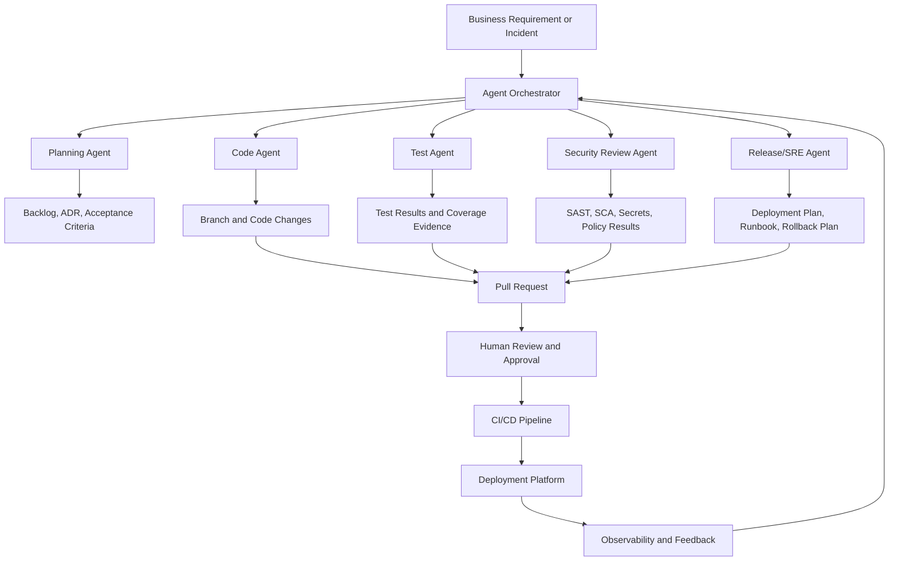
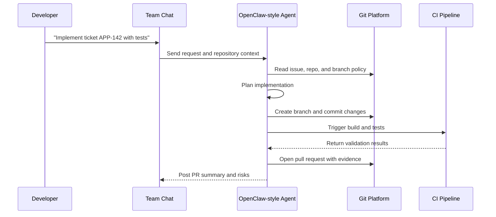

# Understanding Coding Agents and Enterprise Delivery Automation

Coding agents are AI-assisted software engineering systems that can understand requirements, inspect repositories, plan changes, edit code, run validation, open pull requests, and help operate production systems. They are not only chatbots that answer programming questions; mature agents combine an LLM with tools, repository access, execution environments, policy controls, and feedback loops.

The enterprise value is not replacing engineering judgment. The value is reducing hand-offs, automating repetitive delivery work, improving consistency, and making development, release, and SRE processes more observable.

## 1. What is a Coding Agent?

A coding agent usually has these capabilities:

| Capability | What it does | Enterprise use |
| --- | --- | --- |
| Repository understanding | Reads code, documentation, tests, configuration, and history | Onboarding, impact analysis, dependency mapping |
| Planning | Converts a requirement into a sequence of engineering tasks | Story refinement, solution design, backlog decomposition |
| Code modification | Creates or updates source code, tests, scripts, docs, or configuration | Feature implementation, bug fixes, migrations |
| Tool execution | Runs tests, builds, linters, security scans, and local commands | CI preparation, quality gates, repeatable verification |
| Pull request workflow | Produces a change set with summary and validation evidence | Code review acceleration, compliance evidence |
| Multi-agent collaboration | Splits research, coding, review, test, and operations tasks across agents | Parallel delivery and specialized automation |
| Operational automation | Reads alerts/logs, correlates signals, proposes remediation, and executes approved runbooks | SRE triage, incident response, deployment support |

## 2. Types of Agentic Development Solutions

### IDE and developer workstation agents

These tools run close to the developer and are best for interactive coding.

Examples:

- GitHub Copilot Chat and Copilot coding agent
- Cursor
- Continue
- Cline
- Aider
- Codeium/Windsurf-style IDE agents

Best use cases:

- Code explanation
- Local refactoring
- Unit test generation
- Small feature implementation
- Developer onboarding
- Interactive debugging

### Repository and pull-request agents

These agents work directly against issues, branches, and pull requests.

Examples:

- GitHub Copilot coding agent
- OpenHands
- SWE-agent
- Aider in CI or containerized mode
- Custom GitHub App or GitHub Actions based agents

Best use cases:

- Issue-to-PR automation
- Dependency update fixes
- Test repair
- Documentation generation
- Migration tasks across many files
- Review feedback resolution

### Workflow and multi-agent frameworks

These tools help build custom agent workflows instead of only coding inside an IDE.

Examples:

- LangGraph
- Microsoft AutoGen
- CrewAI
- Semantic Kernel
- LlamaIndex agent workflows
- Haystack agents

Best use cases:

- Enterprise approval workflows
- Multi-agent planning and review
- Connecting internal systems such as Jira, ServiceNow, GitHub, Backstage, Argo CD, Datadog, Splunk, or PagerDuty
- Building reusable delivery automations

### Self-hosted automation agents

Self-hosted agents are useful when privacy, network access, model routing, and enterprise controls matter.

Examples:

- OpenClaw-style self-hosted automation and coding agents
- OpenHands deployed in an internal environment
- Aider or SWE-agent running in controlled containers
- Internal agent platforms built on LangGraph, AutoGen, or CrewAI

Best use cases:

- Running agents inside a corporate network
- Keeping source code and telemetry under enterprise control
- Using approved models and gateways
- Integrating with internal development platforms
- Automating operational runbooks with human approval

## 3. How Coding Agents Substitute or Improve Enterprise Development Processes

Coding agents do not remove the need for product owners, engineers, architects, security, release managers, or SRE teams. They can substitute repetitive process steps and provide first-draft work products that humans review.

| Enterprise process | Traditional approach | Agent-assisted approach |
| --- | --- | --- |
| Requirement analysis | Meetings, manual notes, manual story slicing | Agent summarizes requirement, identifies affected systems, drafts acceptance criteria |
| Architecture review | Manual diagram and document creation | Agent generates initial architecture options, trade-offs, ADR draft, and dependency list |
| Development | Engineer manually searches code and writes changes | Agent explores repo, proposes plan, implements scoped change, and runs tests |
| Code review | Human reviewers find style, missing tests, and obvious bugs | Agent performs first-pass review; humans focus on design, risk, domain correctness |
| Testing | Manual test identification and regression selection | Agent maps change to impacted tests, generates unit/integration tests, runs validation |
| Security review | Late-stage scanning and manual interpretation | Agent runs SAST/SCA checks, explains findings, proposes secure fixes |
| Release notes | Manual collection from commits and tickets | Agent generates release summary, migration notes, rollback steps |
| Deployment | Release manager coordinates runbook steps | Agent executes approved checklist and records evidence |
| SRE operations | Engineers search dashboards/logs manually | Agent correlates alerts, logs, traces, recent deployments, and known issues |
| Incident postmortem | Manual timeline reconstruction | Agent builds draft timeline, impact summary, root cause hypotheses, and action items |

## 4. Reference Architecture for Enterprise Coding Agents

A production-grade agent platform should include:

- Identity and access management
- Least-privilege repository permissions
- Tool allowlists
- Isolated execution sandboxes
- Model gateway and prompt logging controls
- Secret redaction
- Human approval for risky actions
- Audit trails for every command, file change, and external action
- Integration with CI/CD, ticketing, observability, and incident management systems

## 5. Step-by-Step Guide: Using a Coding Agent for Development

### Step 1: Select the right task

Good first tasks:

- Documentation updates
- Unit test generation
- Small bug fixes
- Dependency upgrade fixes
- Code cleanup with strong tests
- API client generation
- Migration of repeated patterns

Avoid early automation for:

- Ambiguous product decisions
- High-risk data model changes
- Security-sensitive authentication changes without expert review
- Production incident remediation without approval gates

### Step 2: Prepare the repository

A coding agent works better when the repository has:

- Clear README and local setup instructions
- Build, lint, and test commands
- Small, reliable test suites
- Consistent code style
- Pull request template
- Architecture notes or ADRs
- Environment examples without secrets
- CI pipeline that can run on every pull request

### Step 3: Write an agent-ready request

A good request includes:

- Business goal
- Files or modules likely involved
- Constraints and non-goals
- Expected tests or validation
- Security and compliance expectations
- Definition of done

Example:

> Add request validation to the customer profile API. Keep the public response schema unchanged. Add unit tests for missing required fields and invalid email format. Run the existing backend test suite. Do not change database migrations.

### Step 4: Ask for a plan before implementation

Before code changes, require the agent to:

- Inspect relevant files
- Identify build/test commands
- Describe impacted areas
- Call out assumptions
- Provide a small implementation plan

### Step 5: Let the agent implement in a branch

The agent should:

- Make small changes
- Update tests
- Run validation
- Avoid unrelated formatting
- Produce a clear pull request summary
- Document unresolved risks

### Step 6: Review the change like any human contribution

Human review should check:

- Requirement correctness
- Domain logic
- Security implications
- Data handling
- Backward compatibility
- Observability
- Operational risk
- Maintainability

### Step 7: Capture learning

After merge, improve the agent workflow by updating:

- Repository instructions
- Test commands
- Code style guidance
- Runbooks
- Known failure patterns
- Prompt templates

## 6. Step-by-Step Guide: Building an Open-Source Agent Workflow

The following examples use open-source tools and can be adapted to enterprise environments.

### Option A: OpenClaw-style self-hosted coding and automation agent

Use this pattern when the organization wants a private, self-hosted personal or team agent that can connect to collaboration channels and internal tools.

Implementation steps:

1. Deploy the agent runtime in a controlled environment.
2. Connect approved model providers or local models through an enterprise model gateway.
3. Configure source control access with read-only permissions first.
4. Add tool permissions gradually: file read, file write, test execution, pull request creation.
5. Create skills or workflows for common tasks such as issue triage, branch creation, test execution, and release note generation.
6. Connect collaboration channels such as Slack, Teams, Discord, or internal chat only after access rules are defined.
7. Require approval before shell commands, deployment commands, or production changes.
8. Store execution logs and decisions in an auditable location.
9. Measure productivity, defect leakage, review quality, and incident response improvements.

Example workflow:

### Option B: Aider for local pair programming

Aider is useful for developers who want a command-line pair programmer working directly with Git.

Implementation steps:

1. Install Aider in the developer environment.
2. Start it from the repository root.
3. Add only the files that should be modified to the context.
4. Ask for a focused change.
5. Review the diff after each agent change.
6. Run tests locally.
7. Commit only after human review.

Best fit:

- Small and medium changes
- Refactoring with tight feedback
- Writing tests for known functions
- Documentation close to code

Enterprise maturity controls:

- Use approved model endpoints
- Restrict sensitive repositories
- Require local pre-commit checks
- Train developers to review every diff

### Option C: OpenHands for issue-to-PR automation

OpenHands-style workflows are useful when an agent needs a browser, shell, editor, and repository tools inside a sandbox.

Implementation steps:

1. Run the agent in a containerized sandbox.
2. Mount or clone only the target repository.
3. Provide task instructions from a GitHub issue or Jira ticket.
4. Let the agent inspect files and run tests.
5. Require the agent to produce a pull request instead of pushing directly to main.
6. Run CI and security checks.
7. Route the pull request to code owners.

Best fit:

- Bug fixes with reproducible tests
- Documentation generation
- Framework upgrades
- Cross-file code migrations

### Option D: SWE-agent for benchmark-style bug fixing

SWE-agent-style workflows are useful for structured repair tasks where the agent can search code, edit, and run tests.

Implementation steps:

1. Define a bug report with expected behavior.
2. Provide the repository and failing test if available.
3. Run the agent in a sandbox.
4. Let it identify the failing area.
5. Let it patch code and execute tests.
6. Export the final patch for human review.

Best fit:

- Regression fixes
- Test-driven repair
- Library upgrade breakages

### Option E: LangGraph, AutoGen, or CrewAI for enterprise orchestration

Use orchestration frameworks when a single coding agent is not enough.

Example agents:

- Product analyst agent: turns business request into acceptance criteria
- Architect agent: identifies impacted components and risks
- Developer agent: makes code changes
- Test agent: generates and runs tests
- Security agent: reviews vulnerabilities and compliance rules
- Release agent: prepares deployment and rollback plan
- SRE agent: watches deployment health and incident signals

Implementation steps:

1. Define each agent role and allowed tools.
2. Add a shared state object for requirement, code diff, test results, and approvals.
3. Add routing rules so high-risk changes require human approval.
4. Integrate with GitHub, Jira, CI/CD, artifact repository, and observability tools.
5. Store every decision and action as audit evidence.
6. Start with documentation and test automation before production changes.

## 7. Managing Development and Deployment with Agents

### Agent-assisted software delivery lifecycle

```mermaid
flowchart LR
    A[Idea] --> B[Agent drafts story]
    B --> C[Human validates priority]
    C --> D[Agent creates implementation plan]
    D --> E[Agent implements code and tests]
    E --> F[CI quality gates]
    F --> G[Agent summarizes PR]
    G --> H[Human code review]
    H --> I[Agent prepares release notes]
    I --> J[Deployment approval]
    J --> K[Agent monitors deployment]
    K --> L[Feedback into backlog]
```

### Development functions agents can manage

- Requirement clarification and acceptance criteria drafting
- Repository impact analysis
- API contract review
- Test case generation
- Refactoring proposals
- Pull request summaries
- Dependency upgrade remediation
- Documentation updates
- Migration guides
- Developer onboarding guides

### Deployment functions agents can manage

- Release checklist generation
- Change risk classification
- Deployment window preparation
- Environment readiness checks
- Feature flag verification
- Smoke test execution
- Rollback plan generation
- Release note generation
- Post-deployment health checks

### SRE functions agents can manage

- Alert enrichment
- Log and trace correlation
- Recent deployment correlation
- Runbook recommendation
- Incident timeline drafting
- Error budget reporting
- Capacity and saturation analysis
- Toil identification
- Post-incident action item tracking

## 8. SRE Example: Agent-Assisted Incident Triage

Scenario: API latency increases after a new deployment.

Agent workflow:

1. Receive alert from monitoring platform.
2. Pull service ownership from catalog.
3. Check recent deployments for the impacted service.
4. Query logs for new exceptions or timeout patterns.
5. Query traces for slow downstream calls.
6. Compare metrics before and after deployment.
7. Suggest likely cause and confidence level.
8. Recommend approved runbook actions.
9. Ask human incident commander for approval before remediation.
10. Draft incident timeline and customer impact summary.

Example output expected from the agent:

- Impacted service: `customer-profile-api`
- Symptom: p95 latency increased from 250 ms to 2.4 seconds
- Likely cause: downstream identity service timeout after version `2026.05.03.4`
- Suggested action: disable feature flag `identity-enrichment-v2`
- Required approval: incident commander
- Evidence: deployment ID, dashboard link, top trace IDs, error log samples

## 9. Product Release Example: Agent-Assisted Release Management

Scenario: A team is releasing a new customer onboarding workflow.

Agent-managed release package:

- Scope summary
- Changed services
- Database migration list
- API contract changes
- Feature flags
- Test evidence
- Security scan results
- Risk classification
- Rollback plan
- Customer support notes
- Monitoring dashboard links
- Go/no-go checklist

Release maturity pattern:

1. Agent generates the release package from commits, pull requests, tickets, and CI results.
2. Product owner validates customer-facing scope.
3. Engineering lead validates technical risk.
4. Security validates policy exceptions.
5. SRE validates monitoring and rollback readiness.
6. Release manager approves deployment.
7. Agent monitors deployment and posts health summaries.

## 10. Controls Required for Enterprise Adoption

### Security controls

- Do not expose secrets to prompts or logs.
- Use secret scanning before and after agent changes.
- Restrict agent access by repository and environment.
- Use short-lived credentials.
- Require human approval for production actions.
- Maintain a command allowlist and block dangerous shell operations.
- Log all agent actions.

### Compliance controls

- Map agent activity to user identity or service identity.
- Store prompts, plans, diffs, test results, and approvals where required.
- Preserve pull request evidence.
- Enforce code owner review.
- Require policy-as-code checks for regulated systems.

### Engineering controls

- Keep tasks small.
- Require tests for behavior changes.
- Require CI validation.
- Avoid agent changes directly on main branches.
- Use branch protection.
- Review generated code for maintainability and licensing risk.

### Operational controls

- Separate development agents from production agents.
- Use read-only production access by default.
- Require approval for remediation.
- Tie actions to runbooks.
- Record incident decisions.
- Add automatic rollback only after strong maturity is demonstrated.

## 11. Maturity Model for Coding Agents

| Level | Name | Characteristics | Recommended focus |
| --- | --- | --- | --- |
| 0 | Manual | AI used only as chat assistance | Teach prompt hygiene and security basics |
| 1 | Assisted developer | Agents help write code locally | IDE agents, unit tests, documentation |
| 2 | PR automation | Agents create scoped pull requests | CI gates, code owner review, PR templates |
| 3 | Workflow automation | Agents participate in backlog, testing, security, and release workflows | Orchestration, audit evidence, policy checks |
| 4 | SRE augmentation | Agents triage incidents and recommend runbook actions | Observability integration, incident timelines, approval workflows |
| 5 | Governed autonomy | Agents execute low-risk approved actions automatically | Risk scoring, automatic rollback, continuous learning |

## 12. Metrics to Track

### Delivery metrics

- Lead time for change
- Pull request cycle time
- Review turnaround time
- Build failure rate
- Deployment frequency
- Change failure rate
- Mean time to restore

### Quality metrics

- Defect leakage
- Escaped production incidents
- Test coverage for agent changes
- Reopened pull requests
- Security findings introduced by agent changes

### Productivity metrics

- Engineering hours saved
- Toil reduction
- Number of automated runbook executions
- Documentation freshness
- Onboarding time reduction

### Governance metrics

- Percentage of agent actions with audit evidence
- Percentage of production actions with approval
- Policy violation rate
- Secret exposure attempts blocked

## 13. Practical Enterprise Rollout Plan

### Phase 1: Foundation

- Choose approved agent tools.
- Define security and data handling policy.
- Create repository instructions for agents.
- Standardize build, test, and lint commands.
- Start with documentation and test generation.

### Phase 2: Controlled development automation

- Allow agents to create pull requests.
- Require human review and CI gates.
- Add code owner and security review requirements.
- Track quality and delivery metrics.

### Phase 3: Release automation

- Generate release notes, risk summaries, and rollback plans.
- Integrate agents with CI/CD read access.
- Add deployment checklist automation.
- Keep production deployment execution human-approved.

### Phase 4: SRE augmentation

- Connect observability tools with read-only access.
- Create incident triage agents.
- Generate timelines and runbook recommendations.
- Require incident commander approval for action.

### Phase 5: Governed autonomy

- Allow low-risk automated actions.
- Use policy-as-code and risk scoring.
- Continuously evaluate quality, safety, and business outcomes.
- Expand autonomy only where metrics prove reliability.

## 14. Example Agent Operating Model

| Role | Human owner | Agent support |
| --- | --- | --- |
| Product owner | Owns priority and business outcome | Drafts stories, acceptance criteria, release notes |
| Architect | Owns design decisions and standards | Drafts ADRs, dependency maps, trade-off analysis |
| Developer | Owns implementation quality | Generates code, tests, refactors, docs |
| Reviewer | Owns code approval | Performs first-pass review and checklist validation |
| Security engineer | Owns policy and risk decisions | Runs scans, explains findings, proposes fixes |
| Release manager | Owns release coordination | Builds release package and deployment checklist |
| SRE | Owns reliability and operations | Triage, runbook recommendations, postmortem drafts |

## 15. Common Anti-Patterns

- Giving agents broad production access too early
- Accepting generated code without human review
- Using agents on large ambiguous tasks
- Missing tests and validation commands
- Allowing agents to bypass CI/CD
- Not logging prompts, commands, and decisions
- Treating agents as replacements for accountability
- Ignoring licensing and data privacy risk
- Running agents with long-lived credentials
- Automating remediation without runbooks

## 16. Definition of Done for Agent-Generated Changes

A mature team should require:

- Clear requirement traceability
- Small scoped branch
- Code changes only where needed
- Tests added or updated
- Build, lint, and test evidence
- Security scan evidence
- Human review approval
- Release and rollback notes when applicable
- Observability updates for production changes
- Audit record of agent actions

## 17. Summary

Coding agents can significantly mature enterprise delivery when they are treated as governed engineering automation. The safest adoption path is incremental: start with documentation and test generation, move to pull-request automation, then release support, then SRE augmentation, and only later limited autonomous operations.

The target operating model is a human-led, agent-accelerated software delivery lifecycle where agents perform repetitive analysis and execution while humans retain ownership of product decisions, architecture, security, reliability, and production accountability.
