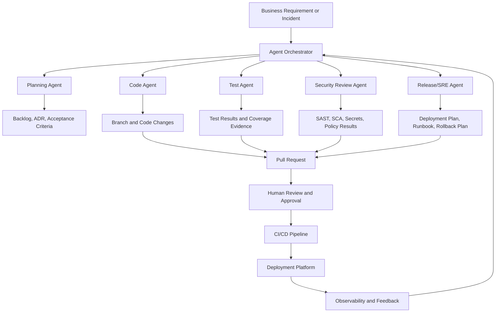
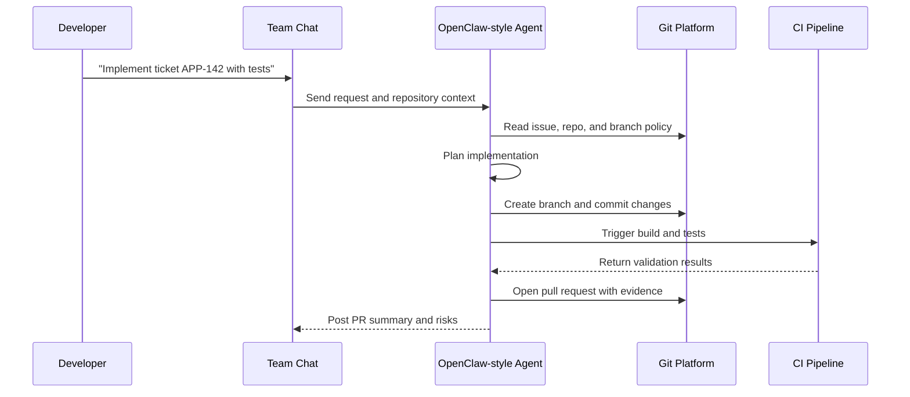
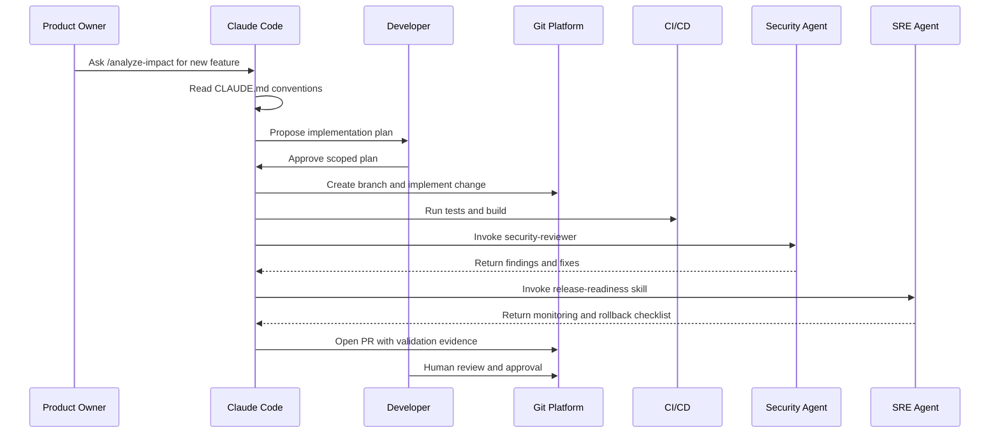
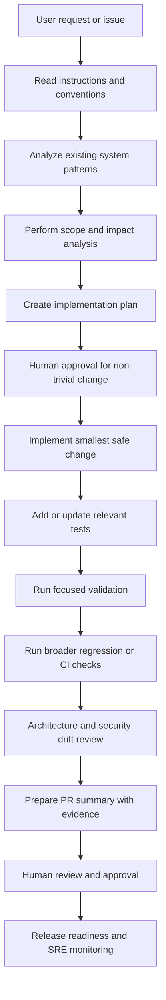

# Understanding Coding Agents and Enterprise Delivery Automation

_Last reviewed: 2026-05-03. AI coding-agent capabilities, product names, and patent publications change quickly; use this as an implementation guide and verify vendor-specific features against official documentation before procurement or production rollout._

Coding agents are AI-assisted software engineering systems that can understand requirements, inspect repositories, plan changes, edit code, run validation, open pull requests, and help operate production systems. They are not only chatbots that answer programming questions; mature agents combine an LLM with tools, repository access, execution environments, policy controls, and feedback loops.

The enterprise value is not replacing engineering judgment. The value is reducing hand-offs, automating repetitive delivery work, improving consistency, and making development, release, and SRE processes more observable.

## 1. What is a Coding Agent?

A coding agent usually has these capabilities:

| Capability | What it does | Enterprise use |
| --- | --- | --- |
| Repository understanding | Reads code, documentation, tests, configuration, and history | Onboarding, impact analysis, dependency mapping |
| Planning | Converts a requirement into a sequence of engineering tasks | Story refinement, solution design, backlog decomposition |
| Code modification | Creates or updates source code, tests, scripts, docs, or configuration | Feature implementation, bug fixes, migrations |
| Tool execution | Runs tests, builds, linters, security scans, and local commands | CI preparation, quality gates, repeatable verification |
| Pull request workflow | Produces a change set with summary and validation evidence | Code review acceleration, compliance evidence |
| Multi-agent collaboration | Splits research, coding, review, test, and operations tasks across agents | Parallel delivery and specialized automation |
| Operational automation | Reads alerts/logs, correlates signals, proposes remediation, and executes approved runbooks | SRE triage, incident response, deployment support |

## 2. Types of Agentic Development Solutions

### IDE and developer workstation agents

These tools run close to the developer and are best for interactive coding.

Examples:

- GitHub Copilot Chat and Copilot coding agent
- Cursor
- Continue
- Cline
- Aider
- Codeium/Windsurf-style IDE agents

Best use cases:

- Code explanation
- Local refactoring
- Unit test generation
- Small feature implementation
- Developer onboarding
- Interactive debugging

### Repository and pull-request agents

These agents work directly against issues, branches, and pull requests.

Examples:

- GitHub Copilot coding agent
- OpenHands
- SWE-agent
- Aider in CI or containerized mode
- Custom GitHub App or GitHub Actions based agents

Best use cases:

- Issue-to-PR automation
- Dependency update fixes
- Test repair
- Documentation generation
- Migration tasks across many files
- Review feedback resolution

### Workflow and multi-agent frameworks

These tools help build custom agent workflows instead of only coding inside an IDE.

Examples:

- LangGraph
- Microsoft AutoGen
- CrewAI
- Semantic Kernel
- LlamaIndex agent workflows
- Haystack agents

Best use cases:

- Enterprise approval workflows
- Multi-agent planning and review
- Connecting internal systems such as Jira, ServiceNow, GitHub, Backstage, Argo CD, Datadog, Splunk, or PagerDuty
- Building reusable delivery automations

### Self-hosted automation agents

Self-hosted agents are useful when privacy, network access, model routing, and enterprise controls matter.

Examples:

- OpenClaw-style self-hosted automation and coding agents
- OpenHands deployed in an internal environment
- Aider or SWE-agent running in controlled containers
- Internal agent platforms built on LangGraph, AutoGen, or CrewAI

Best use cases:

- Running agents inside a corporate network
- Keeping source code and telemetry under enterprise control
- Using approved models and gateways
- Integrating with internal development platforms
- Automating operational runbooks with human approval

## 3. How Coding Agents Substitute or Improve Enterprise Development Processes

Coding agents do not remove the need for product owners, engineers, architects, security, release managers, or SRE teams. They can substitute repetitive process steps and provide first-draft work products that humans review.

| Enterprise process | Traditional approach | Agent-assisted approach |
| --- | --- | --- |
| Requirement analysis | Meetings, manual notes, manual story slicing | Agent summarizes requirement, identifies affected systems, drafts acceptance criteria |
| Architecture review | Manual diagram and document creation | Agent generates initial architecture options, trade-offs, ADR draft, and dependency list |
| Development | Engineer manually searches code and writes changes | Agent explores repo, proposes plan, implements scoped change, and runs tests |
| Code review | Human reviewers find style, missing tests, and obvious bugs | Agent performs first-pass review; humans focus on design, risk, domain correctness |
| Testing | Manual test identification and regression selection | Agent maps change to impacted tests, generates unit/integration tests, runs validation |
| Security review | Late-stage scanning and manual interpretation | Agent runs SAST/SCA checks, explains findings, proposes secure fixes |
| Release notes | Manual collection from commits and tickets | Agent generates release summary, migration notes, rollback steps |
| Deployment | Release manager coordinates runbook steps | Agent executes approved checklist and records evidence |
| SRE operations | Engineers search dashboards/logs manually | Agent correlates alerts, logs, traces, recent deployments, and known issues |
| Incident postmortem | Manual timeline reconstruction | Agent builds draft timeline, impact summary, root cause hypotheses, and action items |

## 4. Reference Architecture for Enterprise Coding Agents



A production-grade agent platform should include:

- Identity and access management
- Least-privilege repository permissions
- Tool allowlists
- Isolated execution sandboxes
- Model gateway and prompt logging controls
- Secret redaction
- Human approval for risky actions
- Audit trails for every command, file change, and external action
- Integration with CI/CD, ticketing, observability, and incident management systems

## 5. Step-by-Step Guide: Using a Coding Agent for Development

### Step 1: Select the right task

Good first tasks:

- Documentation updates
- Unit test generation
- Small bug fixes
- Dependency upgrade fixes
- Code cleanup with strong tests
- API client generation
- Migration of repeated patterns

Avoid early automation for:

- Ambiguous product decisions
- High-risk data model changes
- Security-sensitive authentication changes without expert review
- Production incident remediation without approval gates

### Step 2: Prepare the repository

A coding agent works better when the repository has:

- Clear README and local setup instructions
- Build, lint, and test commands
- Small, reliable test suites
- Consistent code style
- Pull request template
- Architecture notes or ADRs
- Environment examples without secrets
- CI pipeline that can run on every pull request

### Step 3: Write an agent-ready request

A good request includes:

- Business goal
- Files or modules likely involved
- Constraints and non-goals
- Expected tests or validation
- Security and compliance expectations
- Definition of done

Example:

> Add request validation to the customer profile API. Keep the public response schema unchanged. Add unit tests for missing required fields and invalid email format. Run the existing backend test suite. Do not change database migrations.

### Step 4: Ask for a plan before implementation

Before code changes, require the agent to:

- Inspect relevant files
- Identify build/test commands
- Describe impacted areas
- Call out assumptions
- Provide a small implementation plan

### Step 5: Let the agent implement in a branch

The agent should:

- Make small changes
- Update tests
- Run validation
- Avoid unrelated formatting
- Produce a clear pull request summary
- Document unresolved risks

### Step 6: Review the change like any human contribution

Human review should check:

- Requirement correctness
- Domain logic
- Security implications
- Data handling
- Backward compatibility
- Observability
- Operational risk
- Maintainability

### Step 7: Capture learning

After merge, improve the agent workflow by updating:

- Repository instructions
- Test commands
- Code style guidance
- Runbooks
- Known failure patterns
- Prompt templates

## 6. Step-by-Step Guide: Building an Open-Source Agent Workflow

The following examples use open-source tools and can be adapted to enterprise environments.

### Option A: OpenClaw-style self-hosted coding and automation agent

Use this pattern when the organization wants a private, self-hosted personal or team agent that can connect to collaboration channels and internal tools.

Implementation steps:

1. Deploy the agent runtime in a controlled environment.
2. Connect approved model providers or local models through an enterprise model gateway.
3. Configure source control access with read-only permissions first.
4. Add tool permissions gradually: file read, file write, test execution, pull request creation.
5. Create skills or workflows for common tasks such as issue triage, branch creation, test execution, and release note generation.
6. Connect collaboration channels such as Slack, Teams, Discord, or internal chat only after access rules are defined.
7. Require approval before shell commands, deployment commands, or production changes.
8. Store execution logs and decisions in an auditable location.
9. Measure productivity, defect leakage, review quality, and incident response improvements.

Example workflow:



### Option B: Aider for local pair programming

Aider is useful for developers who want a command-line pair programmer working directly with Git.

Implementation steps:

1. Install Aider in the developer environment.
2. Start it from the repository root.
3. Add only the files that should be modified to the context.
4. Ask for a focused change.
5. Review the diff after each agent change.
6. Run tests locally.
7. Commit only after human review.

Best fit:

- Small and medium changes
- Refactoring with tight feedback
- Writing tests for known functions
- Documentation close to code

Enterprise maturity controls:

- Use approved model endpoints
- Restrict sensitive repositories
- Require local pre-commit checks
- Train developers to review every diff

### Option C: OpenHands for issue-to-PR automation

OpenHands-style workflows are useful when an agent needs a browser, shell, editor, and repository tools inside a sandbox.

Implementation steps:

1. Run the agent in a containerized sandbox.
2. Mount or clone only the target repository.
3. Provide task instructions from a GitHub issue or Jira ticket.
4. Let the agent inspect files and run tests.
5. Require the agent to produce a pull request instead of pushing directly to main.
6. Run CI and security checks.
7. Route the pull request to code owners.

Best fit:

- Bug fixes with reproducible tests
- Documentation generation
- Framework upgrades
- Cross-file code migrations

### Option D: SWE-agent for benchmark-style bug fixing

SWE-agent-style workflows are useful for structured repair tasks where the agent can search code, edit, and run tests.

Implementation steps:

1. Define a bug report with expected behavior.
2. Provide the repository and failing test if available.
3. Run the agent in a sandbox.
4. Let it identify the failing area.
5. Let it patch code and execute tests.
6. Export the final patch for human review.

Best fit:

- Regression fixes
- Test-driven repair
- Library upgrade breakages

### Option E: LangGraph, AutoGen, or CrewAI for enterprise orchestration

Use orchestration frameworks when a single coding agent is not enough.

Example agents:

- Product analyst agent: turns business request into acceptance criteria
- Architect agent: identifies impacted components and risks
- Developer agent: makes code changes
- Test agent: generates and runs tests
- Security agent: reviews vulnerabilities and compliance rules
- Release agent: prepares deployment and rollback plan
- SRE agent: watches deployment health and incident signals

Implementation steps:

1. Define each agent role and allowed tools.
2. Add a shared state object for requirement, code diff, test results, and approvals.
3. Add routing rules so high-risk changes require human approval.
4. Integrate with GitHub, Jira, CI/CD, artifact repository, and observability tools.
5. Store every decision and action as audit evidence.
6. Start with documentation and test automation before production changes.


## 7. Claude Code: Conventions, Agents, Skills, Commands, and Hooks

Claude Code is an agentic coding environment that works from a terminal or development workflow and can inspect code, edit files, run commands, invoke tools, use specialized subagents, and follow repository-specific instructions. For enterprise teams, the most important concept is not only the chat interface; it is the ability to encode engineering conventions and repeatable processes so every agent-assisted change follows the same standards.

### Core Claude Code concepts

| Concept | Purpose | How enterprise teams should use it |
| --- | --- | --- |
| `CLAUDE.md` | Project memory and repository instructions | Store coding standards, build/test commands, architecture rules, security expectations, and PR rules |
| Subagents / agents | Specialized assistants with focused responsibilities | Define agents for code review, testing, documentation, release, SRE, security, migration, and architecture |
| Skills | Reusable task modules with instructions and optional assets/scripts | Package repeatable workflows such as release-note generation, incident triage, API documentation, or migration checklists |
| Slash commands | Named shortcuts for common prompts or workflows | Standardize repetitive actions such as `/review-pr`, `/write-tests`, `/prepare-release`, `/triage-incident` |
| Hooks | Lifecycle automation around agent actions | Enforce policy checks, logging, formatting, test execution, approval prompts, and security gates |
| Tool permissions | Controls for what the agent can read, edit, or run | Apply least privilege and separate development, release, and production capabilities |
| MCP servers | External tool integrations | Connect approved systems such as GitHub, Jira, ServiceNow, Backstage, observability, security scanners, and cloud APIs |

### `CLAUDE.md`: building repository conventions

A `CLAUDE.md` file is the best place to define how Claude Code should behave in a specific repository. It should be treated like an engineering operating manual for agents.

Recommended sections:

1. **Repository purpose**: what the system does and who owns it.
2. **Architecture overview**: major modules, boundaries, and integration points.
3. **Build and test commands**: exact commands for linting, unit tests, integration tests, and local builds.
4. **Coding conventions**: naming, formatting, error handling, logging, API patterns, dependency rules.
5. **Security rules**: secret handling, authentication patterns, input validation, data protection, dependency scanning.
6. **Testing expectations**: when to add unit, contract, integration, or end-to-end tests.
7. **Pull request expectations**: summary format, validation evidence, risk notes, rollback notes.
8. **Non-goals and guardrails**: files not to edit, commands not to run, production actions that require approval.
9. **Domain glossary**: business terms and domain-specific concepts.
10. **Known pitfalls**: flaky tests, migration risks, compatibility constraints, operational constraints.

Example convention structure:

```markdown
# CLAUDE.md

## Repository purpose
This service manages customer onboarding workflows and exposes REST APIs used by web and mobile channels.

## Required validation
- Run unit tests before finalizing code changes.
- Run API contract tests when request or response schemas change.
- Run security scanning when dependencies or authentication logic changes.

## Coding conventions
- Keep changes small and scoped to the user request.
- Do not modify unrelated formatting.
- Add tests for behavior changes.
- Preserve backward compatibility for public APIs unless explicitly requested.

## Security rules
- Never print or commit secrets.
- Validate all external input.
- Use existing authentication and authorization helpers.
- Do not introduce new dependencies without review.

## Pull request requirements
- Summarize user-visible changes.
- List validation commands and results.
- Document risks, migrations, feature flags, and rollback plan when applicable.
```

How to mature `CLAUDE.md`:

- Start with build/test commands and basic coding standards.
- Add domain glossary and architecture boundaries.
- Add security and compliance requirements.
- Add release and rollback expectations.
- Add SRE runbook links and incident conventions.
- Review and update it after every failed agent task.

### Claude Code subagents: defining specialized agents

Subagents are specialized agent profiles that focus Claude on a role. Instead of asking one general agent to do everything, define narrow agents with clear responsibilities and tool boundaries.

Typical enterprise subagents:

| Agent | Responsibility | Allowed tools | Human approval needed |
| --- | --- | --- | --- |
| `code-reviewer` | Review diffs for correctness, maintainability, and missing tests | Read files, inspect diffs | No, if read-only |
| `test-engineer` | Identify impacted tests, generate test cases, run test commands | Read/write tests, run test commands | No for local tests |
| `security-reviewer` | Check authentication, authorization, input validation, secrets, dependency risk | Read code, run scanners | Yes for policy exceptions |
| `release-manager` | Generate release notes, deployment checklist, rollback plan | Read commits, PRs, CI results | Yes before deployment |
| `sre-triage` | Analyze alerts, logs, traces, dashboards, and recent deployments | Read observability systems | Yes before remediation |
| `migration-agent` | Apply repeated mechanical changes across services | Read/write code, run tests | Yes for broad changes |
| `architect` | Draft ADRs, dependency maps, and option analysis | Read docs/code | Yes for final decisions |

Recommended agent definition fields:

- Name and purpose
- When to use the agent
- Inputs required
- Outputs expected
- Allowed tools
- Explicit boundaries
- Escalation rules
- Validation checklist

Example subagent definition pattern:

```markdown
---
name: code-reviewer
description: Reviews pull request diffs for correctness, maintainability, testing gaps, and security concerns. Use after code changes or before opening a PR.
tools: Read, Grep, Git
---

You are a senior code reviewer. Focus on correctness, maintainability, test coverage, security, and operational risk.

Do:
- Review only the changed files unless broader context is required.
- Identify blocking issues separately from suggestions.
- Check whether tests match the behavior change.
- Call out security and backward compatibility risks.

Do not:
- Rewrite code unless explicitly asked.
- Approve changes without validation evidence.
```

### Skills: reusable Claude capabilities

A Skill packages repeatable instructions, references, scripts, and templates so Claude can perform a task consistently. Skills are useful when a process is repeated across projects or teams.

Common locations:

- Personal skills: user-level Claude configuration, useful for individual workflows.
- Project skills: repository-level `.claude/skills/`, useful for team standards.
- Enterprise skills: centrally distributed skills, useful for common governance and platform processes.

A typical Skill contains:

```text
.claude/
  skills/
    release-readiness/
      SKILL.md
      references/
        release-policy.md
        rollback-template.md
      scripts/
        collect_ci_results.sh
```

A `SKILL.md` should include frontmatter and detailed instructions:

```markdown
---
name: release-readiness
description: Prepare a release readiness package with scope, risk, validation evidence, rollback plan, and SRE checklist. Use before production deployment or release approval.
---

## Goal
Create a complete release readiness summary for reviewers.

## Inputs
- Pull request or release branch
- Related issue or Jira ticket
- CI results
- Deployment environment

## Steps
1. Identify changed services, APIs, database migrations, feature flags, and configuration changes.
2. Collect build, test, lint, and security evidence.
3. Summarize customer impact and operational risk.
4. Produce rollback and monitoring steps.
5. List unresolved risks and required approvals.

## Output
Return a release package with sections for scope, risk, validation, rollback, monitoring, and approvals.
```

Good Skill candidates:

- `pr-review`: standard pull request review checklist
- `write-tests`: test generation rules for the repository
- `api-contract-review`: REST/GraphQL compatibility review
- `threat-model`: lightweight security review for a change
- `release-readiness`: release package and go/no-go checklist
- `incident-triage`: alert investigation and timeline creation
- `postmortem-draft`: incident retrospective template
- `dependency-upgrade`: dependency update and validation workflow
- `migration-playbook`: repeated migration steps across services
- `documentation-update`: docs quality and navigation standards

### Difference between `CLAUDE.md`, agents, Skills, commands, and hooks

| Mechanism | Best for | Example |
| --- | --- | --- |
| `CLAUDE.md` | Persistent repository-wide instructions | “Always run `bundle exec jekyll build` for docs changes.” |
| Subagent | Specialized role or persona | `security-reviewer` checks auth and data handling |
| Skill | Reusable task workflow | `release-readiness` creates release package |
| Slash command | Fast manual trigger | `/prepare-release 2026.05.03` |
| Hook | Automatic lifecycle enforcement | Run formatter before commit or block unsafe commands |
| MCP tool | External system integration | Read Jira ticket, GitHub PR, Datadog alert, or ServiceNow incident |

### Slash commands: standardizing repeated requests

Slash commands are useful for making agent usage predictable. They are essentially named workflows that users can invoke without rewriting a long prompt.

Useful enterprise slash commands:

| Command | Purpose |
| --- | --- |
| `/analyze-impact` | Identify impacted modules, APIs, data stores, tests, and teams |
| `/write-tests` | Generate or improve tests for the current change |
| `/review-pr` | Perform first-pass pull request review |
| `/prepare-release` | Generate release notes, risk summary, and rollback checklist |
| `/triage-incident` | Investigate alert context and recommend runbook actions |
| `/draft-adr` | Create an architecture decision record draft |
| `/security-check` | Review security implications of a change |
| `/update-docs` | Update documentation related to code changes |

Example command behavior for `/prepare-release`:

1. Read related issues and pull requests.
2. Summarize functional scope.
3. Identify changed services and configuration.
4. Collect CI and security scan evidence.
5. Identify deployment dependencies and feature flags.
6. Generate rollback plan.
7. Generate SRE monitoring checklist.
8. Ask for human approval before any deployment action.

### Hooks: enforcing guardrails automatically

Hooks help enforce enterprise policy around agent behavior. Use hooks to automate checks before or after important agent lifecycle events.

Examples:

| Hook moment | Enterprise use |
| --- | --- |
| Before tool execution | Block dangerous commands, require approval for production access |
| After file edit | Run formatter or detect secret patterns |
| Before commit | Run tests, lint, dependency checks, and license checks |
| Before PR creation | Require PR summary, validation evidence, and risk statement |
| Before deployment | Require change ticket, approvals, rollback plan, and monitoring link |
| After incident analysis | Store timeline and action items in incident system |

Hook design principles:

- Keep hooks deterministic.
- Make failures clear and actionable.
- Do not hide policy decisions inside prompts only.
- Prefer policy-as-code for security and compliance gates.
- Require human approval for irreversible or production-impacting actions.

### MCP and enterprise integrations

Model Context Protocol (MCP) integrations make Claude Code more useful by connecting agents to approved systems. MCP should be governed like any other integration layer.

Common enterprise MCP integrations:

- GitHub or GitLab for issues, branches, PRs, code search, and CI status
- Jira or Azure Boards for backlog and requirements
- ServiceNow for change records and incidents
- Backstage for service catalog and ownership
- Datadog, Grafana, Prometheus, Splunk, or OpenSearch for observability
- Snyk, Semgrep, CodeQL, Dependabot, or internal scanners for security
- Argo CD, Flux, Spinnaker, or Jenkins for deployment status
- Confluence or internal docs for runbooks and standards

Controls for MCP:

- Use read-only access first.
- Scope tokens by system, repository, and environment.
- Redact secrets from tool results.
- Log tool requests and responses where allowed.
- Add approval gates before write actions.
- Separate development MCP tools from production MCP tools.

### Example: Claude Code operating model for a feature



### Example: Claude Code SRE incident triage flow

1. User invokes `/triage-incident INC12345`.
2. Claude reads `CLAUDE.md` for incident conventions and escalation rules.
3. `sre-triage` agent gathers service ownership, recent deployments, dashboards, logs, and traces.
4. `incident-triage` Skill produces impact summary, suspected cause, evidence, and next steps.
5. Hook blocks production remediation unless the incident commander approves.
6. After approval, the agent can execute an approved runbook step or prepare the exact command for an SRE to run.
7. `postmortem-draft` Skill prepares timeline, root cause hypotheses, contributing factors, and action items.

### Example: building a Claude Code convention library

A mature enterprise should maintain a reusable convention library:

```text
platform-agent-standards/
  claude/
    base-CLAUDE.md
    agents/
      code-reviewer.md
      security-reviewer.md
      test-engineer.md
      release-manager.md
      sre-triage.md
    skills/
      release-readiness/
        SKILL.md
      incident-triage/
        SKILL.md
      api-contract-review/
        SKILL.md
      threat-model/
        SKILL.md
    commands/
      prepare-release.md
      review-pr.md
      triage-incident.md
    hooks/
      policy-checks.md
      command-approval.md
```

Adoption model:

1. Platform team creates baseline conventions.
2. Security and SRE teams add mandatory guardrails.
3. Application teams copy or inherit the baseline into repositories.
4. Teams add domain-specific details to local `CLAUDE.md`.
5. Failed or risky agent outcomes become updates to conventions, Skills, or hooks.
6. Metrics track which conventions improve quality and delivery time.

### How to decide whether to use an agent, Skill, command, or hook

| Need | Best mechanism |
| --- | --- |
| “Always follow this repository rule.” | `CLAUDE.md` |
| “Use a specialist reviewer for this type of work.” | Subagent |
| “Repeat this multi-step process across teams.” | Skill |
| “Let users trigger this workflow quickly.” | Slash command |
| “Automatically enforce this policy.” | Hook |
| “Read or update an external enterprise system.” | MCP tool |

### Claude Code maturity roadmap

| Stage | Practices |
| --- | --- |
| Beginner | One `CLAUDE.md`, manual prompts, read-only review tasks |
| Team adoption | Shared commands, basic subagents, project Skills, PR summaries |
| Enterprise governance | Standard agent library, Skills for release/security/SRE, hooks for policy checks |
| Platform integration | MCP integrations with Jira, GitHub, CI/CD, observability, ServiceNow |
| Controlled autonomy | Low-risk automated fixes and runbook actions with approval and audit logs |


## 8. GitHub Copilot: Instructions, Prompt Files, Coding Agent, and Team Conventions

GitHub Copilot is not only an autocomplete tool. In a mature engineering environment it becomes a set of AI-assisted workflows across the IDE, pull requests, issues, repository instructions, reusable prompts, and coding agents. The most important enterprise practice is to move from ad-hoc prompting to version-controlled conventions that keep generated work aligned with architecture, testing, security, and release standards.

### GitHub Copilot concepts

| Concept | Purpose | Enterprise usage |
| --- | --- | --- |
| Copilot Chat | Interactive assistant in IDE or GitHub UI | Ask questions, explain code, generate tests, review changes |
| Code completion | Inline coding suggestions | Accelerate common coding patterns while preserving developer review |
| Repository custom instructions | Persistent repo-level guidance | Keep Copilot aligned to project standards and architecture |
| Instruction files | Targeted instructions for specific file types or folders | Apply different rules for APIs, UI, tests, infrastructure, docs |
| Prompt files | Reusable prompt templates | Standardize workflows such as impact analysis, test generation, security review, release notes |
| Copilot coding agent | Issue-to-branch/PR implementation workflow | Let an agent implement scoped tasks with validation and PR evidence |
| Pull request summaries/review support | Summarize and review PR changes | Improve review speed and consistency |
| Extensions and MCP-like integrations | Connect tools and context | Bring issue, repo, CI, security, or operational data into the assistant context |

### Latest GitHub Copilot instruction conventions to include

GitHub documentation now separates repository guidance into three practical instruction layers:

1. **Repository-wide custom instructions** in `.github/copilot-instructions.md` for guidance that applies to the whole repository.
2. **Path-specific custom instructions** in `.github/instructions/NAME.instructions.md` with `applyTo` frontmatter for specific file paths or technologies.
3. **Agent instructions** through `AGENTS.md` files, where the nearest `AGENTS.md` in the directory tree can guide agent behavior for that area. For single-file cross-tool compatibility, root-level `CLAUDE.md` or `GEMINI.md` can also be used as agent instruction files.

This means a mature repository should not rely on one large instruction file. Use repository-wide instructions for stable truths, path-specific instructions for technology boundaries, and `AGENTS.md` or `CLAUDE.md` for agent execution rules.

### Copilot instruction file conventions

The common repository-level convention is:

```text
.github/
  copilot-instructions.md
```

Use this file for global repository rules that should influence Copilot across the project.

Recommended content:

```markdown
# Copilot Instructions

## Repository overview
Describe what the system does, core modules, and ownership.

## Architecture principles
- Follow the existing layered architecture.
- Do not introduce new frameworks without approval.
- Keep API contracts backward compatible unless explicitly requested.

## Coding standards
- Follow existing naming, formatting, and error-handling conventions.
- Prefer existing utilities over new helper libraries.
- Keep changes scoped to the requested task.

## Testing standards
- Add or update tests for behavior changes.
- Run the smallest relevant test first, then broader regression tests.
- Include contract tests when APIs change.

## Security standards
- Never log secrets or sensitive data.
- Validate all external input.
- Use existing authentication and authorization patterns.

## Pull request expectations
- Explain user-visible changes.
- List validation commands and results.
- Call out migration, deployment, rollback, and monitoring needs.
```

Good instructions are:

- Short enough to be consistently followed
- Specific to the repository
- Written as rules, not vague preferences
- Reviewed like code
- Updated when architectural decisions change
- Connected to tests and quality gates

Avoid:

- Long documents copied from generic standards
- Contradictory instructions
- Rules that are not enforced anywhere
- Secrets, credentials, or private operational details
- Instructions that encourage bypassing review or CI

### Targeted instruction files

For larger repositories, a single instruction file is not enough. Use targeted instruction files for specific areas.

Example structure:

```text
.github/
  copilot-instructions.md
  instructions/
    api.instructions.md
    frontend.instructions.md
    tests.instructions.md
    infrastructure.instructions.md
    security.instructions.md
```

Example targeted instruction pattern:

```markdown
---
applyTo: "src/api/**/*.ts"
---

# API Instructions

- Preserve backward-compatible response schemas.
- Validate request payloads at the boundary.
- Return standardized error objects.
- Add contract tests for public API changes.
- Update OpenAPI documentation when routes change.
```

Use targeted instructions when:

- Different modules use different frameworks
- Test files need different conventions from production files
- Infrastructure code needs stricter approval rules
- Security-sensitive code needs additional checks
- Documentation has navigation or formatting standards

### Copilot prompt files

Prompt files are reusable workflow prompts. They help teams avoid rewriting long prompts and reduce inconsistent results.

Common convention:

```text
.github/
  prompts/
    analyze-impact.prompt.md
    generate-tests.prompt.md
    review-pr.prompt.md
    prepare-release.prompt.md
    security-review.prompt.md
    incident-triage.prompt.md
```

Example `analyze-impact.prompt.md`:

```markdown
# Analyze Impact

Analyze the requested change before implementation.

Return:
1. Business capability impacted
2. Modules and files likely affected
3. APIs, events, database tables, configuration, and dependencies affected
4. Tests that should be run or added
5. Backward compatibility risks
6. Deployment and rollback considerations
7. Questions that must be answered before coding

Rules:
- Read existing code before proposing changes.
- Prefer existing patterns.
- Do not implement until the plan is approved.
```

Example `generate-tests.prompt.md`:

```markdown
# Generate Relevant Tests

Create or update tests for the current change.

Focus on:
- Changed behavior
- Edge cases
- Error paths
- Backward compatibility
- Contract expectations
- Regression coverage for the bug or feature

Rules:
- Use existing test frameworks and naming conventions.
- Do not add new test libraries unless explicitly approved.
- Prefer focused tests first, then broader integration tests when needed.
```

Example `architecture-drift-check.prompt.md`:

```markdown
# Architecture Drift Check

Review the proposed change for architecture drift.

Check:
- Does the change follow existing module boundaries?
- Does it introduce a new dependency where an existing pattern exists?
- Does it duplicate existing business logic?
- Does it bypass established service, repository, event, or API layers?
- Does it weaken observability, security, or operational standards?
- Should an ADR be created or updated?

Return blocking issues, non-blocking concerns, and recommended corrections.
```

### GitHub Copilot vs Claude Code concepts

| Capability | GitHub Copilot convention | Claude Code convention | Practical interpretation |
| --- | --- | --- | --- |
| Repository-wide instructions | `.github/copilot-instructions.md` | `CLAUDE.md` | Store durable project rules and validation expectations |
| Targeted instructions | `.github/instructions/*.instructions.md` or editor-supported instruction files | Additional project memory or scoped instructions | Use when modules need different rules |
| Reusable prompts | `.github/prompts/*.prompt.md` | Slash commands or command prompt files | Standardize repeated workflows |
| Specialized agent roles | Copilot coding agent task context and prompts | Subagents in `.claude/agents/` | Use role specialization for review, test, security, release, SRE |
| Reusable task packages | Prompt libraries and workspace conventions | Skills in `.claude/skills/` | Package repeatable enterprise workflows |
| Automatic enforcement | GitHub Actions, branch protection, code owners | Hooks plus CI/policy tools | Do not rely on prompt text alone for governance |
| External context | GitHub issues, PRs, code search, extensions | MCP servers and tools | Use approved integrations with least privilege |
| Change delivery | Issue-to-PR agent or IDE-assisted PR | Terminal agent branch/PR workflow | Require PR review and validation evidence |

### How to prevent coding and architecture drift

AI coding drift happens when generated code slowly diverges from intended architecture, naming, testing, security, and operational practices. Preventing drift requires instructions, examples, automated checks, and review gates.

Use this layered approach:

1. **Document rules** in Copilot instructions and Claude `CLAUDE.md`.
2. **Provide examples** by pointing agents to existing modules that represent the preferred pattern.
3. **Use prompt files and Skills** for repeatable workflows.
4. **Add automated checks** in CI for formatting, tests, API compatibility, security, and dependency policy.
5. **Require human review** for design, domain behavior, and production risk.
6. **Update instructions** when reviewers repeatedly correct the same agent behavior.

Architecture drift checklist:

- Does the change use existing modules and abstractions?
- Does it preserve service boundaries?
- Does it avoid duplicating domain logic?
- Does it use existing configuration, logging, metrics, and error handling patterns?
- Does it keep public API contracts backward compatible?
- Does it avoid unnecessary new dependencies?
- Does it follow existing deployment and feature flag patterns?
- Does it update documentation or ADRs when architecture changes?

### Teaching agents to learn from the existing system

Agents should not start by generating code from a generic pattern. They should first learn the local system.

A strong agent workflow asks the agent to inspect:

- Similar features already implemented
- Existing tests for the same module
- Error handling and logging conventions
- API request/response models
- Data access patterns
- Configuration and feature flag usage
- Security and authorization helpers
- CI workflow and validation commands
- Documentation and ADRs

Recommended prompt:

```markdown
Before implementing, inspect the existing codebase for similar functionality. Identify the files that show the preferred pattern. Explain the pattern and then apply the smallest consistent change. Do not introduce a new architecture if an existing pattern already solves the problem.
```

Expected agent output before coding:

- Similar files reviewed
- Pattern discovered
- Proposed impacted files
- Tests to add or update
- Risks and assumptions
- Validation commands

### Scope and impact analysis before code changes

Every agent-assisted change should begin with impact analysis.

Impact analysis dimensions:

| Dimension | Questions |
| --- | --- |
| Functional | What user journey or business capability changes? |
| Code | Which modules, files, APIs, events, jobs, or UI components are affected? |
| Data | Are schemas, migrations, retention, or PII handling affected? |
| Integration | Are downstream or upstream contracts affected? |
| Security | Are auth, authorization, secrets, validation, or audit logs affected? |
| Testing | Which unit, integration, contract, regression, and smoke tests are relevant? |
| Release | Are feature flags, configuration, rollback, or deployment order affected? |
| SRE | Are metrics, logs, traces, dashboards, alerts, or runbooks affected? |

Example Copilot or Claude prompt:

```markdown
Perform impact analysis for this requested change. Do not edit files yet. Read the repository and identify similar patterns. Return impacted modules, tests, architecture concerns, security concerns, release concerns, and open questions. Then propose the smallest safe implementation plan.
```

### Strong testing approach for AI-generated changes

AI-generated code should raise the testing bar, not lower it. The agent should select tests based on impact instead of running random or excessive test suites.

Testing pyramid for agent changes:

1. **Unit tests** for changed functions, services, validators, and edge cases.
2. **Contract tests** for API, event, schema, or integration boundary changes.
3. **Integration tests** for database, external service, workflow, or message processing changes.
4. **End-to-end or smoke tests** for critical user journeys.
5. **Regression tests** for bugs, especially when the failure mode is known.
6. **Security tests** for authentication, authorization, input validation, and sensitive data handling.
7. **Performance tests** for changes that affect hot paths, queries, batch jobs, or high-volume APIs.

Agent testing rules:

- First run the smallest test that proves the change.
- Add or update tests before broad refactoring.
- Run broader tests after focused tests pass.
- Do not delete failing tests to make the build pass.
- Document any unrelated pre-existing failures.
- Use existing test frameworks and fixtures.
- Include validation evidence in the pull request.

Relevant test selection example:

| Change type | Tests to prioritize |
| --- | --- |
| Request validation | Unit tests, API contract tests, negative tests |
| UI form change | Component tests, accessibility checks, relevant E2E smoke test |
| Database query change | Repository tests, integration tests, performance check for large data |
| Event schema change | Producer/consumer contract tests, backward compatibility tests |
| Authentication change | Security tests, authorization matrix tests, audit log checks |
| Deployment config change | Static config validation, environment smoke test, rollback check |
| Incident fix | Regression test that reproduces the incident symptom |

### Recommended enterprise file structure for AI coding standards

A combined Copilot and Claude setup can look like this:

```text
repo-root/
  CLAUDE.md
  .github/
    copilot-instructions.md
    instructions/
      api.instructions.md
      tests.instructions.md
      security.instructions.md
      infrastructure.instructions.md
    prompts/
      analyze-impact.prompt.md
      generate-tests.prompt.md
      architecture-drift-check.prompt.md
      prepare-release.prompt.md
      incident-triage.prompt.md
  .claude/
    agents/
      code-reviewer.md
      test-engineer.md
      security-reviewer.md
      release-manager.md
      sre-triage.md
    skills/
      release-readiness/
        SKILL.md
      incident-triage/
        SKILL.md
      architecture-drift-check/
        SKILL.md
```

Use both ecosystems consistently:

- Put shared repository truths in both `CLAUDE.md` and `.github/copilot-instructions.md` or generate one from a source-of-truth template.
- Put workflow-specific prompts in `.github/prompts/` for Copilot users.
- Put reusable Claude workflows in `.claude/skills/`.
- Put specialized Claude reviewers in `.claude/agents/`.
- Enforce mandatory rules in CI, branch protection, code owners, and policy-as-code.

### Correct implementation workflow with Copilot or Claude



Definition of correct AI coding implementation:

- The agent read repository instructions before changing code.
- The agent identified existing patterns and reused them.
- The agent explained impact and scope.
- The agent changed only necessary files.
- The agent added or updated relevant tests.
- The agent ran appropriate validation.
- The agent checked architecture, security, and operational drift.
- The pull request contains summary, validation, risks, and rollback notes.
- Humans reviewed domain correctness and production risk.

### Prompt template: full lifecycle coding task

Use this reusable prompt when asking Copilot or Claude to implement a change:

```markdown
You are working in this repository. Before making changes:

1. Read the repository instructions and relevant documentation.
2. Inspect existing implementations similar to this request.
3. Explain the existing pattern and why it applies.
4. Perform impact analysis across code, data, API, security, tests, release, and SRE.
5. Propose the smallest safe implementation plan.
6. Wait for approval if the change is non-trivial.

When implementing:

1. Follow existing architecture and naming conventions.
2. Do not introduce new dependencies unless required and approved.
3. Add or update focused tests for behavior changes.
4. Run relevant validation commands.
5. Check for architecture drift and security risk.
6. Produce a PR-ready summary with validation evidence and rollback notes if applicable.
```

### Governance checklist for Copilot and Claude adoption

- Are repository instructions version-controlled?
- Are prompt files and Skills reviewed by architecture/security/SRE owners?
- Are critical rules enforced in CI instead of only prompts?
- Are generated changes traceable to a user request or ticket?
- Are tests required for behavior changes?
- Are secret scanning and dependency scanning enabled?
- Are production actions separated from development actions?
- Are agent permissions scoped by repository and environment?
- Are repeated review comments converted into better instructions or prompts?
- Are metrics tracked for quality, speed, drift, and incident outcomes?


## 9. Latest AI Coding-Agent Trends to Track

The coding-agent landscape is moving from simple completion to governed autonomous engineering workflows. The important enterprise trend is not one vendor feature; it is the convergence of repository instructions, prompt files, skills, subagents, tool protocols, cloud execution, and audit controls.

### Current solution categories

| Category | Current examples | What is new or important |
| --- | --- | --- |
| IDE-native assistants | GitHub Copilot, Cursor, Continue, Windsurf-style IDEs | Deeper workspace context, agent mode, reusable rules, prompt files, and multi-model routing |
| Terminal agents | Claude Code, Aider, OpenAI Codex-style CLIs | Repo-wide edits, command execution, Git workflow support, and automation-friendly operation |
| Cloud coding agents | GitHub Copilot coding agent, Devin-style agents, hosted Codex-style agents | Asynchronous issue-to-PR workflows, sandboxed execution, CI feedback loops, and PR evidence |
| Open-source agents | OpenHands, SWE-agent, Aider, custom LangGraph/CrewAI/AutoGen systems | Self-hosting, custom tools, custom orchestration, research-driven workflows |
| Enterprise orchestration | LangGraph, Semantic Kernel, AutoGen, CrewAI, internal platforms | Multi-agent governance, approvals, tool policies, and workflow state persistence |
| Tool/context protocols | MCP and similar tool interfaces | Standardized tool discovery, schema-based tool calls, external context, and safer integration boundaries |

### Trends that matter for enterprise adoption

1. **Instruction-as-code**: repository and path-specific instructions are becoming version-controlled engineering assets.
2. **Prompt libraries**: teams are standardizing prompts for impact analysis, test generation, code review, release readiness, and incident triage.
3. **Specialized agents**: general agents are being split into reviewer, tester, security, architect, release, and SRE roles.
4. **Skills and reusable workflows**: domain processes are being packaged as reusable capabilities rather than one-off prompts.
5. **Protocol-based tool access**: MCP-style integrations make agents useful across GitHub, Jira, ServiceNow, CI/CD, observability, and cloud platforms.
6. **Cloud sandbox execution**: agents increasingly work in isolated environments and return pull requests instead of direct production changes.
7. **Governed autonomy**: mature teams allow agents to act only within clear permissions, policy gates, and human approval workflows.
8. **Testing-first delivery**: agent success is measured by validated changes, not by generated lines of code.
9. **Architecture drift control**: rules, examples, ADRs, code owners, and CI checks are used to keep generated code aligned with enterprise architecture.
10. **IP and license awareness**: organizations must consider generated-code provenance, open-source license obligations, patent publications, and contractual risk.

### What to verify before choosing a tool

- Does it support repository instructions, path-specific instructions, or prompt files?
- Can it run in a controlled sandbox?
- Can it integrate with source control and open pull requests?
- Can it run existing tests and collect validation evidence?
- Can it restrict shell commands and external network access?
- Can it redact secrets and sensitive data?
- Can it work with internal tools through approved integrations such as MCP servers?
- Can it support audit logs for prompts, tool calls, diffs, approvals, and command output?
- Can it be configured to use approved models and data boundaries?
- Can it operate with least privilege across development, staging, and production?


## 10. Managing Development and Deployment with Agents

### Agent-assisted software delivery lifecycle

```mermaid
flowchart LR
    A[Idea] --> B[Agent drafts story]
    B --> C[Human validates priority]
    C --> D[Agent creates implementation plan]
    D --> E[Agent implements code and tests]
    E --> F[CI quality gates]
    F --> G[Agent summarizes PR]
    G --> H[Human code review]
    H --> I[Agent prepares release notes]
    I --> J[Deployment approval]
    J --> K[Agent monitors deployment]
    K --> L[Feedback into backlog]
```



### Development functions agents can manage

- Requirement clarification and acceptance criteria drafting
- Repository impact analysis
- API contract review
- Test case generation
- Refactoring proposals
- Pull request summaries
- Dependency upgrade remediation
- Documentation updates
- Migration guides
- Developer onboarding guides

### Deployment functions agents can manage

- Release checklist generation
- Change risk classification
- Deployment window preparation
- Environment readiness checks
- Feature flag verification
- Smoke test execution
- Rollback plan generation
- Release note generation
- Post-deployment health checks

### SRE functions agents can manage

- Alert enrichment
- Log and trace correlation
- Recent deployment correlation
- Runbook recommendation
- Incident timeline drafting
- Error budget reporting
- Capacity and saturation analysis
- Toil identification
- Post-incident action item tracking

## 11. SRE Example: Agent-Assisted Incident Triage

Scenario: API latency increases after a new deployment.

Agent workflow:

1. Receive alert from monitoring platform.
2. Pull service ownership from catalog.
3. Check recent deployments for the impacted service.
4. Query logs for new exceptions or timeout patterns.
5. Query traces for slow downstream calls.
6. Compare metrics before and after deployment.
7. Suggest likely cause and confidence level.
8. Recommend approved runbook actions.
9. Ask human incident commander for approval before remediation.
10. Draft incident timeline and customer impact summary.

Example output expected from the agent:

- Impacted service: `customer-profile-api`
- Symptom: p95 latency increased from 250 ms to 2.4 seconds
- Likely cause: downstream identity service timeout after version `2026.05.03.4`
- Suggested action: disable feature flag `identity-enrichment-v2`
- Required approval: incident commander
- Evidence: deployment ID, dashboard link, top trace IDs, error log samples

## 12. Product Release Example: Agent-Assisted Release Management

Scenario: A team is releasing a new customer onboarding workflow.

Agent-managed release package:

- Scope summary
- Changed services
- Database migration list
- API contract changes
- Feature flags
- Test evidence
- Security scan results
- Risk classification
- Rollback plan
- Customer support notes
- Monitoring dashboard links
- Go/no-go checklist

Release maturity pattern:

1. Agent generates the release package from commits, pull requests, tickets, and CI results.
2. Product owner validates customer-facing scope.
3. Engineering lead validates technical risk.
4. Security validates policy exceptions.
5. SRE validates monitoring and rollback readiness.
6. Release manager approves deployment.
7. Agent monitors deployment and posts health summaries.

## 13. Controls Required for Enterprise Adoption

### Security controls

- Do not expose secrets to prompts or logs.
- Use secret scanning before and after agent changes.
- Restrict agent access by repository and environment.
- Use short-lived credentials.
- Require human approval for production actions.
- Maintain a command allowlist and block dangerous shell operations.
- Log all agent actions.

### Compliance controls

- Map agent activity to user identity or service identity.
- Store prompts, plans, diffs, test results, and approvals where required.
- Preserve pull request evidence.
- Enforce code owner review.
- Require policy-as-code checks for regulated systems.

### Engineering controls

- Keep tasks small.
- Require tests for behavior changes.
- Require CI validation.
- Avoid agent changes directly on main branches.
- Use branch protection.
- Review generated code for maintainability and licensing risk.

### Operational controls

- Separate development agents from production agents.
- Use read-only production access by default.
- Require approval for remediation.
- Tie actions to runbooks.
- Record incident decisions.
- Add automatic rollback only after strong maturity is demonstrated.

## 14. Maturity Model for Coding Agents

| Level | Name | Characteristics | Recommended focus |
| --- | --- | --- | --- |
| 0 | Manual | AI used only as chat assistance | Teach prompt hygiene and security basics |
| 1 | Assisted developer | Agents help write code locally | IDE agents, unit tests, documentation |
| 2 | PR automation | Agents create scoped pull requests | CI gates, code owner review, PR templates |
| 3 | Workflow automation | Agents participate in backlog, testing, security, and release workflows | Orchestration, audit evidence, policy checks |
| 4 | SRE augmentation | Agents triage incidents and recommend runbook actions | Observability integration, incident timelines, approval workflows |
| 5 | Governed autonomy | Agents execute low-risk approved actions automatically | Risk scoring, automatic rollback, continuous learning |

## 15. Metrics to Track

### Delivery metrics

- Lead time for change
- Pull request cycle time
- Review turnaround time
- Build failure rate
- Deployment frequency
- Change failure rate
- Mean time to restore

### Quality metrics

- Defect leakage
- Escaped production incidents
- Test coverage for agent changes
- Reopened pull requests
- Security findings introduced by agent changes

### Productivity metrics

- Engineering hours saved
- Toil reduction
- Number of automated runbook executions
- Documentation freshness
- Onboarding time reduction

### Governance metrics

- Percentage of agent actions with audit evidence
- Percentage of production actions with approval
- Policy violation rate
- Secret exposure attempts blocked

## 16. Practical Enterprise Rollout Plan

### Phase 1: Foundation

- Choose approved agent tools.
- Define security and data handling policy.
- Create repository instructions for agents.
- Standardize build, test, and lint commands.
- Start with documentation and test generation.

### Phase 2: Controlled development automation

- Allow agents to create pull requests.
- Require human review and CI gates.
- Add code owner and security review requirements.
- Track quality and delivery metrics.

### Phase 3: Release automation

- Generate release notes, risk summaries, and rollback plans.
- Integrate agents with CI/CD read access.
- Add deployment checklist automation.
- Keep production deployment execution human-approved.

### Phase 4: SRE augmentation

- Connect observability tools with read-only access.
- Create incident triage agents.
- Generate timelines and runbook recommendations.
- Require incident commander approval for action.

### Phase 5: Governed autonomy

- Allow low-risk automated actions.
- Use policy-as-code and risk scoring.
- Continuously evaluate quality, safety, and business outcomes.
- Expand autonomy only where metrics prove reliability.

## 17. Example Agent Operating Model

| Role | Human owner | Agent support |
| --- | --- | --- |
| Product owner | Owns priority and business outcome | Drafts stories, acceptance criteria, release notes |
| Architect | Owns design decisions and standards | Drafts ADRs, dependency maps, trade-off analysis |
| Developer | Owns implementation quality | Generates code, tests, refactors, docs |
| Reviewer | Owns code approval | Performs first-pass review and checklist validation |
| Security engineer | Owns policy and risk decisions | Runs scans, explains findings, proposes fixes |
| Release manager | Owns release coordination | Builds release package and deployment checklist |
| SRE | Owns reliability and operations | Triage, runbook recommendations, postmortem drafts |

## 18. Common Anti-Patterns

- Giving agents broad production access too early
- Accepting generated code without human review
- Using agents on large ambiguous tasks
- Missing tests and validation commands
- Allowing agents to bypass CI/CD
- Not logging prompts, commands, and decisions
- Treating agents as replacements for accountability
- Ignoring licensing and data privacy risk
- Running agents with long-lived credentials
- Automating remediation without runbooks

## 19. Definition of Done for Agent-Generated Changes

A mature team should require:

- Clear requirement traceability
- Small scoped branch
- Code changes only where needed
- Tests added or updated
- Build, lint, and test evidence
- Security scan evidence
- Human review approval
- Release and rollback notes when applicable
- Observability updates for production changes
- Audit record of agent actions


## 20. Patent and IP References for Coding Agents

Patent and intellectual-property analysis is important for agentic software engineering platforms because the field is moving from code suggestion to full SDLC automation. This section is not legal advice; it is a practical reference checklist for architects, product owners, and enterprise governance teams.

### Related patent themes to track

| Theme | Why it matters for coding agents |
| --- | --- |
| Multi-agent SDLC orchestration | Covers systems that assign coding, review, testing, debugging, and revision tasks to specialized AI agents |
| Autonomous refinement of agents | Covers agents that evaluate their own results, revise strategies, and optimize workflows over time |
| Tool and API orchestration | Covers standardized tool interfaces, schema validation, and controlled tool invocation |
| Checkpointed workflow state | Covers pause/resume behavior, human approval gates, and persisted agent execution state |
| Policy-governed execution | Covers safety gates before tool calls, code changes, deployment, or response generation |
| Code generation and repair | Covers generation, debugging, test creation, and patch validation workflows |
| Context retrieval and vector search | Covers retrieval of relevant files, examples, requirements, and prior decisions to guide implementation |
| Auditability and compliance | Covers traceability of prompts, decisions, generated artifacts, approvals, and execution evidence |

### Public patent/application examples to review

| Publication | General subject | Relevance |
| --- | --- | --- |
| `US20250355641A1` | AI agent architecture platform for managing a software development process | Describes coordinated agents for generating, revising, testing, and debugging code; relevant to multi-agent SDLC automation |
| `US20260099419` | Autonomous refinement and optimization of multi-AI agents | Relevant to systems where a controller configures, executes, evaluates, and improves multiple agents and their workflows |

When referencing patents, review the claims, priority date, assignee, prosecution status, and family members. Do not rely only on abstracts or marketing descriptions.

### Existing related document in this repository

This repository already contains a patent-style draft related to agentic AI orchestration:

- [Agentic AI Orchestration for Task-Oriented Chatbots with Model Context Protocol](patent_paper.md)

That draft focuses on task-oriented chatbot fulfillment with agentic AI, Model Context Protocol, staged policy evaluation, checkpointed workflow state, tool registry behavior, schema validation, fallback transports, and response safety. The concepts are adjacent to enterprise coding agents because both require governed tool execution, workflow continuity, approvals, and auditability.

### How coding-agent documentation should reference patent concepts

Use patent references to frame architectural novelty and governance concerns, not to claim that a tool is safe or compliant.

Recommended references in enterprise architecture documents:

- Identify whether the agent platform uses one agent or multiple specialized agents.
- Explain how tasks are assigned, evaluated, revised, and completed.
- Explain how source files, test results, logs, issues, and requirements are retrieved as context.
- Explain how tool calls are schema-validated and permissioned.
- Explain how human approval checkpoints are represented and persisted.
- Explain how generated code is tested, reviewed, and traced to requirements.
- Explain how the system prevents unsafe production actions.
- Explain how prompts, tool calls, diffs, CI results, and approvals are audited.

### IP and license governance checklist

- Use generated code filtering or similarity detection where available.
- Require review for large generated code blocks or unfamiliar algorithms.
- Prefer project-local patterns over copied internet examples.
- Avoid asking agents to reproduce proprietary or copyrighted code.
- Track new dependencies and their licenses.
- Require SBOM and dependency scanning for release candidates.
- Document whether agent outputs are accepted under the organization's IP policy.
- Review vendor terms for model training, telemetry, prompt retention, and indemnity.
- Ask legal counsel to review patent publications, open-source obligations, and vendor contracts for regulated or high-value systems.


## 21. Summary

Coding agents can significantly mature enterprise delivery when they are treated as governed engineering automation. The safest adoption path is incremental: start with documentation and test generation, move to pull-request automation, then release support, then SRE augmentation, and only later limited autonomous operations.

The target operating model is a human-led, agent-accelerated software delivery lifecycle where agents perform repetitive analysis and execution while humans retain ownership of product decisions, architecture, security, reliability, and production accountability.
