# The Modern Enterprise AI Revolution: A Complete Guide to Understanding and Implementing Artificial Intelligence

*In the rapidly evolving landscape of enterprise technology, artificial intelligence has emerged not just as a buzzword, but as a fundamental force reshaping how organizations operate, innovate, and compete. This comprehensive guide takes you on a journey through the intricate world of AI—from its foundational concepts to cutting-edge implementations, security considerations, and future possibilities.*

---

## Introduction: The AI Imperative

We stand at the threshold of an AI-driven transformation that rivals the industrial revolution in its scope and impact. For enterprise leaders, developers, and technology professionals, understanding AI is no longer optional—it's essential. This guide distills over 90 essential concepts into a coherent narrative that bridges the gap between theoretical understanding and practical implementation.

Whether you're a CTO evaluating AI strategies, a developer building AI-powered applications, or a business leader seeking to understand the implications of intelligent systems, this guide provides the comprehensive foundation you need to navigate the AI landscape with confidence.

---

## Part I: Foundations - Understanding the AI Universe

### The Hierarchical Nature of Intelligence

At its core, artificial intelligence represents humanity's ambition to create machines capable of intelligent behavior. But intelligence itself exists in layers, each building upon the previous to create increasingly sophisticated capabilities.

```mermaid
%%{init: {'theme':'base', 'themeVariables': { 'primaryColor': '#ffffff', 'primaryTextColor': '#333333', 'primaryBorderColor': '#cccccc', 'lineColor': '#666666'}}}%%
graph TB
    AI[🧠 Artificial Intelligence<br/>The Ultimate Goal<br/>Simulating Human Intelligence<br/>in All Its Forms]
    ML[📊 Machine Learning<br/>Learning from Data<br/>Pattern Recognition<br/>Statistical Inference]
    DL[🔗 Deep Learning<br/>Multi-layered Neural Networks<br/>Hierarchical Feature Learning<br/>Automated Pattern Discovery]
    
    AI --> ML
    ML --> DL
    
    style AI fill:#e1f5fe,stroke:#0277bd,stroke-width:3px
    style ML fill:#f3e5f5,stroke:#7b1fa2,stroke-width:3px
    style DL fill:#fff3e0,stroke:#ef6c00,stroke-width:3px
```

**Artificial Intelligence** encompasses the broadest vision: machines that can perform tasks requiring human-like intelligence. Within this vast domain lies **Machine Learning**, a specific approach where systems learn from data rather than following pre-programmed rules. At the innermost level, **Deep Learning** uses multi-layered neural networks to automatically discover intricate patterns in complex data.

This hierarchy isn't merely academic—it represents a fundamental shift in how we build intelligent systems. Traditional programming follows explicit rules; machine learning derives rules from data; deep learning discovers both rules and representations automatically. For enterprise developers, this progression represents a journey from deterministic systems to probabilistic ones, from rigid logic to adaptive intelligence.

### The Spectrum of AI Capabilities

Understanding where we are on the AI journey is crucial for setting realistic expectations and making informed decisions about AI investments.

Today's AI systems, regardless of their sophistication, operate within **Artificial Narrow Intelligence (ANI)**. Even advanced systems like GPT-4 or autonomous vehicles excel within specific domains but cannot transfer their expertise across unrelated tasks. **Artificial General Intelligence (AGI)** remains the holy grail—systems that match human cognitive flexibility across all domains. **Artificial Super Intelligence (ASI)** represents a theoretical future where AI surpasses human intelligence in every conceivable way.

For enterprise planners, this spectrum provides crucial context: current AI investments should focus on narrow applications with clear business value, while preparing organizational capabilities for the eventual emergence of more general systems.

### The AI Development Paradigm

Building AI systems requires a fundamentally different approach from traditional software development. The workflow is data-centric, iterative, and empirical.

```mermaid
%%{init: {'theme':'base', 'themeVariables': { 'primaryColor': '#ffffff', 'primaryTextColor': '#333333', 'primaryBorderColor': '#cccccc', 'lineColor': '#666666'}}}%%
graph TB
    subgraph "Data Foundation"
        A[📥 Data Collection<br/>Sources: APIs, Databases, Files<br/>Volume: Scale Requirements<br/>Quality: Accuracy Assessment]
        B[🧹 Data Preparation<br/>Cleaning: Remove Noise<br/>Labeling: Supervised Learning<br/>Transformation: Feature Engineering]
    end
    
    subgraph "Model Development"
        C[🔧 Algorithm Selection<br/>Problem Type: Classification/Regression<br/>Data Size: Model Complexity<br/>Performance: Accuracy Requirements]
        D[🎓 Model Training<br/>Learning Process: Parameter Optimization<br/>Validation: Cross-validation<br/>Tuning: Hyperparameter Optimization]
    end
    
    subgraph "Validation & Deployment"
        E[📊 Evaluation<br/>Metrics: Accuracy, Precision, Recall<br/>Testing: Unseen Data<br/>Comparison: Baseline Models]
        F[🚀 Deployment & Monitoring<br/>Production: Integration<br/>Monitoring: Performance Tracking<br/>Maintenance: Model Updates]
    end
    
    A --> B
    B --> C
    C --> D
    D --> E
    E --> F
    F -->|Feedback| B
    E -->|Poor Performance| C
    
    style A fill:#e3f2fd,stroke:#1565c0,stroke-width:3px
    style B fill:#f1f8e9,stroke:#2e7d32,stroke-width:3px
    style C fill:#fff8e1,stroke:#ef6c00,stroke-width:3px
    style D fill:#fce4ec,stroke:#c2185b,stroke-width:3px
    style E fill:#f3e5f5,stroke:#7b1fa2,stroke-width:3px
    style F fill:#e8f5e8,stroke:#388e3c,stroke-width:3px
```

This cyclical process reflects the experimental nature of AI development. Unlike traditional software where requirements drive implementation, AI development is hypothesis-driven: we theorize that patterns in data can solve business problems, then test and refine those theories through iterative experimentation.

The feedback loops are crucial—poor performance might require better data, different algorithms, or adjusted expectations. Successful AI teams embrace this uncertainty and build processes that support rapid iteration and continuous learning.

---

## Part II: Learning Paradigms - How Machines Learn

The way machines learn fundamentally shapes what they can accomplish. Understanding these learning paradigms is essential for choosing the right approach for specific business problems.

### The Three Pillars of Machine Learning

**Supervised Learning** operates like a traditional classroom: we provide examples with correct answers, and the system learns to generalize from these examples. This approach powers most current enterprise AI applications—from fraud detection to customer sentiment analysis.

**Unsupervised Learning** resembles archaeological discovery: systems explore data without guidance, uncovering hidden patterns and structures. This is invaluable for customer segmentation, anomaly detection, and exploratory data analysis.

**Reinforcement Learning** mimics how humans learn through experience: systems try actions, receive feedback, and adjust their behavior to maximize rewards. This approach excels in dynamic environments like financial trading, resource optimization, and autonomous systems.

The choice between these paradigms depends on your data availability, business objectives, and tolerance for exploration versus exploitation. Most enterprise AI strategies benefit from a portfolio approach, applying different learning paradigms to different business challenges.

---

## Part III: Neural Network Architectures - The Engines of Modern AI

Neural networks provide the computational foundation for today's AI breakthroughs. Each architecture is optimized for specific types of data and problems.

### The Neural Network Zoo

```mermaid
%%{init: {'theme':'base', 'themeVariables': { 'primaryColor': '#ffffff', 'primaryTextColor': '#333333', 'primaryBorderColor': '#cccccc', 'lineColor': '#666666'}, 'flowchart': {'nodeSpacing': 50, 'rankSpacing': 100, 'curve': 'basis'}}}%%
flowchart TB
    subgraph SG1 ["🧠 Basic Neural Network"]
        direction TB
        I1["Input Layer<br/>📥 Data Input"]
        H1["Hidden Layer 1<br/>🔄 Feature Processing"]
        H2["Hidden Layer 2<br/>🔄 Pattern Recognition"]
        O1["Output Layer<br/>📤 Predictions"]
        I1 --> H1
        H1 --> H2
        H2 --> O1
    end
    
    subgraph SG2 ["🖼️ CNN Architecture"]
        direction TB
        CI["Input Image<br/>📷 Raw Pixels"]
        CC["Convolutional Layers<br/>🔍 Feature Detection"]
        CP["Pooling Layers<br/>📉 Dimensionality Reduction"]
        CF["Fully Connected<br/>🔗 Classification Layer"]
        CO["Classification Output<br/>🏷️ Object Classes"]
        CI --> CC
        CC --> CP
        CP --> CF
        CF --> CO
    end
    
    subgraph SG3 ["📚 RNN Architecture"]
        direction TB
        RI["Sequential Input<br/>📝 Time Series Data"]
        RH["Hidden State<br/>🧠 Memory Cell"]
        RO["Output<br/>📊 Prediction"]
        RI --> RH
        RH --> RO
        RH -.->|"🔄 Memory Loop"| RH
    end
    
    subgraph SG4 ["⚡ Transformer Architecture"]
        direction TB
        TI["Input Tokens<br/>🔤 Text Tokens"]
        TE["Embedding + Positional<br/>📍 Position Encoding"]
        TSA["Self-Attention<br/>👀 Context Understanding"]
        TFF["Feed Forward<br/>⚙️ Processing Layer"]
        TO["Output<br/>📋 Generated Text"]
        TI --> TE
        TE --> TSA
        TSA --> TFF
        TFF --> TO
    end
    
    style I1 fill:#e3f2fd,stroke:#1565c0,stroke-width:4px,color:#000
    style CI fill:#f1f8e9,stroke:#2e7d32,stroke-width:4px,color:#000
    style RI fill:#fff8e1,stroke:#ef6c00,stroke-width:4px,color:#000
    style TI fill:#fce4ec,stroke:#c2185b,stroke-width:4px,color:#000
    
    style H1 fill:#bbdefb,stroke:#1976d2,stroke-width:3px,color:#000
    style H2 fill:#bbdefb,stroke:#1976d2,stroke-width:3px,color:#000
    style O1 fill:#bbdefb,stroke:#1976d2,stroke-width:3px,color:#000
    
    style CC fill:#c8e6c9,stroke:#388e3c,stroke-width:3px,color:#000
    style CP fill:#c8e6c9,stroke:#388e3c,stroke-width:3px,color:#000
    style CF fill:#c8e6c9,stroke:#388e3c,stroke-width:3px,color:#000
    style CO fill:#c8e6c9,stroke:#388e3c,stroke-width:3px,color:#000
    
    style RH fill:#ffcc80,stroke:#f57c00,stroke-width:3px,color:#000
    style RO fill:#ffcc80,stroke:#f57c00,stroke-width:3px,color:#000
    
    style TE fill:#f8bbd9,stroke:#e91e63,stroke-width:3px,color:#000
    style TSA fill:#f8bbd9,stroke:#e91e63,stroke-width:3px,color:#000
    style TFF fill:#f8bbd9,stroke:#e91e63,stroke-width:3px,color:#000
    style TO fill:#f8bbd9,stroke:#e91e63,stroke-width:3px,color:#000
    
    style SG1 fill:#f8f9fa,stroke:#1565c0,stroke-width:3px
    style SG2 fill:#f8f9fa,stroke:#2e7d32,stroke-width:3px
    style SG3 fill:#f8f9fa,stroke:#ef6c00,stroke-width:3px
    style SG4 fill:#f8f9fa,stroke:#c2185b,stroke-width:3px
```

**Basic Neural Networks** provide the foundation—layers of interconnected neurons that can approximate any function given sufficient complexity. They excel at structured data problems like fraud detection and customer scoring.

**Convolutional Neural Networks (CNNs)** revolutionized computer vision by mimicking how the visual cortex processes images. They're indispensable for image recognition, medical imaging, and any task involving spatial data.

**Recurrent Neural Networks (RNNs)** handle sequential data by maintaining memory of previous inputs. They power language translation, time series forecasting, and any application where order matters.

**Transformers** represent the current state-of-the-art for language understanding and generation. Their attention mechanism allows them to process entire sequences simultaneously, making them both more accurate and more parallelizable than RNNs.

### The Vector Revolution

Modern AI systems represent information as high-dimensional vectors—mathematical objects that capture semantic meaning in geometric space.

Vector embeddings transform complex data—text, images, audio—into numerical representations that preserve semantic relationships. Words with similar meanings cluster together in vector space, enabling AI systems to understand context and nuance.

Vector databases make this semantic search scalable, allowing enterprises to build systems that understand meaning rather than just matching keywords. This technology underpins modern search engines, recommendation systems, and retrieval-augmented generation (RAG) architectures.

---

## Part IV: Prompt Engineering - The Art of AI Communication

As AI systems become more sophisticated, the ability to communicate effectively with them becomes a critical skill. Prompt engineering represents the intersection of technical expertise and creative problem-solving.

### The Evolution of Prompting Techniques

The journey from basic prompting to sophisticated prompt engineering reflects our growing understanding of how to leverage AI capabilities effectively. **Zero-shot** prompting relies on the model's pre-training, while **few-shot** prompting provides examples to guide behavior.

**Chain-of-thought** prompting revolutionized complex reasoning by encouraging models to show their work, while **self-consistency** improves reliability by considering multiple reasoning paths. Advanced techniques like **Tree-of-Thoughts** enable systematic exploration of solution spaces.

For enterprises, the evolution toward structured protocols like **Model Context Protocol (MCP)** promises more reliable, secure, and scalable AI interactions. These standards enable consistent behavior across different models and deployment environments.

---

## Part V: Modern AI Architecture - Building Intelligent Systems

Contemporary AI applications require sophisticated architectures that balance performance, scalability, security, and maintainability.

### The Modern AI Application Stack

Modern AI applications adopt a layered architecture where each component serves a specific purpose. The **User Interface** provides human interaction, while **API Gateways** manage access and routing. **Guardrail Services** ensure safe and appropriate responses, while **Orchestrators** coordinate complex workflows.

The **Model Layer** supports multiple AI models optimized for different tasks. **Base LLMs** provide general intelligence, **Fine-tuned Models** handle specialized tasks, and **Embedding Models** enable semantic understanding.

The **Knowledge Layer** integrates external information through **RAG Pipelines** and **Vector Databases**, allowing AI systems to access current and domain-specific information without retraining.

### RAG vs. Fine-Tuning: Strategic Decision Making

The choice between RAG and fine-tuning represents one of the most important architectural decisions in AI system design. **RAG** excels when you need dynamic access to current information, while **fine-tuning** provides superior performance for well-defined, stable tasks.

**Hybrid approaches** combine the best of both worlds: fine-tuned models provide strong domain expertise, while RAG components supply current information and handle edge cases. This architecture pattern is becoming the gold standard for enterprise AI applications.

---

## Part VI: AI Security - Defending Intelligent Systems

As AI systems become more powerful and ubiquitous, securing them becomes paramount. The attack surface is broader and more complex than traditional software systems.

### The AI Security Landscape

AI security requires defending against attacks across the entire lifecycle. **Training stage** attacks involve poisoning data or inserting backdoors. **Inference stage** attacks target deployed models through prompt injection or adversarial inputs. **Deployment stage** attacks focus on stealing model weights or extracting sensitive information.

Defense requires a multi-layered approach: **Guardrails** filter inputs and outputs, **Content filtering** blocks harmful content, **Zero trust architectures** validate every interaction, and **Supply chain security** ensures the integrity of AI components.

### Enterprise AI Security Framework

Enterprise AI security requires extending traditional security practices to address AI-specific risks. **Perimeter security** controls access to AI systems, while **application security** protects APIs and user interfaces. **Data security** ensures the confidentiality of training data and user inputs.

**Model security** involves validating model integrity and detecting tampering, while **infrastructure security** protects the underlying compute and storage resources. **Security operations** must be enhanced with AI-specific monitoring and incident response capabilities.

---

## Part VII: AI Safety and Governance - Responsible AI

Building AI systems that are safe, reliable, and aligned with human values requires systematic approaches to governance and oversight.

### AI Safety Framework

AI safety begins with the **alignment problem**: ensuring AI systems pursue intended goals without harmful side effects. **Constitutional AI** embeds safety principles directly into training, while **guardrails** provide runtime safety checks.

**Red teaming** and **capabilities testing** help identify potential risks before deployment. This proactive approach to safety is essential as AI systems become more capable and autonomous.

---

## Part VIII: Agentic AI - The Future of Autonomous Systems

AI agents represent the next frontier: systems that can plan, reason, and act autonomously to achieve complex goals.

### Agentic Systems Architecture

AI agents combine language models with planning capabilities, memory systems, and tool interfaces. The **agent loop** of perception, thinking, acting, and learning enables continuous improvement and adaptation.

**Multi-agent systems** allow specialization and collaboration, enabling complex tasks that exceed the capabilities of individual agents. This architecture pattern will likely define the next generation of enterprise AI applications.

---

## Part IX: Enterprise Implementation - From Strategy to Reality

Successfully implementing AI in enterprise environments requires careful planning, robust infrastructure, and organizational change management.

### Enterprise AI Implementation Strategy

Enterprise AI implementation requires comprehensive assessment across technical, business, organizational, and risk dimensions. A phased approach allows organizations to build capabilities incrementally while managing risks.

**MLOps frameworks** ensure reliable deployment and operation of AI systems at scale. The continuous cycle of development, testing, deployment, and monitoring provides the foundation for sustainable AI operations.

### AI Platform Architecture

A comprehensive AI platform integrates data, AI/ML, and application layers. **Data platforms** provide the foundation for training and inference, while **AI/ML platforms** enable model development and deployment. **Application platforms** handle integration, scaling, and monitoring.

---

## Part X: The Future of Enterprise AI

As we look toward the future, several trends will shape the evolution of enterprise AI systems.

### Future AI Technologies Roadmap

The near-term future will see the convergence of modalities—AI systems that seamlessly integrate text, vision, and audio. Neuromorphic computing will enable more efficient AI processing, while edge AI will bring intelligence closer to data sources.

In the longer term, quantum computing may revolutionize AI optimization and learning, while the pursuit of AGI will continue to drive fundamental advances in AI architectures and training methods.

### Sustainable and Ethical AI

The future of AI must be sustainable, ethical, and inclusive. **Green AI** initiatives focus on reducing energy consumption and carbon footprints. **Ethical AI** ensures fairness, transparency, and privacy protection. **Inclusive AI** seeks to democratize access and ensure benefits reach all communities.

---

## Conclusion: Navigating the AI-Driven Future

The AI revolution is not a distant possibility—it's happening now, reshaping industries, redefining competitive advantages, and creating new possibilities for human achievement. This comprehensive guide has taken you through the essential concepts, from foundational principles to cutting-edge implementations.

The key insights for enterprise leaders include:

1. **Start with Strategy**: AI implementation requires clear business objectives, not just technological fascination
2. **Invest in Foundations**: Data quality, infrastructure, and team capabilities are prerequisites for success
3. **Embrace Experimentation**: AI development is inherently experimental—build systems that support rapid iteration
4. **Prioritize Safety**: As AI systems become more powerful, safety and security become paramount
5. **Plan for Scale**: Today's pilot projects should be designed with enterprise-scale deployment in mind

The organizations that will thrive in the AI-driven future are those that begin building AI capabilities today while maintaining a clear focus on business value, ethical considerations, and long-term sustainability.

As we stand at the threshold of an AI-driven future, the question is not whether AI will transform your industry, but whether you'll lead that transformation or be transformed by it. The concepts, architectures, and strategies outlined in this guide provide the foundation for that leadership.

The journey into AI is complex, challenging, and filled with uncertainty—but it's also the most significant opportunity of our time. Armed with this comprehensive understanding, you're prepared to navigate that journey with confidence and purpose.

*The future is not just intelligent—it's being written by those who understand intelligence. Your chapter begins now.*

---

## About This Guide

This comprehensive guide synthesizes over 90 essential AI concepts into a coherent narrative for enterprise professionals. Each section builds upon previous concepts while providing practical insights for implementation. The MermaidJS diagrams can be rendered in any compatible viewer or integrated into documentation systems.

For the latest updates and additional resources, visit our [AI Implementation Repository](https://github.com/kishorekkota/kishorekkota.github.io).
