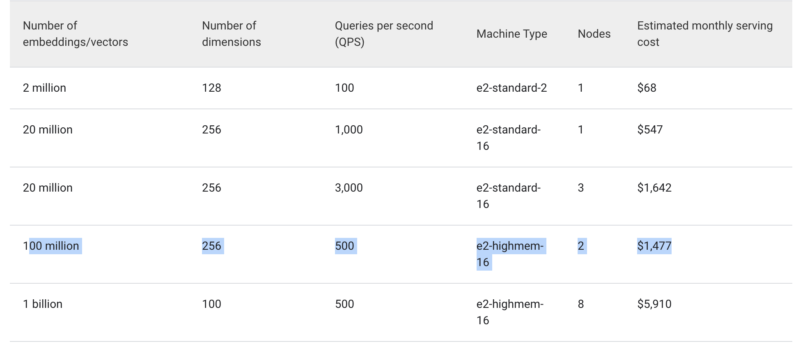

## Vector DB Capacity Requirements

Below are the key details that influence vector DB Capacity needs for an AI Application.

- Data Size: Dimension, Number of Items and Metadata.
- Indexing Overhead. ANN.
- Query Throughput.
- Memory and Storage.
- Embedding Process. Will impact processing time of Vector generation, but not the size of the vector.
- Chunking. A bigger document will need more chuncks, each chunk itesef convert to vector.

### Comparison between Vector Stores

Google Vector DB Smallest is sized as 2 CPU and 8 GB RAM with flexible storage options.

Hertzner 2 cpu	8 GB -> $16  
Akamai   2 cpu  4 GB -> $67  
Google   2 cpu  8 GB -> $66  
(e2 shared core instances recommended for small workload, which could be even cheaper)  
(storage cost @ $3 per GB per month)
(2million embedding with 100 QPS - queries per second with 128 Dimension will cost about $68 using e2-standard-2 instance)

### Key Points

Google high memory intensive workload is approximately prices @ 728$ (16 core with 128 GB of memory), which is much more efficient than our pricing $672 (more cpu cores and more RAM - 4 x 90 vs 16 X 128) .

Overall google vector search pricing is very competitive to our pricing w/ Akamai hosting options.

Micro definition is changing between providers. This will be adding confusion to instance classification, instance classification should be consistent across provides.

